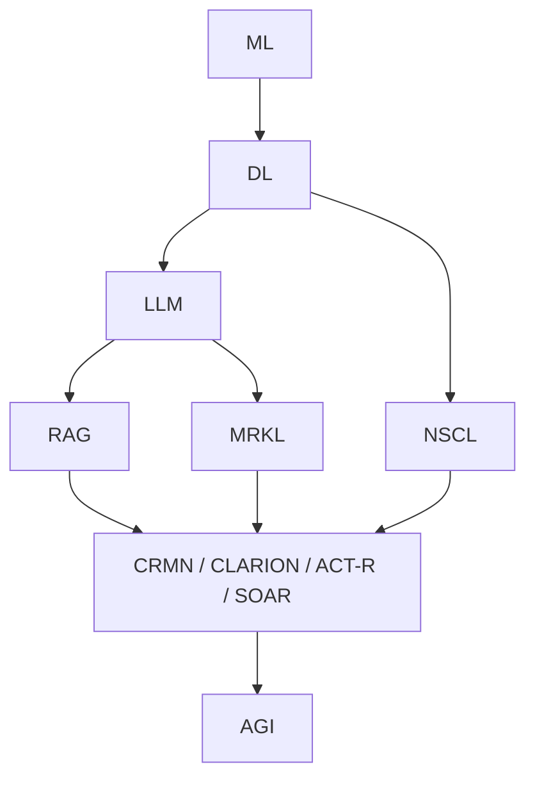

# [[AI]] Cognitive Architectures

## Layered Narrative (10-second view)

1. [[Machine Learning]] spots patterns in data.
2. [[Deep Learning]] automates representation.
3. [[LLM]]s scale [[Deep Learning|DL]] to the web.
4. [[RAG]] grafts real-time retrieval.
5. [[MRKL]] turns an [[LLM]] into a tool-router.
6. [[NSCL]] fuses perception with symbolic logic.
7. Cognitive-architectures ([[CRMN]], [[CLARION]], [[ACT-R]], [[SOAR]]) add meta-cognition, motivation and long-horizon planning—pushing toward trustworthy [[AGI]].

---

---

## Module 1 — Machine-Learning & Deep-Learning Foundations

### Unified Narrative

[[Machine Learning|ML]] learns from data; [[Deep Learning|DL]] replaces manual features with multi-layer nets that learn end-to-end embeddings. These representations fuel every later step—[[NLP]], retrieval, neuro-symbolic reasoning, meta-cognition and safety.

### Conceptual Overview

| Core Concepts | Key Methods | Real-World Uses | Gaps / Challenges |
|---------------|------------|-----------------|-------------------|
| Supervised, unsupervised, RL | SGD, decision trees, CNN, RNN, Transformer | Fraud detection, vision, speech | Bias, data hunger, interpretability, energy cost |
| Tokenisation & Embeddings | BPE, WordPiece, ada-002 vectors | Sentiment, search | Cost vs. semantic granularity |
| Chunking Primitives | Fixed, sentence, recursive | 256-token [[RAG]] window | Recall drop on long docs |

### Interconnections

- Embeddings feed [[RAG]] (Module 3) and the Living-Document retriever (Support Track B).
- Energy/bias metrics surface later in Explainability (Module 5).

### Action Plan

1. Work through Andrew Ng [[Machine Learning|ML]] course; build a spam-filter (scikit-learn).
2. Finish fast.ai [[Deep Learning|DL]] part 1; train a CIFAR-10 CNN, log CodeCarbon footprint.
3. Re-implement CNN in PyTorch Lightning; add tensorboard bias metrics.

---

## Module 2 — Large-Language Processing & Privacy-Safe Conversation

### Unified Narrative

LLMs (GPT-x/Llama-3) provide the first-class interface for downstream hybrid reasoning. They excel at fluency and code but hallucinate—mitigated downstream by [[RAG]], [[CRMN]] and [[NSCL]].

### Conceptual Overview

| Axis | Techniques | Uses | Open Issues |
|------|-----------|------|-------------|
| Prompt vs. Fine-tune | 0-shot, few-shot, adapters | Support chat, code gen | Catastrophic forgetting |
| Dialogue State | RLHF, retrieval memory | Assistants, tutors | Long context, privacy |
| Attention Maps | BertViz, Grad-CAM | Debug, Gov audits | "Attention≠Explanation" |

### Interconnections

- Emits chunk-hit telemetry and attention hashes for Module 5 XAI.
- Feeds stage/drive tags to [[Integrated Human-AI Metacognitive Systems|IHAMS]] loop (Module 4).

### Action Plan

1. Fine-tune a compact BERT on multilingual intent; counterfactual bias audit.
2. Build an FAQ bot with LangChain + FAISS; add profanity Prolog filter.
3. Log attention heat-maps; red-act PII with OpenDP clipping.

---

## Module 3 — Hybrid Reasoning: [[RAG]], [[MRKL]] & Neuro-Symbolic ([[NSCL]])

### Unified Narrative

Pure LLMs falter on factuality, math, and logic. Hybrid stacks fix this using:
- Retrieval-Augmented Generation ([[RAG]]) for fresh evidence.
- [[MRKL]] routing to specialist tools.
- [[NSCL]] to write and execute symbolic programs against structured data or scene graphs.

### Conceptual Overview

| Technique | Strength | Risk | Mitigation |
|-----------|----------|------|-----------|
| [[RAG]] | Current info, citation | Retrieval attack | Trust-score filter + [[CRMN]] gate |
| [[MRKL]] | Extensible, modular | Tool abuse | Policy guards, rate limits |
| [[NSCL]] | Logic transparency | Search explosion | Heuristic pruning + caching |
| Existential Layer | Value veto | Over-blocking | Threshold tuning |

### Interconnections

- [[RAG]] chunks pass through [[CRMN]] reality-gate (Module 6) before symbolic checks.
- [[SHAP]]/[[DeepLIFT]] attributions flow to Transparency Card (Module 5).

### Action Plan

1. Build mini-[[RAG]] over your vault notes; log source URLs.
2. Add a calculator + web-search [[MRKL]] tool; keep a tool-call ledger.
3. Implement CLEVR-style [[NSCL]] demo; compare logic trace vs. [[SHAP]] heat-map.
4. Wrap chain with Existential-Layer prompt gate; record veto stats.

---

## Module 4 — Meta-Cognition, [[Integrated Human-AI Metacognitive Systems|IHAMS]] & Cooperative Inverse RL

### Unified Narrative

[[Integrated Human-AI Metacognitive Systems|IHAMS]] (Integrated Human-AI Meta-cognitive System) closes the loop:
Observe → Reflect (uncertainty + CIRL value inference) → Plan/Act under Existential-Layer guard → Update Living-Document.

### Conceptual Overview

| Facet | Methods | Outputs | Challenge |
|-------|---------|---------|-----------|
| Self-monitor | Deep ensembles, conformal | Confidence p | Latency |
| Value-Inference | CIRL, Bayesian IRL | Reward vector | Ambiguous goals |
| Reality-Certainty | [[CRMN]] logits | 0-1 score | Over/Under blocking |

### Interconnections

- Receives stage/archetype tags (Module 2) and reality flags (Module 6).
- Writes value drift and attribution vectors back to Living-Document.

### Action Plan

1. Add ensemble uncertainty to FAQ bot; threshold human hand-off.
2. Run 7-day journaling → advice loop; plot value drift.
3. Call [[DeepLIFT]]-2 on policy net daily; surface top drivers for user review.

---

## Module 5 — Explainability, Governance & Value Alignment

### Unified Narrative

XAI becomes the social interface: feature attribution ([[SHAP]], [[DeepLIFT]]-2), focus views (attention, Grad-CAM), counterfactual recourse (DICE) and concept reasoning (TCAV). All artefacts are collated into an **[[Integrated Human-AI Metacognitive Systems|IHAMS]] Transparency Card**.

### Conceptual Overview

| Pillar | Key Methods | Artefact | Risk | Guardrail |
|--------|------------|----------|------|-----------|
| Attribution | [[SHAP]], [[DeepLIFT]]-2 | Top features | Correlated feats | Permutation test |
| Focus | Attention maps | Heat-map | Privacy | DP-clip |
| Counter-factual | LIME, DICE | Recourse | Implausible edits | Plausibility bounds |
| Concept | TCAV, ACE | Concept score | Drift | Curated concept bank |
| Provenance | Chunk URLs, tool ledger | Source sheet | Omitted link | Mandatory logging |

### Interconnections

- Consumes attribution vectors, reality scores, tool ledger for full trace.
- Feeds counterfactual edits back to [[MRKL]] planner (Module 3).

### Action Plan

1. Generate Transparency Card for your hybrid bot.
2. Coalition-prune [[SHAP]] with attention masks; benchmark runtime vs. fidelity.
3. Publish auditor-ready explanation for one workflow (PII-safe).

---

## Module 6 — Cognitive Architectures & Reality-Monitoring

### Unified Narrative

Human-inspired stacks add durable memory, goal management and watchdogs:
- [[CRMN]] — reality-gating mixture-of-experts.
- [[CLARION]] — dual implicit ↔ explicit swap.
- [[ACT-R]] — symbolic productions + latency model.
- [[SOAR]] — hierarchical planning with chunking.

### Conceptual Overview

| Arch | Core Idea | Signature | Example | Challenge |
|------|----------|-----------|---------|-----------|
| [[CRMN]] | Reality gate | Gating net | Hallucination filter | Tune thresholds |
| [[CLARION]] | Dual-process | Rule induction + NN | Social robot | Implicit bias |
| [[ACT-R]] | Prod rules + utilities | Conflict res. | Tutoring | Single-goal bottleneck |
| [[SOAR]] | Hierarchical plan | Impasse-driven | NASA sim | Knowledge eng. |

### Interconnections

- [[CRMN]] flags propagate to Modules 3-5 (chunk vetting, [[Integrated Human-AI Metacognitive Systems|IHAMS]] alarms, Transparency Card).
- [[CLARION]] rule extractor seeds [[NSCL]] program bank.
- [[ACT-R]] latency informs hand-off timing.
- [[SOAR]] plan trees become [[AGI]] stress tests (Module 7).

### Action Plan

1. Bolt [[CRMN]] gate onto chatbot; target ≥25 % hallucination drop.
2. Port [[CLARION]] Iowa-Gambling demo; compare rules vs. [[SHAP]].
3. Integrate [[ACT-R]] Stroop model to benchmark response lag.
4. Build [[SOAR]] Blocks-World planner; auto-generate from [[LLM]] text.

---

## Module 7 — Toward Artificial General Intelligence ([[AGI]])

### Unified Narrative

[[AGI]] requires breadth (perception, language), systematic reasoning ([[NSCL]]), self-reflection ([[Integrated Human-AI Metacognitive Systems|IHAMS]]) and safety rails (Existential Layer + cognitive architectures) all instrumented for transparency.

### Conceptual Overview

| Capability | Today | Demo                                   | Unknown |
| -------------------------- | --------------------------------------------------------- | -------------------------------------- | ------------------- |
| General learning | Foundation models | GPT-4 tools                            | Domain shift |
| Unified memory & reasoning | Neuro-symbolic | AlphaCode                              | Long-term coherency |
| Self-reflection | [[Integrated Human-AI Metacognitive Systems\|IHAMS]] loop | [[Anthropic's debate-style protocols]] | Safety proofs |
| Embodied agency | Sim2Real + [[SOAR]] | Gato arm                               | Open-world explore |

### Action Plan

1. Assemble a "mini-[[AGI]]": [[LLM]] + [[RAG]]/[[MRKL]] + [[NSCL]] + [[CRMN]] + [[Integrated Human-AI Metacognitive Systems|IHAMS]].
2. Join an alignment reading group (e.g., Berkeley CS-294).
3. Contribute to an open benchmark scoring hybrid reasoning, provenance and reality-monitoring.

---

## Support Tracks

### Support Track A — Math & Probabilistic Foundations

Complete before or in parallel with Module 1.
- Linear Algebra (Strang 18.06) — weeks 1-4.
- Probability for [[Machine Learning|ML]] (Murphy ch. 1-4) — weeks 5-8.
- Optimisation (Convex opt — Boyd & Vandenberghe) — skim as needed.

### Support Track B — Research Craft & Reproducibility

- How to read a paper (Keshav's 3-pass method).
- Replicate one flagship paper per module; blog pitfalls.
- Use Weights & Biases for experiment tracking; publish config + seed.

### Support Track C — Community & Feedback Loops

- Join a weekly study group (meetup / discord).
- Present module projects; gather peer review.
- After Module 3, file at least one PR or issue on an open-source hybrid-reasoning repo.

---

## Sample Pacing (part-time, 12 h/week)

| Phase | Weeks | Focus |
|-------|-------|-------|
| Foundation | 1-8 | Math track + Module 1 |
| Language | 9-16 | Module 2 |
| Hybrid | 17-28 | Module 3 + first research blog |
| Meta | 29-36 | Module 4 + Transparency v1 |
| Governance | 37-44 | Module 5 |
| Cog-Arch | 45-52 | Module 6 |
| [[AGI]] Sprint | 53-60 | Module 7 + benchmark submission |

---

## Living-Document Checklist (update weekly)

 - [ ] Goals & blockers
 - [ ] Time log & energy use
 - [ ] Value drift plot
 - [ ] Top-k [[SHAP]] features
 - [ ] Reality-certainty score
 - [ ] Tool-call ledger
 - [ ] Sources & chunk IDs
 - [ ] Peer feedback notes

---

## Next Steps

1. Fork this file; tick off tasks as you advance.
2. Keep *everything* version-controlled; every experiment reproducible.
3. Share your first replication blog after completing Module 2.
