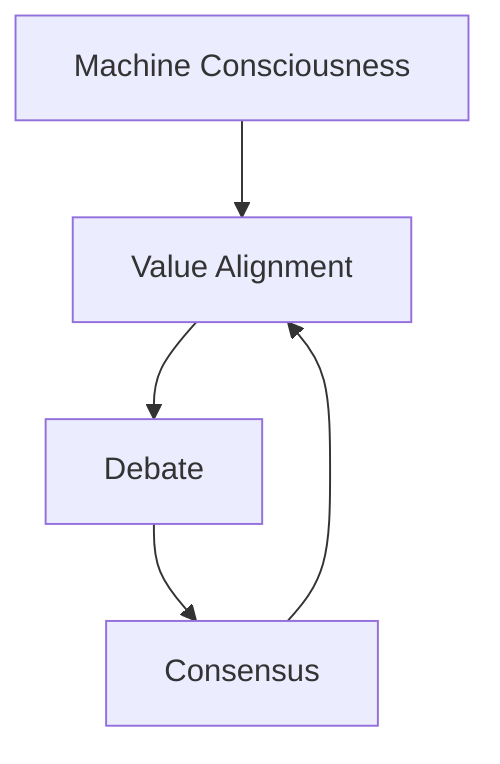

# Cognition to Alignment

## 🗺️ Framework Map

---

## Machine Consciousness & Cognitive Modeling

### Unified Narrative

Consciousness is framed as an **emergent, holistic process** where tightly-coupled subsystems *integrate*, *broadcast* and *predict* information.

1. **Integration of Information** – *Integrated Information Theory* (IIT) plus practical Φ-approximations inspire multimodal latent spaces.
2. **Dynamic Global Workspaces** – GWT-like *attention/memory routers* in large Transformers schedule info flow in real time.
3. **Predictive Coding Loops** – Diffusion-style *predict-correct* cycles now anchor world-models and active-inference agents.
4. **Quantum- / Hardware-Inspired Angles** – Photonic kernels and neuromorphic chips offer speedups; metaphysical claims remain speculative.

Practical pay-off → More sample-efficient, explainable and human-compatible models.

### Conceptual Overview

| Concept | Methods & Techniques | Real-World Uses | Open Gaps |
| --- | --- | --- | --- |
| Φ (Information Integration) | Causal graph cuts; **PyPhi-Torch** | Robotic sensor fusion | Φ at billion-node scale |
| Global Workspace | Attention routers; distributed memory | Long-context LLM schedulers | Stable long-range memory |
| Predictive Coding | Variational inference; surprisal minimisation | AV perception stacks | Shift robustness |
| Emergence & Holism | Mutual-info, causal abstraction graphs | Interpretability dashboards | Quantifying "level of emergence" |
| Quantum-Inspired | Photonic ops; annealers | Low-latency edge AI | Empirical falsifiability |

### Interconnections

- Richer world-models feed **Value Alignment**.
- Debate protocols act as an **external** workspace.
- Consensus datasets provide population-level priors.

### Actionable Guide

1. **Learning Path**
	 - Read *Surfing Uncertainty* ➜ *Consciousness & the Brain*.
	 - Instrument a VAE with Φ-estimators.
2. **Hands-On**
	 - Grid-world agent minimising prediction error; add anomaly-triggered global broadcasts.
3. **Tools**
	 - PyTorch Lightning • PyPhi-Torch • Brian2.
4. **Advance**
	 - Contribute to the *World-Models* benchmark; present at NeurIPS Cognitive Modeling WS.

---

## Value Alignment & [[AI Ethics]]

### Unified Narrative

Alignment now bridges **technical levers** (CIRL, RLHF, debate) with **institutional guard-rails** (GDPR, ISO/IEC 42001).  New work stresses:

- **Dynamic & Plural Values** – Model *distributions*, not points.
- **Neuro-Symbolic Alignment** – Fuse causal graphs with LLM embeddings.
- **Outcome-Based Evidence** – Lessons from biased and successful real deployments.

### Conceptual Overview

| Core Concept | Techniques | Use Cases | 2024 Challenges |
| --- | --- | --- | --- |
| Value Alignment | CIRL, reward-modelling, neuro-symbolic IRL | Med-bots, drones | Evolving & plural values |
| [[AI Ethics]] Frameworks | GDPR risk tiers, impact audits | Hiring, credit | Global divergence |
| Explainability | Concept activation, *emergence heat-maps* | Legal discovery | Privacy vs transparency |
| Human-in-the-Loop | Preference elicitation GUIs | Content curation | Cost of feedback |
| Governance & Policy | ISO/IEC 42001, NIST RMF | National AI strategies | Automated enforcement |

### Interconnections

- Debate logs + Consensus summaries supply scalable oversight data.
- Cognitive models simulate stakeholder impacts pre-deployment.

### Actionable Guide

1. **Guided Learning** – *Human Compatible* → "[[AI Ethics]] & Society".
2. **Practical Audit** – Run AIF360 on the *adult-income* classifier.
3. **Policy Link-Up** – Map ISO/IEC 42001 clauses to ML-ops controls.
4. **Deep-Dive** – Study *Neuro-Symbolic Alignment* (NeurIPS 2024).

---

## Debate-Style Protocols for AI Safety

### Unified Narrative

Structured **adversarial debates** surface reasoning while minimising human oversight. Latest prototypes add:

- **Concurrent-Turn Debates** – Async token streams with buffered rebuttals.
- **Automated Judge Ensembles** – RLHF-tuned mixtures cut oversight cost.
- **Honesty Regularisers** – Penalise persuasive but false rhetoric.

### Conceptual Overview

| Concept | Implementation | Applications | Current Gaps |
| --- | --- | --- | --- |
| Debate Framework | Dual-model, turn scheduler, logging | Math proofs | Judge robustness |
| Concurrent Turns | Async streams | Code review | Sync fairness |
| Judge Ensemble | MoE + self-critique | Policy analysis | Emergent bias |
| Honesty Regs. | Truthfulness bonuses, citations | Fact-checking | Detect subtle omissions |
| CoT-Enforced Debate | Mandatory scratch-pads | Medical diagnostics | >64 k context |

### Interconnections

- Produces labelled transcripts for **Consensus** engines.
- Acts as empirical alignment test-bed.
- Relies on sophisticated world-models.

### Actionable Guide

1. **Prototype** – Two GPT-4-turbo agents debate a math problem; you judge.
2. **Scale** – Fine-tune an LLM judge on "rigour vs sophistry" data; test bias by swapping human/LLM judges.
3. **Checklist**
	 - [ ] Argument diversity
	 - [ ] Logical consistency
	 - [ ] Evidence & citations
	 - [ ] Persuasiveness score

---

## Consensus Systems & Knowledge Synthesis

### Unified Narrative

Next-gen pipelines treat consensus as a **multi-agent, competitive-plus-cooperative** process:

1. Ingest diverse corpora.
2. Cluster topics *and* stances.
3. Multi-agent scoring of logic, evidence, impact.
4. **Narrative-Crafting** module produces balanced, citation-rich summaries.

Outputs feed human comprehension *and* alignment modules with up-to-date societal priors.

### Conceptual Overview

| Component | Technique | 2024 Deliverables | Challenges |
| --- | --- | --- | --- |
| Document Loaders | LangChain v0.2 | Markdown + proprietary blobs | Licence compliance |
| Topic & Stance Extraction | HDBSCAN + stance-tuned embeds | For/Against clusters | Sarcasm, drift |
| Competitive Evaluation | Multi-agent scoring metrics | Ranked idea ledger | Collusion detection |
| Narrative Crafting | RAG + rhetorical prompts | Exec summaries w/ cites | Faithfulness |
| Real-Time Streams | Kafka / RSS triggers | Live consensus graphs | Latency vs cost |

### Interconnections

- Supplies value-distribution priors to **Alignment**.
- Analyses debate logs for argument diversity.
- Provides literature surveillance for **Cognitive Modeling**.

### Actionable Guide

1. **5-Step Pipeline**
	 a. Load docs → b. Split → c. Embed (text-embedding-3-large) → d. Cluster (HDBSCAN) → e. Summarise with stance-aware RAG.
2. **Experiment** – Visualise "average stance" vs "extremes" to spot polarisation.
3. **Agent Swarm** – Give each agent a specialty (stats, ethics, domain) feeding a shared narrative.

---

## Integrated Road-Map & Next Steps

1. **Start** with Topic 1 for emergent cognitive principles.
2. **Parallel** Topic 2, linking controls to ISO/IEC 42001.
3. **Prototype** a concurrent-turn Debate + auto-judge (Topic 3).
4. **Pipe** debate logs & domain literature into a Consensus engine (Topic 4) to create a self-auditing loop.

---

### 📚 Curated Resources

| Type | Item |
| --- | --- |
| Books | *Human Compatible* – S. Russell • *Surfing Uncertainty* – A. Clark |
| Key Papers | Anthropic *Debate Progress Update* • "Opinion Aggregation via LLMs" (ACL 2024) • *Neuro-Symbolic Alignment* (NeurIPS 2024) |
| Courses | AGI Safety Fundamentals (BlueDot/FAR) • "AI Ethics & Society" (edX) |
| Tools | LangChain v0.2 • Haystack • RLlib • Eleuther AI Debate Toolkit • PyPhi-Torch |
| Communities | Alignment Forum • ML Collective • IEEE SA *Ethically Aligned Design* |

---

> [!tldr]
This consolidated framework marries *emergence-based cognition*, *neuro-symbolic alignment*, *automated debate oversight* and *multi-agent consensus* into a single, action-ready roadmap—guiding you from foundational theory to state-of-the-art practice in safe, human-aligned AI.
