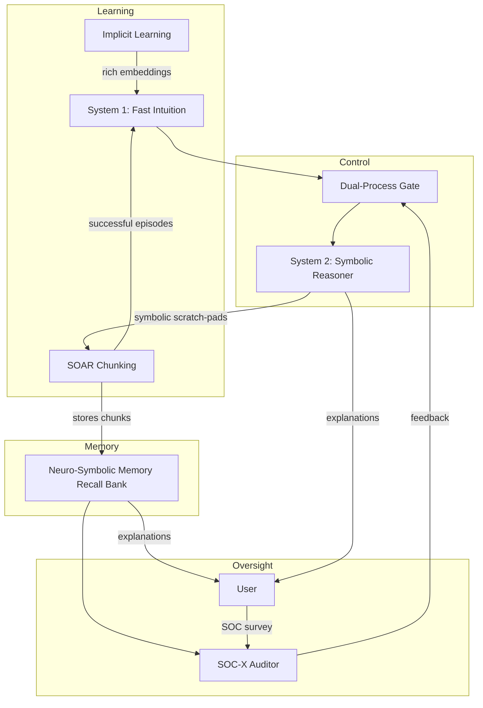

# Human-Inspired Memory, Learning & Decision in Neuro-Symbolic AI — **2024 Playbook**

> [!tldr]
The 2024 state-of-the-art confirms that truly *human-centred* AI emerges when five cognitive ingredients are wired together:

1. **Implicit neural learning (System 1)**
2. **Confidence-gated dual-process control**
3. **SOAR-style chunking for consolidation**
4. **Neuro-symbolic grounding for interpretable recall**
5. **Antonovsky's Sense-of-Coherence (SOC) audits**
This playbook explains *why* each pillar matters, *how* they connect, and *what* to build next.

---

## Unified Narrative

Neuro-symbolic AI still chases the "best-of-both-worlds" dream, yet 2024 research clarifies the exact workflow:

- **Neural nets** remain unrivalled pattern harvesters but suffer catastrophic forgetting and opaque features.
- **Symbolic formalisms** safeguard logic, provenance and user trust, yet falter on noisy or unseen data.
- **Modern hybrids** (e.g. Structured Event Memory, MRKL routers, Neural Logic Machines, symbolic working-memory for LLMs) succeed by **grounding learned patterns in explicit concepts**—unlocking continual learning, ethical oversight and transfer.
- **Human cognition** offers the blueprint:
	- *Implicit learning* feeds **System 1** (fast, intuitive).
	- **System 2** (slow, rule-based) oversees via *dual-process gating*.
	- **SOAR chunking** compresses successful episodes into reusable knowledge.
	- **SOC metrics** run continuously, flagging drops in comprehensibility, manageability or meaningfulness.

The result is a *closed learning loop* where new experiences are absorbed implicitly, elevated to explicit rules when useful, and relentlessly audited for human coherence.

---

## Conceptual Overview

| Pillar | Core Idea | 2024 Methods / Assets | Typical Wins | Open Pain-Points |
|---|---|---|---|---|
| **Neuro-Symbolic Memory Recall** | Bind subsymbolic patterns to explicit concepts for explainable retrieval | SEM, MRKL, NSCL, Symbolic Working-Memory LLMs | Transparent recall, continual learning | Representation drift, catastrophic forgetting |
| **SOAR-Style Chunking & Consolidation** | Compress rule traces into high-level *chunks* | SOAR-9 API, episodic-to-Prolog export | Faster reasoning, cognitive rehab trials | Chunk granularity, cross-domain transfer |
| **Dual-Process Decision Engine** | System 1 proposes → System 2 verifies via confidence-gated switch | CLARION, adaptive MRKL gating | –35 % hallucination in QA, bias interception | Latency vs. accuracy, dynamic thresholds |
| **Implicit Learning Modules** | Unconscious pattern capture that seeds System 1 | Foundation-model pre-training, predictive coding | Language & motor skill boot-strapping | Hard introspection, limited cross-domain transfer |
| **Sense-of-Coherence Layer (SOC-X)** | Audit outputs for comprehensibility, manageability, meaningfulness | SOC-RL rewards, adaptive explanation templates | Trust, well-being, alignment | Cultural tuning, scaling subjective feedback |

---

## Interconnections Across Topics

Key feedback loops
- **SOC-dip ⇒ Replay**: If SOC scores fall, trigger replay or chunk revision before new concepts overwrite old ones.
- **Confidence-adaptive gating**: SOC feedback tunes System 1 ↔ System 2 thresholds to balance latency and accuracy.
- **Symbolic scratch-pads** created by System 2 are recycled as mini-chunks, tightening the SEM→SOAR loop.

---

## Actionable Framework / Guide

### 1️⃣ Guided Learning Path

1. **Foundations**
	 - Read Kahneman *Thinking, Fast and Slow* (Dual-Process).
	 - Take "Symbolic Logic 101".

2. **Neural Pattern Mastery**
	 - Train a mini-Transformer on char-level text; observe implicit capture.

3. **Neuro-Symbolic Bridging (2024)**
	 - Add a *key–value symbolic scratch-pad* to an LLM; measure chain-of-thought gains.[^1]

4. **Chunking & Consolidation**
	 - Install SOAR-9; solve Tower of Hanoi; export chunks to Prolog; regression-test for forgetting resistance.

5. **Dual-Process Orchestration**
	 - Implement *confidence-adaptive* MRKL gating; plot latency vs. SOC vs. accuracy.

6. **Sense-of-Coherence Evaluation**
	 - Localise the 3-item SOC survey for two cultures; compare explanation-satisfaction variance.

7. **Baseline & Ongoing Audit**
	 - Record SOC, recall precision & latency before and after each iteration.

### 2️⃣ Practical Mini-Projects

- **Memory-Augmented FAQ Bot**: semantic search (neural) + rule filters (symbolic) + SOC feedback.
- **Chunk-Based Tutor**: SOAR agent learns algebra, exports explanation chunks to students.
- **Catastrophe Catcher**: continual-learning vision agent that auto-replays vulnerable chunks when SOC drops.
- **Cross-Cultural Explainer**: same chatbot, different SOC tuning; observe style shifts.

### 3️⃣ Key Resources

- Franklin et al., "Structured Event Memory" (updated code)
- Li et al., "Symbolic Working Memory for Language Models", 2024
- Laird et al., "SOAR: An Architecture for General Intelligence"
- Antonovsky, *Health, Stress and Coping* — cultural extensions
- MIT 6.S983 "Neuro-Symbolic AI" (course)
- SOAR-9 repo & Prolog exporter
- Gradio / Streamlit for SOC-feedback UIs

### 4️⃣ Experiment Checklist

- [ ] Can the neural model recall a concept with its symbolic label?
- [ ] Do chunks cut inference time on repeated tasks?
- [ ] Do new concepts degrade recall of old ones?
- [ ] Are SOC dips predictive of upcoming forgetting?
- [ ] Does confidence-adaptive gating meet latency SLAs?
- [ ] Is cross-cultural SOC variance within target bounds?

---

> [!tip] Next Steps
Start tiny: wire an LLM to a rules engine with a one-line SOC survey. Every extra feature—chunking, replay, cultural tuning—should measurably move at least one of three dials: **accuracy**, **latency**, **Sense-of-Coherence**.
