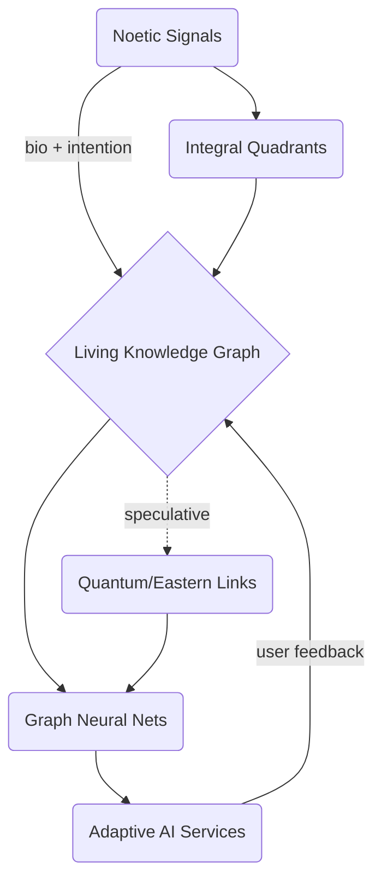

# Noetic-AI Knowledge Ecosystems

*(Integrating Noetic Science, Meta-Knowledge Integration & AI)*

---

## 1. Unified Narrative

Since the early decades of AI, "intelligence" has been modeled almost exclusively from observable data and formal rules. Noetic Science—founded by Apollo-14 astronaut Edgar Mitchell in 1973—asks a complementary question: *What if subjective consciousness (intuition, intention, collective focus) also exerts causal influence?*

Concurrently, the Living / Meta-Knowledge-Ecosystem movement contends that information infrastructures should behave like biological ecosystems: dynamic, adaptive, and meaning-aware rather than static libraries.

Merging these streams yields the vision of a **Noetic-AI Knowledge Ecosystem**, where

- **Noetic Science** supplies historical context (Institute of Noetic Sciences), protocols (intention-RNG experiments, meditation, EEG/HRV monitoring) and cautionary tales about speculative claims.
- **Living Knowledge Ecosystems** offer the cybernetic scaffolding—knowledge graphs, feedback loops, adaptive ontologies—that allows AI to integrate empirical signals and subjective inputs in real time.

> [!success] Promises
> 1. **Richer Training Signals** – Intention, affect, physiological and contextual data become first-class features.
> 2. **Human-AI Symbiosis & Well-being Metrics** – Success criteria expand beyond accuracy to include collective coherence, stress reduction and insight.
> 3. **Cross-Disciplinary Innovation** – Linking neuroscience, quantum theory, Eastern philosophy and systems science surfaces novel hypotheses.

> [!warning] Cautions
> • **Pseudoscience Risk** – Conflating speculative noetic phenomena with validated science can erode credibility; rigorous provenance tagging is mandatory.
> • **Epistemic Overload** – Too many perspectives can paralyze decision-making unless visual summarization and bias sentinels are in place.
> • **Ethical / Privacy Concerns** – Physiological and intention data require explicit informed consent and governance.

---

## 2. Conceptual Overview

| Element | Core Definition | Methods / Techniques | Representative Use-Cases | Key Challenges & Mitigations |
|---------|-----------------|----------------------|--------------------------|------------------------------|
| **Noetic Science** | Interdisciplinary study of consciousness & its causal power (Mitchell 1973) | Meditation protocols, intention & RNG experiments, EEG/HRV sensing | Stress-reduction apps; Global Consciousness Project dashboards | Sparse replication → use hierarchical evidence ratings |
| **Living Knowledge Ecosystem** | Adaptive, feedback-rich knowledge graph that evolves like a biological ecosystem | Bidirectional linking, graph DBs, cybernetic feedback loops | NASA mission planning; personal PKMs (Obsidian) | Governance & complexity → modular ontology versioning |
| **Meta-Knowledge Integration** | Connecting knowledge *about* knowledge across silos, incl. subjective layers | Ontology alignment, semantic provenance, meta-modeling | Policy dashboards; interdisciplinary research platforms | Semantic drift → continuous entity reconciliation |
| **Systems Thinking / Cybernetics** | Modeling interdependencies via feedback loops & adaptation | Causal-loop maps, system-dynamics sims, participatory GIS | Climate or SDG planning; supply-chain resilience | Non-linear unpredictability → scenario ensembles |
| **Integral Theory (Wilber)** | Four-Quadrant lens (I/We × Interior/Exterior) to balance data types | Quadrant mapping, balanced scorecards | Holistic org change; wellness analytics | Subjective mapping → peer review & annotation layers |
| **Quantum & Eastern Links** | Theoretical bridges between quantum interconnectedness & contemplative traditions | Literature mining, hypothesis generation | AGI consciousness models; "quantum cognition" probes | Interpretive controversies → maintain *speculative* flag |
| **AI Enablers** | ML models & tooling that consume graph + noetic data streams | Graph neural nets, affective computing, RL-HF feedback | Mindful copilots; adaptive learning; bias sentinels | Signal noise & privacy → differential privacy + consent ledger |

---

## 3. Interconnections Across Topics

- Noetic insights feed affective & intention data → enhance AI personalization and well-being-aware recommendations.
- Knowledge graphs host links between objective biomedical facts and subjective patient-reported outcomes → enable precision-medicine dashboards.
- Systems thinking & cybernetics close the loop: mood check-ins update graph weights; graph changes retrain models; model actions shift user state—a living adaptive cycle.
- Integral Theory keeps inner/outer and individual/collective perspectives balanced, preventing technocratic domination.
- Quantum-mechanics metaphors are tagged as *speculative* but still mined for hypothesis generation via LLM literature review.

---

## 4. Actionable Framework / Guide

### A. Guided Learning Path

| Phase | Duration | Focus |
|-------|----------|-------|
| **1 — Foundations** | 2 weeks | History of Noetic Science (IONS); Philosophy of Mind & Epistemology; Systems Thinking basics |
| **2 — Technical Core** | 4 weeks | Knowledge-graph construction (RDF/Neo4j) with provenance & evidence ratings; Affective & physiological sensing (BrainFlow); Differential privacy for bio-data |
| **3 — Synthesis** | 4 weeks | Build a "Living PKM" in Obsidian; auto-tag notes with HRV + mood; Train a GNN recommender weighted by semantic similarity + HRV trend |
| **4 — Advanced Exploration** | ongoing | Replicate intention-RNG experiments; stream data into graph; Evaluate AGI frameworks (IIT, Global Workspace, Active Inference) for noetic fit; Run participatory GIS or SDG simulators with community noetic inputs |

### B. Mini-Projects

1. **Mindful Recommender** – Fine-tune an LLM whose reward model balances relevance and user-reported well-being (Wilber quadrant tags as features).
2. **Living Graph Dashboard 2.0** – Real-time visualization with provenance badges (empirical, speculative, anecdotal) and sliders for evidence weighting.
3. **Bias + Epistemic Heat-Map Sentinel** – Agent surfaces how subjective tags shift recommendation distributions; graphs *evidence vs. intuition* tension over time.

### C. Practical Tips

1. **Provenance First** – Every triple carries *(source, evidence-level, quadrant)*.
2. **Manage Complexity** – Adopt modular ontologies; freeze "stable cores," iterate "experimental leaves."
3. **Ethical Toolkit** – Embed consent smart-contracts or data-trust frameworks for physiological & intention data.

### D. Key Resources

| Type | Item |
|------|------|
| **Books** | *The Way of the Explorer* (E. Mitchell); *The Noetic Universe* (D. Radin); *Thinking in Systems* (D. Meadows); *Graph Databases* (O'Reilly) |
| **Courses / Talks** | MIT "Principles of Awareness" seminar; IONS Consciousness webinars; Knowledge Graph Conference workshops |
| **Tools** | Obsidian + Dataview + Neo4j; BrainFlow / Muse / Empatica; PyTorch-Geometric + HuggingFace RLHF stack; Provenance-aware graph stores (TerminusDB, Stardog) |
