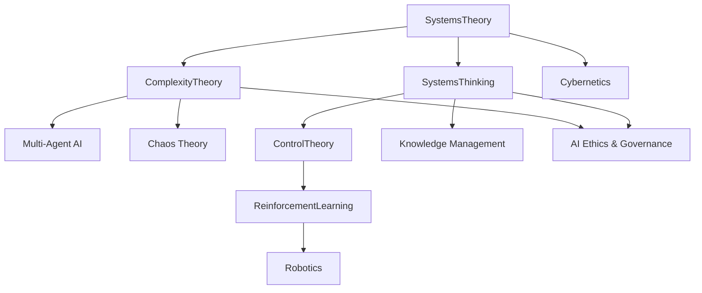

# Systems & Complexity Foundations for AI

## Unified Narrative

From the very start of AI, researchers have borrowed four complementary lenses that explain **how many moving pieces co-produce global behaviour**:

- **Systems Theory** (von Bertalanffy, 1940s) rebuts reductionism with the dictum *"the whole is more than the sum of its parts."* In 2024 the "whole" now spans socio-technical ecosystems: data generators, ML models, users, regulators, compute hardware, and even corporate knowledge graphs.

- **Systems Thinking** (Forrester → Senge) operationalises the theory. Practitioners map feedback loops, locate leverage points, and test interventions—from Toyota's production system to modern MLOps dashboards. Yet the power comes with a caveat: *complexity overload* or analysis paralysis when every node links to every other.

- **Control Theory** (Maxwell governors → PID, MPC, adaptive control) supplies the mathematics for steering dynamic systems. Reinforcement Learning generalises optimal control to unknown dynamics; autopilots, robot arms, and LLM guardrails all embed control ideas. Mis-specified models can still cause flash-crash-style failures, so safe & interpretable controllers matter.

- **Complexity Theory** (cybernetics → Santa Fe Institute) explores emergence, non-linearity, and phase transitions. Swarm robotics, multi-agent LLM toolchains, and market contagion all hinge on the fact that *simple local rules create surprising global patterns*.

Together these perspectives encourage AI/KM teams to
1. Treat models, data, users, policies, and org charts as one living system.
2. **Close the loop**: instrument, monitor, and adapt—automatic retraining or human-in-the-loop—to stay on target.
3. Design for emergence and resilience: small prompt tweaks or data shifts can trigger outsized effects.
4. Guard against misuse: decision paralysis from infinite causal maps or blind trust in automated controllers.

---

## Conceptual Overview

| Core Concept | Refined Definition | Key Methods / Techniques | AI & KM Examples | Fresh Open Challenges (2024) |
|--------------|--------------------|--------------------------|------------------|------------------------------|
| **System** | Interacting elements forming an integrated whole across technical *and* human layers | System maps, causal-loop & stock-flow diagrams | Enterprise knowledge graphs; end-to-end ML pipelines | Uncovering hidden data-supply-chain dependencies; privacy provenance |
| **Feedback Loop** | Output re-enters system as input, altering future state | A/B dashboards, causal simulation, auto-retraining triggers | Ad-ranking that learns from clicks; documentation quality → user adoption | Biased or delayed feedback, echo-chambers |
| **Controller** | Algorithm or policy that steers a system to desired state despite noise & delay | PID, MPC, policy gradients, safe RL | HVAC optimisation; guardrail policies for LLMs | Robustness under distribution shift; interpretable safety envelopes |
| **Emergence** | Macro-patterns arising from micro-rules | Agent-based simulation, network science | Traffic for autonomous fleets; LLM toolchains | Predicting tipping points; explaining emergent LLM skills |
| **Leverage Point** | Small intervention with large systemic effect | Sensitivity analysis, system-leverage audits | Data-governance tweak preventing global bias | Locating points in opaque deep nets; avoiding "fixes that fail" |
| **Complexity Overload** | When system scope exceeds human cognitive limits | Model reduction, scenario pruning | Large KM initiatives stalling | Balancing fidelity vs. actionability |

---

## Interconnections Across Topics

- Systems Theory ⇄ Complexity Theory: both study wholes; complexity adds non-linearity & phase transitions.
- Systems Theory ⇄ Cybernetics ⇄ Control Theory: cybernetics bridges qualitative systems views and quantitative control maths.
- Control Theory ⇄ Reinforcement Learning: RL = data-driven optimal control; "safe RL" borrows MPC constraints.
- Systems Thinking ⇄ Knowledge Management: causal maps become living KM artefacts linking data lineage to decisions.
- Complexity Theory ⇄ Chaos Theory: sensitivity to initial conditions informs adversarial-robust AI.
- All four ⇄ AI Governance & Ethics: holistic, feedback-aware, complexity-savvy governance is essential after high-profile failures.

---

## Actionable Framework / Guide

### 1. Guided Learning Path

1. **Foundations**
	 - Bertalanffy *General Systems Theory* (history & critique)
	 - Maxwell (1868) + MIT OCW "Feedback Control"

2. **Bridges to AI & KM**
	 - Meadows *Thinking in Systems* + the Beer-Game simulation
	 - Sutton & Barto RL Ch. 10 (control links)
	 - Senge *The Fifth Discipline* for organisational learning

3. **Complexity & Emergence**
	 - Santa Fe Institute MOOC *Introduction to Complexity*
	 - Explore the Lorenz attractor; relate chaos to adversarial robustness

4. **Applied Projects**
	 - Build a closed-loop ML service with Evidently-AI *and* a knowledge-graph provenance layer.
	 - Red-team a controller: stress-test an RL policy under shifted dynamics.
	 - Run a causal-loop workshop with cross-functional stakeholders; extract leverage points and prune unnecessary detail.

5. **Advanced & Research**
	 - *Safe Control under Uncertainty* (survey 2023)
	 - Mechanistic interpretability papers on emergent circuits in LLMs
	 - Case-study readings: 2008 financial crash & feedback-amplified failures

### 2. Hands-On Experiments

- PID vs RL on cart-pole; interpret failures under sensor latency.
- **Emergence Sandbox:** PettingZoo multi-agent games; compute entropy & clustering metrics.
- **Feedback Audit:** live dashboards + knowledge-graph provenance tracker.
- **Complexity Overload Drill:** give a team an oversized causal map, then practice model reduction until insights become actionable.

### 3. Key Resources

| Type | Items |
|------|-------|
| Papers | Tassa *Deep RL & Control* (2020); CARTA *Measuring Emergent Communication* (2021); Forrester *Industrial Dynamics* |
| Courses | Georgia Tech *Control of Mobile Robots*; Stanford CS329E *ML Systems Design*; MIT *System Dynamics* |
| Tools | NetLogo, OpenAI Gym, Ray RLlib, Evidently-AI, AnyLogic (hybrid discrete/continuous simulation) |

### 4. Practitioner Checklist

- [ ] Have we mapped **data → model → user → regulator** feedback loops?
- [ ] Is a **controller** (policy, rule, or human) enforcing safety boundaries, and is it interpretable?
- [ ] Do we monitor **emergent externalities** (bias, market impact, environmental cost)?
- [ ] Have we located *at least one leverage point* and stress-tested for unintended side-effects?
- [ ] Have we **bounded system complexity** to avoid analysis paralysis?

---

> [!summary]
By integrating systems, control, and complexity thinking—and by explicitly managing feedback loops and emergent risks—AI practitioners can build services that are not only performant but **robust, interpretable, and organisationally sustainable**.
