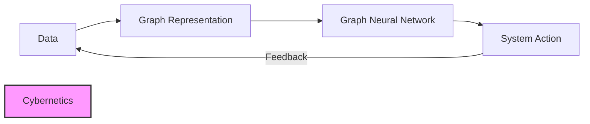

# Network Theory in Artificial Intelligence

## Unified Narrative

Network Theory explores how **nodes** (entities) and **edges** (relations) shape emergent behaviour. Modern AI leverages this lens along four intertwined fronts:

1. **Representation** – Knowledge graphs, social-influence graphs, and multi-modal supply-chain networks store facts or agent states that models query, reason over, and update.
2. **Learning** – Graph Neural Networks (GNNs) generalise convolution, attention, and diffusion to arbitrary graphs, producing node/edge/graph embeddings for prediction or control.
3. **System Thinking** – Treating an AI application (multi-agent fleets, recommender engines, epidemic simulators, risk monitors) as a graph exposes cascades, robustness, and control points.
4. **Governance & Risk** – Hub-dominated (scale-free) structures enable rapid diffusion yet amplify single-point failure and bias; small-world topologies deliver resilience with short paths.

Historical milestones—Euler's bridges, Watts-Strogatz small-worlds, Barabási-Albert scale-free hubs—explain why attacks on influential social-media accounts spread quickly, while decentralised peer-to-peer learning degrades gracefully.

## Conceptual Overview

| Aspect / Lens                      | Definition & Nuance                                              | Typical AI Methods & Tools                         | Mature Use Cases                                                       | Key Risks & Gaps |
|-----------------------------------|------------------------------------------------------------------|----------------------------------------------------|------------------------------------------------------------------------|------------------|
| Nodes & Edges (static)            | Fundamental graph units                                          | NetworkX, Neo4j, TigerGraph                        | Knowledge-base reasoning, basic link prediction                        | PII leakage; >10 B-edge scaling |
| Dynamic / Temporal Networks       | Topology & attributes evolve (streams/events)                    | DySAT, TGAT, Temporal GNNs                         | COVID-19 forecasting, high-freq trading, cyber-threat propagation      | Non-stationarity; real-time hardware |
| Small-World Networks              | High clustering, low average path                                | Community detection, label propagation             | Friend suggestion; swarm co-ordination                                 | Detecting shifting community boundaries |
| Scale-Free Networks               | Heavy-tailed degree; hubs dominate                               | Centrality-based analytics & counter-measures      | Influence maximisation, supply-chain hub optimisation                  | Hub attack vulnerability; socio-political manipulation |
| Centrality & Vulnerability        | Degree, betweenness, eigenvector; stress-test hubs               | NetworKit, adversarial sims                        | Critical-infra audits; misinformation choke-point analysis             | Bias toward well-connected groups |
| Graph Neural Networks (GNNs)      | Deep learning on graphs                                          | GCN, GAT, GraphSAGE, Graph Transformers            | Molecule property prediction, fraud detection, routing optimisation    | Over-smoothing; explainability |
| Multi-Modal / Hetero-Graphs       | Multiple node/edge types (user–product–logistics)                | R-GCN, HeteroGNN                                   | End-to-end supply-chain simulators, cross-domain recommendation        | Data standardisation across modes |

## Interconnections Across Topics

- **Cybernetics → Network Theory:** Every graph-aware AI that *acts* (route, recommend, quarantine) alters the network it observes, closing a feedback loop.
- **Complex Systems:** Phase-transition tools determine when misinformation "percolates" past a critical threshold.
- **Human-AI Interaction:** Exposing graph explanations ("you were recommended this because X common friends") raises transparency.

## Actionable Framework / Guide

### 1. Guided Learning Path

1. Graph Theory primer (Euler) ➜ Watts-Strogatz & Barabási-Albert.
2. Tooling: NetworkX → **NetworKit** for billion-edge graphs → PyTorch-Geometric / DGL.
3. Advanced: Temporal & hetero-GNN papers (DySAT, HeteroGraph Transformer).
4. Ethics: "The Hubness Problem in Social Networks" + ACC 2023 misinformation report.

### 2. Hands-On Experiments

- Build a mini supply-chain graph; simulate hub removal stress tests.
- Reproduce an SEIR epidemic on small-world vs scale-free graphs; add a GNN policy that vaccinates high-betweenness nodes.

### 3. Key Resources

Book — "Networks, Crowds, and Markets" (Easley & Kleinberg)
Course — Stanford CS224W "Machine Learning with Graphs"
Dataset — AWS Open-Data COVID-19 contact network

---

# Cybernetics in Artificial Intelligence

## Unified Narrative

Cybernetics—coined by Norbert Wiener (1948)—is the science of communication and control via **feedback**. Its influence on AI appears at three levels:

1. **Learning Feedback** – Back-prop gradients, TD-error in RL, and meta-learning function as controllers that minimise loss or maximise reward.
2. **Physical Control** – Robotics, IoT devices, and autonomous vehicles embed PID, LQR, or MPC loops from classical control theory.
3. **Socio-Technical Governance** – Audits, dashboards, and policy levers form *second-order* feedback loops in which the observer (human/regulator) is inside the system.

Micro-loops optimise performance; macro-loops regulate societal impact (e.g., EU AI Act as policy feedback).

## Conceptual Overview

| Aspect / Lens                 | Definition & Nuance                              | AI Techniques & Tools            | Mature Applications                                    | Open Problems |
|-------------------------------|--------------------------------------------------|----------------------------------|--------------------------------------------------------|---------------|
| Feedback Loop                 | Output re-enters as input                        | Back-prop, Q-learning, PID       | Model training, thermostat, servo motors               | Long-delay credit assignment; reward hacking |
| Control Theory                | Design of regulators (linear & non-linear)       | LQR, MPC, Kalman, Koopman        | Drone path planning, HVAC optimisation                 | Robustness to stochastic/adversarial disturbances |
| Homeostasis & Adaptation      | Maintain equilibrium under change                | Adaptive LR, batch-norm, meta-learning | Continual learning; auto hyper-param tuning            | Stability-plasticity dilemma |
| Second-Order Cybernetics      | Observer included in system                      | Human-in-the-loop, active learning | Medical diagnosis refinement, crowd-sourced labelling  | Measuring co-adaptation; manipulation avoidance |
| Socio-Ethical Feedback        | Policy/audit loops that steer deployment         | Model cards, impact assessments  | EU AI Act dashboards                                   | Feedback latency; regulatory capture |

## Interconnections Across Topics

- **Network Topology ↔ Cybernetic Speed:** Consensus rate in multi-agent swarms scales with graph algebraic connectivity.
- **Knowledge-Management Systems:** Sense → decide → act → learn cycles mirror cybernetic design.
- **Systems Theory:** Stocks & flows blend structure (graphs) with dynamics (feedback).

## Actionable Framework / Guide

### 1. Guided Learning Path

1. Wiener's "Cybernetics" → classical PID & state-space control.
2. Modern Koopman-based non-linear control.
3. RL crossover: Sutton & Barto + "Safe RL Survey" (Garcia & Fernández 2023).
4. Socio-technical: Beer's Viable System Model + EU AI Act white paper.

### 2. Experiments

- Compare PID vs Q-learning on CartPole; add adversarial wind disturbance.
- Deploy an active-learning loop in a knowledge-management system; track accuracy vs annotation cost.

### 3. Key Resources

Tool — `ControlGym` (bridges control & RL)
Course — Georgia Tech AE 4803 "Cyber-Physical Systems"

---

# Cross-Topic Synthesis & Learning Road-Map

| Phase | Weeks | Focus | Deliverable |
|-------|-------|-------|-------------|
| **Foundations** | 1–2 | Graph Theory (Euler, Watts-Strogatz, Barabási-Albert) + Control Theory (PID, feedback stability) | Flash-cards & solved problem sets |
| **Computational Tools** | 3–4 | NetworkX / NetworKit; Python `control` lib & `ControlGym` | Jupyter notebooks reproducing classic results |
| **Integrative Projects** | 5–8 | A) SEIR epidemic on heterogeneous graphs with cybernetic vaccination.  B) Multi-agent fleet: local PID, dynamic small-world links, robustness tests.  C) Knowledge-management recommender retraining on user-interaction graph. | Project reports + GitHub repos |
| **Advanced Topics** | 9–12 | Temporal & hetero-GNNs; Safe & interpretable RL with policy-level feedback | Conference-style paper draft |
| **Reflection & Ethics** | continuous | Debate bias amplification vs cybernetic correction; draft guidelines for sensor/actuator placement in AI platforms | Policy white-paper |

Completion positions practitioners to architect AI systems that are **structurally aware (Network Theory)** and **dynamically stable, safe, and ethically governed (Cybernetics)**.
