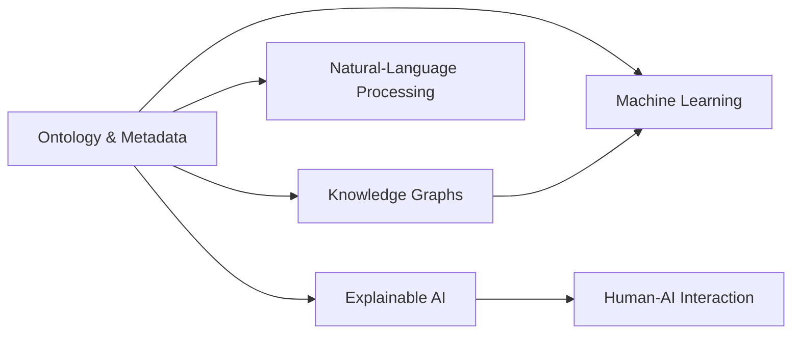

# Ontology & Metadata Creation in Artificial Intelligence (2024)

---

## Unified Narrative

Ontologies and metadata are the *structure* and the *labels* that let computers—and people—agree on what data **is** and how pieces of it relate.

- **Ontology** = explicit specification of the *things that exist* in a domain (classes, properties, axioms).
- **Metadata** = *data about data*—concise descriptors that tell systems and humans what a file, record, or field means.

Three decades of practice reveal a clear trajectory:

1. **Historical provenance now matters**
	 Library catalogues → MARC → Dublin Core proved that metadata increases findability. The Web's data deluge birthed RDF (1999) and OWL (2004). Today, Internet-scale knowledge graphs (Google KG, Microsoft Satori, Wikidata) show that well-governed ontologies are operational assets, not academic luxuries.

2. **Outcome-oriented practice trumps "ontology for ontology's sake"**
	 When focused on concrete goals—interoperability (FHIR+SNOMED), explainable AI layers for LLM copilots, rapid multi-omics integration—semantic models accelerate value. Over-engineering (thousands of brittle classes) or poor governance (no versioning) still sink projects.

3. **Pragmatic depth**
	 Full OWL DL reasoning isn't always required. Lightweight taxonomies or LinkML schemas often suffice for departmental analytics, while heavyweight ontologies remain indispensable in regulated domains (finance, pharma). Modern teams ask *how much* semantics they need *before* modelling.

Why does AI still care?

| # | AI Benefit | Explanation |
|---|------------|-------------|
| 1 | **Training Data Quality** | Consistent labels reduce "garbage in, garbage out." |
| 2 | **Interoperability** | Shared semantics remove bespoke ETL glue. |
| 3 | **Explainability & Trust** | Decisions can be traced to authoritative terms (e.g., ICD-10). |
| 4 | **Automated Reasoning** | Neuro-symbolic stacks infer new facts from existing ones. |
| 5 | **Lifecycle Adaptability** | Evolving ontologies track real-world change (e.g., new virus variants). |

Success stories: SNOMED CT, Gene Ontology, Google KG.
Typical failure modes: scope creep, stale governance, or neglecting user adoption.

---

## Conceptual Overview

| Category | Core Points (2024) | Representative Methods / Tools | Use-Case Highlights | Open Gaps & Challenges |
|----------|-------------------|-------------------------------|---------------------|------------------------|
| **Concepts** | Ontology, Metadata, Taxonomy, Controlled Vocabulary, *Epistemic alignment* (cross-discipline term mapping) | – | – | – |
| **Representation Standards** | RDF / RDFS, OWL 2, SHACL, JSON-LD, LinkML (lightweight) | Protégé, GraphDBs, SHACL engines | Wikidata, schema.org, FHIR profiles | Expressiveness vs. compute cost |
| **Building & Governance** | Iterative modelling, competency questions, versioning, change logs, stakeholder boards | Protégé, TopBraid, DataHub lineage UI | Enterprise data mesh; open-source scientific ontologies | Sustaining consensus; scope creep |
| **Evaluation & Quality** | Coverage, consistency, reasoning latency, SHACL tests, human-in-the-loop review | SHACL, SPARQL, KgBench | FAIRscore dashboards | Scarce multi-domain benchmarks |
| **AI-Facing Techniques** | Semantic enrichment, ontology-based feature engineering, embedding methods (RDF2Vec/OWL2Vec), prompt grounding for LLMs, neuro-symbolic reasoning | spaCy + rdflib, DeepReasoner, RDF2Vec | Semantic search, drug repurposing, code copilots with grounded explanations | Scalable graph reasoning; concept-drift detection |

---

## Interconnections Across Topics

- **Machine Learning** – Ontologies stabilise labels and enable feature construction; embeddings inject structure into neural models.
- **Knowledge Graphs** – Ontology = schema; KG = instances; SHACL keeps them consistent.
- **NLP / LLMs** – Authoritative vocabularies reduce hallucinations and improve entity linking.
- **Human-AI Interaction & XAI** – Semantic traces ("see SNOMED:404684003") bolster trust.
- **Data-Centric AI** – Teams now track metadata quality like code coverage.
- **Epistemology & Data Modelling** – Both ask "What exists and how do we agree on it?", highlighting the social side of governance.

---

## Actionable Framework / Guide

### 1. Guided Learning Path (8 weeks)

| Phase | Focus | Key Activities |
|-------|-------|----------------|
| **Week 1-2** Foundations | Read *Semantic Web for the Working Ontologist* (Ch. 1-4) and the FAIR Principles. | Complete W3C RDF/OWL tutorials; run simple SHACL constraints. |
| **Week 3-4** Modelling Skills | Install Protégé; model a familiar micro-domain. | Draft 10 competency questions; validate with SPARQL + SHACL. Commit ontology snapshots to Git with CHANGELOG. |
| **Week 5-6** AI Integration | Load ontology into Neo4j/GraphDB. | Build a semantic-search demo combining sentence-transformers with SPARQL filters. Benchmark an ML model with/without ontology-based features. |
| **Week 7-8** Advanced Topics | Study neuro-symbolic stacks ("Neural Logic Machines", "Graph Neural Theorem Provers"). | Auto-extract concepts (spaCy + OntoRefine) and align to your ontology. Introduce new terms to test model drift. |

### 2. Hands-On Experiments

- Build a knowledge graph of conference papers; auto-tag using the ACM CCS ontology; run reasoning to suggest reviewers.
- Create an LLM chatbot that grounds answers in ontology entities **and cites them** for transparency.

### 3. Practical Applications to Try

- Stand-up a metadata-aware data catalog (Amundsen, DataHub) and enforce SHACL on ingest.
- Deploy a "semantic diff" pipeline that alerts data owners when ontology changes threaten downstream ML features.

### 4. Key Resources

- **Books / Papers**: *Knowledge Graphs: Methodology, Tools and Selected Use Cases* (Hogan et al., 2022); *Ontological Engineering* (Gómez-Pérez et al.); FAIR Principles for Research Software (preprint).
- **Courses / Tutorials**: Stanford CS520 "Knowledge Graphs"; IJCAI 2023 "Neuro-Symbolic AI" tutorial.
- **Tools**: Protégé, LinkML model designer, SHACL Playground, KgBench benchmarks.

### 5. Continual-Improvement Checklist

- [ ] Quarterly governance board review; publish semantic‐diff reports.
- [ ] Monitor reasoning latency; refactor deeply nested class axioms.
- [ ] Track adoption metrics (datasets, API calls); retire unused terms.
- [ ] Annual alignment audit against external standards (ISO, FHIR, schema.org).

---

> [!tldr] **Take-away**
Model *only what you need*, govern *what you model*, and let AI exploit the semantics you provide. Done right, ontologies & metadata turn disparate data silos into an intelligible, interoperable fabric that powers trustworthy, explainable, and adaptable AI.
