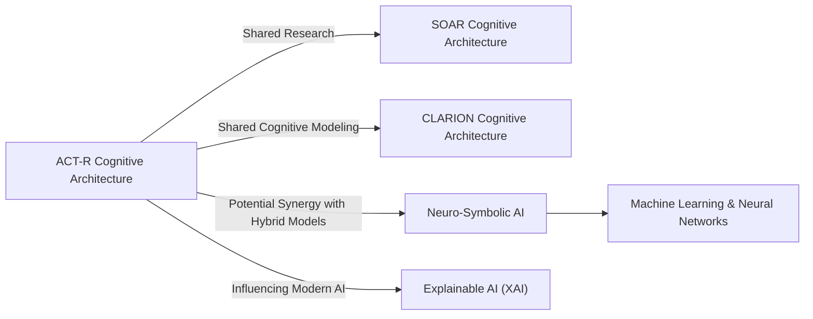

# Unified Framework for ACT-R and Cognitive Architecture Insights

## Unified Narrative

### Core Themes and Interrelations

The [[ACT-R]] cognitive architecture emerges as a **unified theory of human cognition**, integrating **symbolic (declarative and procedural knowledge)** and **subsymbolic (probabilistic, learning-driven) processes**. It aligns closely with cognitive neuroscience, providing a theoretically grounded but computationally intricate model for problem-solving, decision-making, and skill acquisition. [[ACT-R]] is particularly notable for its applications in **cognitive modeling, educational tools, human-computer interface design, and [[AI]]-driven decision-support systems**.

At the heart of [[ACT-R]]'s computational mechanisms are **Production Rules**, which facilitate goal-directed execution and adaptive reasoning. The **Conflict Resolution Mechanism** enables selection among competing rules by using subsymbolic values (e.g., utility and probability) to optimize decision-making. This mechanism **enhances task efficiency but can introduce computational overhead, complexity, and challenges related to model generalization**.

Comparisons with other cognitive architectures—**[[SOAR]]** (which focuses on hierarchical problem decomposition and chunking) and **[[CLARION]]** (which differentiates implicit and explicit learning mechanisms)—reveal that [[ACT-R]]'s **distinct advantage** lies in its **neural plausibility and modular architecture**, fostering bridges between **symbolic reasoning (traditional [[AI]]) and neural representation (connectionism)**.

A key challenge for [[ACT-R]] is its **handling of multiple concurrent goals**, as its current structure **relies on a single-goal framework**, making it difficult to model **parallel cognitive tasks**. Additionally, while [[ACT-R]] has been **highly successful in modeling human cognition**, it lacks integrated handling of **emotional and motivational factors**, aspects better captured in architectures like [[CLARION]].

### Emergent Insights and Trends

1. **Bridging [[ACT-R]] with Neuro-Symbolic AI**
	 - [[ACT-R]] is effectively a **modular hybrid system**, akin to neuro-symbolic [[AI]] approaches that **combine symbolic reasoning with deep learning**.
	 - Potential enhancements include **integrating ACT-R with neural networks to improve adaptability, pattern recognition, and real-time learning**.

2. **Cognitive Modeling for AI-based Assistants and Decision-Support Systems**
	 - ACT-R is **already used in simulation-based applications** (e.g., air traffic control, military strategy).
	 - Its **goal-directed task execution** provides insights into human-like **AI assistant development** but remains constrained by its **serial goal stack**.
	 - Future advancements must improve **parallel goal management and dynamic task re-prioritization**.

3. **Educational and Training Applications**
	 - ACT-R's production-rule system has significantly **influenced Intelligent Tutoring Systems (ITS)**.
	 - Combining ACT-R's **procedural learning capabilities with reinforcement learning** could enhance adaptive educational software, **tailoring lesson difficulty dynamically** based on student response patterns.

4. **Explainability vs. Complexity Trade-offs in AI Cognitive Models**
	 - ACT-R's **transparent rule-based system makes it explainable**, mitigating AI's 'black-box' problem.
	 - However, integrating higher levels of **stochastic and probabilistic elements** introduces **interpretability challenges**.

---

## Organized Summaries via Tables

### Bloom's Taxonomy Overview of ACT-R Concepts

| **Layer**         | **Description** | **Examples from ACT-R** |
|------------------|--------------------------------|------------------------------------------|
| **Factual**      | Basic terms and components       | Declarative vs. Procedural memory; Production Rules |
| **Conceptual**   | Interactions and theoretical frameworks | Connection to cognitive neuroscience; Relationship to SOAR & CLARION |
| **Procedural**   | Application and implementation    | Using ACT-R in Intelligent Tutoring Systems and Cognitive Assistants |
| **Metacognitive**| Reflective analysis and critique    | Limitations of ACT-R in handling parallel goals and emotions |

---

### Integral Theory Framework for Understanding ACT-R

| **Quadrant**              | **Key Takeaways from ACT-R** |
|--------------------------|--------------------------------------------------|
| **Interior-Individual**  | Insights into cognitive processes, reflection on how modeling decision-making aids human understanding |
| **Interior-Collective**  | Scientific and societal recognition of ACT-R as a standard in cognitive science, shaping theoretical discourse |
| **Exterior-Individual**  | Observable applications: AI-driven cognitive assistants, tutoring systems, human-computer interaction design |
| **Exterior-Collective**  | Impact on broader AI research, forming the foundation for hybrid neuro-symbolic reasoning models |

---

### Cross-Knowledge Integration Table

| **Related Concept**                       | **Description**                                             | **Relevance to ACT-R**                                                                                |
| ----------------------------------------- | ----------------------------------------------------------- | ----------------------------------------------------------------------------------------------------- |
| **SOAR**                                  | Problem-solving cognitive architecture                      | Focus on hierarchical task organization, comparable but distinct conflict resolution system           |
| **CLARION**                               | Dual-process cognition model                                | Complements ACT-R in handling implicit vs. explicit learning                                          |
| **Neuro-Symbolic AI**                     | Hybrid AI integrating symbolic models with neural networks  | Potential future enhancement—bridging ACT-R's structured rules with deep-learning pattern recognition |
| **Explainable AI (XAI)**                  | AI models that are interpretable                            | ACT-R's rule-based reasoning contributes to explainability but suffers from complexity                |
| **Connectionist/Machine Learning Models** | AI based on statistical paradigms and distributed cognition | Alternative approach to modeling learning processes, potential ACT-R integration for adaptability     |

---

## Emergent Relationships with Visualizations

The following **MermaidJS diagrams** illustrate **structural connections** between ACT-R, related cognitive architectures, and potential future integrations.

### ACT-R in the Larger AI Ecosystem

**Key Insights from Diagram:**
- **SOAR and ACT-R** share similarities in cognitive modeling but differ in rule selection.
- **CLARION complements ACT-R** by handling implicit vs. explicit learning more flexibly.
- **Neuro-Symbolic and XAI models intersect with ACT-R**, suggesting paths for **future AI integration.**

---

## Actionable Framework for Research and Application

### 1. Applying ACT-R to AI Assistants & Cognitive Systems

**Steps for Implementation:**
1. Use **ACT-R's goal-directed execution** to structure tasks in AI assistants.
2. Design systems with **conflict-resolution mechanisms** that refine decision-making.
3. Incorporate ACT-R's **learning mechanisms** for adaptive user interaction.

**Key Challenges & Solutions:**
- **Challenge:** ACT-R struggles with **multitasking and parallel goal management**.
- **Solution:** Implement **hybrid models** that utilize **multi-threaded execution** to simulate concurrent thought processes.

---

### 2. ACT-R as a Foundation for Next-Gen Educational Systems

**Steps for Implementation:**
4. ACT-R's production-rule structure can **inform adaptive tutoring**, adjusting tasks dynamically to learners' progress.
5. The architecture's **error-feedback modeling** can refine AI tutors' corrective action mechanisms.

**Key Challenges & Solutions:**
- **Challenge:** ACT-R's learning rate is heavily dependent on **well-structured rule bases**, limiting generalizability.
- **Solution:** Introduce **reinforcement learning mechanisms** within ACT-R's production-rule framework to improve adaptability.

---

### 3. Integrating ACT-R with Neuro-Symbolic AI for Greater Adaptability

**Steps for Implementation:**
6. Develop a **hybrid framework** combining **ACT-R's structured reasoning** with neural networks for **pattern recognition**.
7. Train symbolic **production rules dynamically** using deep-learning inference mechanisms.
8. Develop interpretable **AI decision-support tools**, leveraging ACT-R's explainable cognitive processes.

**Key Challenges & Solutions:**
- **Challenge:** Balancing **symbolic structure with learned adaptability** in hybrid AI.
- **Solution:** Implement **meta-learning algorithms** that adjust ACT-R production rules based on neural network insights.

---

## Closing Perspective: Toward a Cognitive-AI Synthesis

ACT-R represents both an **analytical framework for human cognition** and a **computational tool for intelligent systems**. Its **blending of structured symbolic rules and adaptive mechanisms** makes it an **essential component of future cognitive-AI approaches**. The next frontier in **AI and human-like reasoning lies in fusing its knowledge representation abilities with adaptive, data-driven learning**—creating **truly dynamic, interpretable intelligent agents.**
