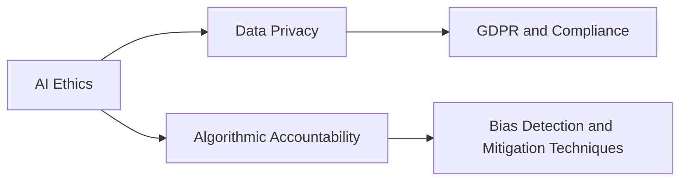

# AI Ethics

## Origin

### Immediate Circumstances

The field of [[AI Ethics]] emerged out of necessity as artificial intelligence technologies began to permeate various realms of daily life, prompting ethical concerns about their implications and applications. The immediate purpose was to explore and establish frameworks that could guide the humane and responsible development and deployment of AI, addressing issues like privacy, bias, accountability, and fairness. A significant catalyst for the creation of [[AI Ethics]] was the rapid progress in AI capabilities marked by milestones such as the revitalization of neural networks and the increased availability of big data.

### Evolution

[[AI Ethics]] has evolved significantly since its inception, expanding from a niche academic discourse to a critical element of technology deployment strategies globally. Key historical milestones include the 2016 release of the [[Asilomar AI Principles]], which laid the groundwork for ethical considerations in AI development, and the EU's General Data Protection Regulation (GDPR), which set stringent guidelines on data use and protection. Over time, [[AI Ethics]] has broadened to examine not just the immediate implications of AI technologies, but also their potential long-term impacts, such as labor displacement and existential risks.

## Possibilities

### Expected Outcomes

#### Positive Outcomes

- **Enhanced Transparency**: Implementing ethical guidelines ensures that AI systems operate transparently, allowing users to understand and trust AI-driven decisions.
- **Fairness and Inclusion**: [[AI Ethics]] promotes the development of AI systems that are free from bias, encouraging equitable treatment across diverse demographics.
- **Sustainability**: Ethical AI practices advocate for the development of technology that contributes to sustainable environmental and social progress.

#### Negative Outcomes

- **Slower Innovation**: The imposition of ethical constraints might slow the research and development process, potentially stymieing technological advancements.
- **Economic Disparities**: Misaligned AI applications could exacerbate economic inequalities if ethical principles aren't uniformly applied across different regions or industries.
- **Surveillance Risks**: Privacy-related ethical lapses could lead to more invasive surveillance systems.

## Actual Outcomes

### Positive Outcomes

- **Increased Accountability**: The increased focus on [[AI Ethics]] has led to organizations instituting robust accountability frameworks, as seen in the partnership between the Partnership on AI and multiple tech giants to study best practices.
- **Public Trust**: Enhanced efforts in ethical AI development have contributed to improved public trust, as evidenced by Google's Responsible AI Policy, which includes specific guidelines and evaluation metrics for AI systems.

### Negative Outcomes

- **Algorithmic Bias**: Despite ethical frameworks, examples like the deployment of biased facial recognition systems by some law enforcement agencies highlight the persistent risks of failing to adequately address ethical concerns.
- **Job Displacement**: The automation of jobs through AI has led to unintended workforce disruptions, necessitating new ethical considerations around economic impact mitigation.

### Resonance

AI Ethics resonates with various disciplines, enriching fields like [[Data Science]] through discussions on bias detection, and [[Philosophy]], where it examines foundational questions about machine autonomy and consciousness. It intertwines with [[AI Regulation Laws]], shaping regulations, and with [[Sociology]], exploring societal impacts.

### Distinction

AI Ethics stands in contrast to more technologically deterministic views, arguing that technology's value cannot be separated from ethical reflections. It also challenges purely economic perspectives that prioritize efficiency over moral consequences, prompting consideration of alternative models like [[Human-Centered Design]].

## Summary

### Bloom's Taxonomy Table

| **Bloom's Layer** | **Description**                     | **Examples**                                           |
| ----------------- | ----------------------------------- | ------------------------------------------------------ |
| Factual           | Terminology and core principles     | Asilomar AI Principles, GDPR                            |
| Conceptual        | Overarching ideas and patterns      | Intersection of ethics with technology deployment       |
| Procedural        | Methods to embed ethics in AI       | Development of accountability frameworks                |
| Metacognitive     | Reflective understanding            | Analyzing the impact of AI Ethics on public trust       |

### Integral Theory Table

| **Quadrant**        | **Key Elements/Insights**                            |
| ------------------- | ---------------------------------------------------- |
| Interior-Individual | Personal reflections from AI ethics scholars         |
| Interior-Collective | Cultural shifts towards ethical tech dialogues       |
| Exterior-Individual | Behavioral changes in AI research protocols          |
| Exterior-Collective | Institutional adoption of ethical AI standards       |

### Knowledge Expansion Table

| **Knowledge Item**                | **Description**                                        | **Relevance/Relationship**                      |
| --------------------------------- | ------------------------------------------------------ | ----------------------------------------------- |
| [[Data Privacy]]                  | Examines protection aspects in data usage              | Tightly linked to ethical considerations         |
| [[Algorithmic Accountability]]    | Frameworks and tools for ensuring algorithm transparency| Core part of ethical AI implementations          |
| [[Machine Learning Fairness]]     | Strategies to mitigate bias in model outputs           | Integral to achieving fair AI systems            |

### Visualization

---

## Project Link

[[Create Knowledge Management System]]
