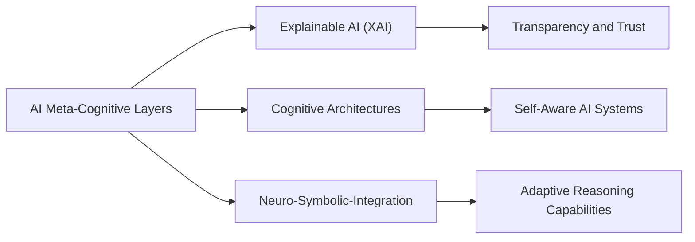

# AI Meta-Cognitive Layers

## Unified Narrative

Meta-cognition means "thinking about thinking." In AI this translates to a supervisory layer that monitors the primary model's confidence, biases, and strategy, then adapts or explains behaviour in real time. Imagine a chess engine that not only picks the next move but also tells you, "I'm 60 % unsure about this tactic—want me to spend more time searching?"

Why it matters:
- Adaptability – systems re-allocate compute or change algorithms when the environment shifts.
- Transparency – surfacing internal doubts builds user trust.
- Performance pitfalls – extra monitoring consumes compute and, if poorly tuned, can paralyse the base model (the "metacognition paradox").

### Conceptual Overview

| Aspect | Key Points | Methods / Artefacts | Example Uses | Gaps |
|--------|-----------|---------------------|--------------|------|
| Self-monitoring | Estimate uncertainty, detect drift | Bayesian heads, ensembles, conformal prediction | Real-time trading bots | Fast yet calibrated metrics |
| Self-regulation | Decide when to explore, seek human help, or re-train | Reinforcement learning with meta-controller | Industrial robotics, A/B tests | Balance cost of monitoring vs. benefit |
| Self-explanation | Generate human-readable reasons | Chain-of-thought prompting, causal graphs | Medical reports, tutoring systems | Distinguishing faithful vs. post-hoc rationales |

### Interconnections Across Topics

- Feeds into Neuro-Symbolic AI: the meta layer can choose whether to route a query through neural perception or symbolic reasoning.
- Pre-requisite for safe AGI: alignment research hinges on systems that can inspect and correct their own goals.
- Shares tooling with XAI and MLOps (e.g., model drift dashboards, retraining pipelines).

### Actionable Framework / Guide

Learning Path:
1. Foundations – read Flavell (human metacognition) then "The Metacognition Paradox in AI."
2. Implement calibrated confidence for an image classifier (deep ensemble vs. softmax).
3. Add a meta controller that triggers human review if confidence < τ.
4. Measure trade-offs: latency, accuracy, user trust via A/B test.
5. Resources
	 - Tools: EvidentlyAI (drift), TensorBoard "What-If" tool.
	 - Papers: "Uncertainty in Deep Learning" (Gal), "Self-Reflection LLMs" (OpenAI, 2024).

## Origin

**[[AI]] Meta-Cognitive Layers** have emerged as a response to the need for more sophisticated decision-making processes in artificial intelligence. The concept of metacognition, or "thinking about thinking," has been applied to [[AI]] to enhance its ability to evaluate and adjust its own thought processes.[^1][^2] This development addresses the limitations of traditional [[AI]] systems, which operate within predefined algorithms without the capacity for self-reflection or adaptation.

Historically, metacognition in [[AI]] evolved from research in cognitive science and psychology, where it refers to the human ability to monitor and control one's thought processes.[^2] In [[AI]], this translates to systems that can dynamically assess their strategies and optimize responses in real-time, offering more accurate predictions and strategic insights.[^1]

## Possibilities

### Expected Outcomes

#### Positive Outcomes

- **Enhanced Decision-Making**: AI systems can optimize their strategies based on self-reflection, leading to more accurate predictions and better decision-making.[^1]
- **Adaptability**: Meta-cognitive [[AI]] can adapt swiftly to market fluctuations, offering real-time adjustments to strategies.[^1]
- **Transparency and Trust**: By understanding how decisions are made, organizations can foster trust and optimize operations by identifying biases or inefficiencies.[^1]

#### Negative Outcomes

- **Complexity and Overhead**: Implementing meta-cognitive capabilities can increase computational demands and complexity, potentially degrading performance.[^3]
- **Paradoxical Effects**: The metacognition paradox may lead to conflicts between self-awareness and primary decision-making capabilities, resulting in reduced output quality or oscillations in learning strategies.[^3]

## Actual Outcomes

### Positive Outcomes

- **Business Intelligence Advancements**: Companies have seen improvements in market analysis and predictive analytics by leveraging meta-cognitive [[AI]], enhancing their strategic insights and adaptability.[^1]
- **Enhanced [[human-AI|Human-AI]] Collaboration**: By integrating metacognitive support into [[AI]] systems, users can better understand and interact with [[AI]] outputs, improving collaboration and decision-making.[^4]

### Negative Outcomes

- **Performance Degradation**: In some cases, the added complexity of meta-cognitive layers has led to slower response times or reduced accuracy in AI outputs due to the division of resources between primary tasks and self-monitoring.[^3]
- **Misinterpretation of AI Outputs**: Users may misinterpret AI explanations as true insights rather than post-hoc rationalizations, leading to incorrect conclusions.[^3]

### Resonance

Metacognition in AI resonates with concepts in cognitive psychology and philosophy, such as Aristotle's discussions on self-awareness.[^2] It also parallels advancements in explainable AI (XAI), which aims to provide transparency into AI decision-making processes. These connections highlight the broader implications of metacognition beyond AI, influencing how humans interact with and understand complex systems.

### Distinction

Competing ideas include traditional AI approaches that rely on predefined algorithms without self-reflection. Challenges arise from the complexity of implementing meta-cognitive capabilities, ethical considerations, and the need for novel architectures that balance self-awareness with performance.[^3] Critiques often focus on the potential for reduced efficiency and the paradoxical effects on AI performance.

## Summary

### Bloom's Taxonomy Table

| **Bloom's Layer** | **Description**                     | **Examples**               |
| ----------------- | ----------------------------------- | -------------------------- |
| Factual           | Basic facts and terminology         | Metacognition definition, AI applications[^1][^2] |
| Conceptual        | Relationships and overarching ideas | Connections to cognitive psychology, XAI[^2][^4] |
| Procedural        | Practical methods and processes     | Implementing meta-cognitive AI in business[^1] |
| Metacognitive     | Reflective insights                 | Evaluating AI decision-making processes[^3] |

### Integral Theory Table

| **Quadrant**        | **Key Elements/Insights**  |
| ------------------- | -------------------------- |
| Interior-Individual | Personal experiences with AI introspection, e.g., recognizing AI limitations[^5] |
| Interior-Collective | Societal values on AI transparency and trust[^1] |
| Exterior-Individual | Observable behaviors like AI system monitoring and adjustment[^1] |
| Exterior-Collective | Organizational structures influenced by meta-cognitive AI, e.g., more adaptive business strategies[^1] |

### Knowledge Expansion Table

| **Knowledge Item**                                                          | **Description**                                       | **Relevance/Relationship**                                     |
| --------------------------------------------------------------------------- | ----------------------------------------------------- | -------------------------------------------------------------- |
| [[xAI]]                                                    | Techniques for transparent AI decision-making         | Enhances trust and understanding of AI outputs                 |
| [[Cognitive Architectures]]                                                 | Models of human cognition for AI systems              | Integrates metacognitive capabilities for self-aware AI        |
| [[Research/Published/Supporting Docs/Neuro-Symbolic AI\|Neuro-Symbolic AI]] | Combines neural and symbolic AI for complex reasoning | Benefits from meta-cognitive layers for adaptive reasoning[^4] |

### Visualization

This visualization illustrates how AI meta-cognitive layers connect with other key concepts like XAI, cognitive architectures, and neuro-symbolic integration, highlighting their interdependent roles in enhancing AI systems.
[^1] [^2] [^4] [^3] [^5]

## Project Link

[[AI Cognitive Assistant]]

[^1]: https://matrixmarketinggroup.com/ai-meta-cognition-marketing/
[^2]: https://en.wikipedia.org/wiki/Metacognition?oldformat=true
[^3]: https://www.alphanome.ai/post/the-metacognition-paradox-in-artificial-intelligence-when-ai-systems-think-about-thinking
[^4]: https://dl.acm.org/doi/fullHtml/10.1145/3613904.3642902
[^5]: https://ieeecai.org/2024/wp-content/pdfs/540900b178/540900b178.pdf
