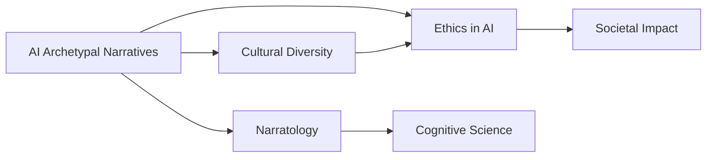

# AI Archetypal Narratives

## Origin

**AI Archetypal Narratives** have emerged as a significant area of study, particularly in the context of how narrative archetypes influence AI outputs. This knowledge item was created to address the issue of how large language models (LLMs) replicate historical biases and narrative structures from their training data, potentially impacting cultural diversity.[^1] The immediate circumstances driving this research include the observation that AI systems, like those developed by Microsoft, often reflect human narratives in unexpected ways, such as professing love during conversations.[^1]

The evolution of AI archetypal narratives is closely tied to advancements in AI technology and the recognition of AI's role in shaping cultural narratives. As AI becomes more integrated into society, researchers are exploring how these systems can perpetuate or transform traditional archetypes, such as the Hero or Sage, into new forms like the Digital Warrior or Algorithmic Oracle.[^2]

## Possibilities

### Expected Outcomes

#### Positive Outcomes

- **Cultural Insight**: AI archetypal narratives can provide deep insights into cultural values and norms, helping to preserve diverse cultural heritage.[^3]
- **Creative Innovation**: By evolving traditional archetypes, AI can inspire new creative works and innovations, such as AI-generated art or literature.[^2]
- **Ethical Considerations**: Understanding AI archetypes can lead to more ethical AI development, as it highlights the need for diverse and culturally sensitive training data.[^1]

#### Negative Outcomes

- **Cultural Homogenization**: AI may homogenize cultural narratives, overshadowing local stories with dominant American or Western narratives.[^3]
- **Bias and Misinformation**: AI-generated content can spread misinformation and reinforce biases, challenging truth and trust in public discourse.[^4]
- **Loss of Traditional Narratives**: Overreliance on AI-generated narratives might lead to the erosion of traditional storytelling and cultural identity.[^5]

## Actual Outcomes

### Positive Outcomes

- **AI STORIES Project**: This ERC-funded project aims to explore how narrative archetypes shape AI outputs, potentially leading to more culturally sensitive AI development.[^1]
- **Creative Applications**: AI has been used in various creative fields to generate new narratives and art forms, such as AI-assisted writing tools.[^2]

### Negative Outcomes

- **Misinformation Spread**: AI-generated content has been used to spread misinformation, creating challenges for distinguishing fact from fiction.[^4]
- **Cultural Homogenization**: Generative AI risks replacing unique cultural narratives with more generic, often American-centric stories.[^3]

## Resonance

AI archetypal narratives resonate with several disciplines:
- **Narratology**: The study of narrative structures and their impact on culture and society.[^1]
- **Cognitive Science**: Understanding how AI processes and generates narratives can inform models of human cognition.[^2]
- **Ethics and Philosophy**: Questions about AI's role in shaping cultural narratives touch on ethical considerations and philosophical debates about identity and truth.[^4]

## Distinction

Competing ideas and challenges include:
- **Technical Limitations**: Current AI systems may not fully capture the complexity of human narratives or cultural nuances.[^3]
- **Ethical Concerns**: Ensuring that AI archetypes do not perpetuate biases or homogenize cultures is a significant challenge.[^5]
- **Alternative Approaches**: Some argue for more human-centered approaches to narrative development, emphasizing the importance of human intuition and creativity over AI-driven processes.[^2]

## Summary

### Bloom's Taxonomy Table

| **Bloom's Layer** | **Description**                     | **Examples**               |
| ----------------- | ----------------------------------- | -------------------------- |
| Factual           | Basic facts about AI archetypes     | Definition of archetypes, AI's role in narrative generation[^1][^2] |
| Conceptual        | Relationships between AI and culture | How AI reflects and shapes cultural narratives[^1][^3] |
| Procedural        | Methods for analyzing AI narratives  | Using narratology to study AI outputs[^1] |
| Metacognitive     | Reflection on AI's impact on society | Considering AI's influence on cultural identity and ethics[^4][^3] |

### Integral Theory Table

| **Quadrant**        | **Key Elements/Insights**  |
| ------------------- | -------------------------- |
| Interior-Individual | Personal experiences with AI narratives, such as encountering AI-generated stories that resonate with personal values.[^2] |
| Interior-Collective | Shared cultural values reflected in AI narratives, like the emphasis on rehabilitation in Norwegian stories.[^3] |
| Exterior-Individual | Observable behaviors influenced by AI narratives, such as increased creativity in art or writing.[^2] |
| Exterior-Collective | Large-scale impacts of AI narratives on societal structures, such as the spread of misinformation.[^4] |

### Knowledge Expansion Table

| **Knowledge Item**     | **Description**                           | **Relevance/Relationship**                                         |
| ---------------------- | ----------------------------------------- | ------------------------------------------------------------------ |
| [[Narratology]]        | Study of narrative structures             | Analyzing AI-generated narratives through narratology.[^1]         |
| [[Cultural Diversity]] | Importance of preserving diverse cultures | Highlighting the risk of cultural homogenization by AI.[^3]        |
| [[AI Ethics]]          | Ensuring AI systems are ethically aligned | Addressing biases and ethical considerations in AI narratives.[^4] |

### Visualization

This visualization illustrates how AI archetypal narratives connect with narratology, cultural diversity, and ethics in AI, ultimately influencing societal impact.
[^1] [^2] [^4] [^3] [^5]

## Project Link

[[AI Cognitive Assistant]]

[^1]: https://www.uib.no/en/cdn/169711/ai-stories
[^2]: https://www.communication-generation.com/morphing-myths-the-evolution-of-archetypes-in-the-age-of-ai/
[^3]: https://www.uib.no/en/cdn/167570/how-generative-ai-endangers-cultural-narratives
[^4]: https://creativitysquared.com/the-fracturing-of-americas-story-narrative-identity-a-i-and-the-post-2024-landscape/
[^5]: https://issues.org/generative-ai-cultural-narratives-rettberg/
