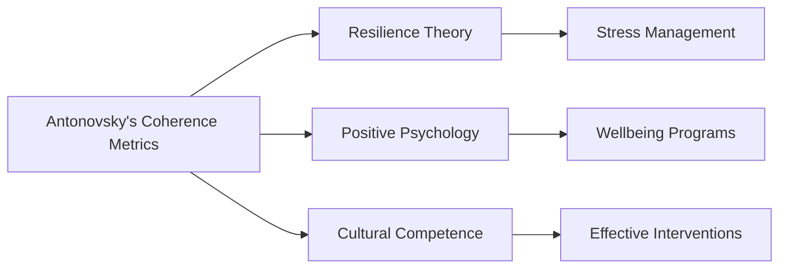

# Antonovsky's Coherence Metrics

## Origin

**[[Antonovsky's coherence metrics]]** were developed by Aaron Antonovsky in the late 1970s as part of his salutogenic theory, which focuses on understanding why some people remain healthy despite experiencing stress and hardships.[^1][^2] The immediate circumstances driving this creation were the need to explain health resilience beyond traditional pathogenic models that emphasize disease mechanisms. Antonovsky aimed to identify factors contributing to health rather than illness, leading to the concept of **Sense of Coherence (SOC)**.

The evolution of [[SOC]] includes its expansion into various fields such as psychology, sociology, and healthcare. Initially, [[SOC]] was seen as a three-component construct: **comprehensibility**, **manageability**, and **meaningfulness**.[^1][^2] Over time, it has been applied in numerous studies to assess stress resistance and health outcomes, with its metrics being used globally in diverse cultural contexts.[^2]

## Possibilities

### Expected Outcomes

#### Positive Outcomes

- **Enhanced Stress Management**: Individuals with a strong [[SOC]] tend to manage stress more effectively, leading to better health outcomes.[^2]
- **Improved Coping Strategies**: [[SOC]] helps in identifying and utilizing resources to overcome challenges, promoting resilience.[^2]
- **Health Promotion**: By focusing on health rather than disease, [[SOC]] encourages proactive health behaviors.[^1]

#### Negative Outcomes

- **Overemphasis on Individual Resilience**: Focusing solely on SOC might overlook systemic barriers to health.[^1]
- **Limited Cultural Universality**: While widely applied, [[SOC]] metrics may not fully capture cultural nuances in stress perception and coping.[^2]
- **Measurement Limitations**: The [[SOC]] scale, though reliable, may not fully capture the complexity of human experience.[^1]

## Actual Outcomes

### Positive Outcomes

- **Healthcare Applications**: [[SOC]] has been used in clinical settings to predict patient outcomes and improve treatment adherence.[^1]
- **Community Health Initiatives**: By enhancing community resources and support, [[SOC]] can be strengthened, leading to better community health.[^2]

### Negative Outcomes

- **Misapplication in Policy**: Overreliance on individual resilience might lead policymakers to overlook structural changes needed for public health.[^1]
- **Cultural Misinterpretation**: SOC metrics might not fully account for cultural differences in stress perception, potentially leading to misdiagnosis or ineffective interventions.[^2]

### Resonance

SOC resonates with concepts like **resilience** and **positive psychology**, which also focus on individual strengths and capacities for coping with adversity. In other disciplines, similar ideas are found in **stress management** and **wellness programs** that emphasize proactive health strategies.

### Distinction

Competing ideas include **pathogenic models** that focus on disease mechanisms rather than health promotion. Critiques of SOC include its potential to overlook systemic factors influencing health and its limited ability to fully capture cultural variability in stress responses.

## Summary

### Bloom's Taxonomy Table

| **Bloom's Layer** | **Description**                     | **Examples**               |
| ----------------- | ----------------------------------- | -------------------------- |
| Factual           | Basic facts and terminology         | SOC components (comprehensibility, manageability, meaningfulness) |
| Conceptual        | Relationships and overarching ideas | Salutogenic theory vs. pathogenic models |
| Procedural        | Practical methods and processes     | Applying SOC in healthcare settings |
| Metacognitive     | Reflective insights                 | Recognizing limitations of SOC in diverse cultural contexts |

### Integral Theory Table

| **Quadrant**        | **Key Elements/Insights**  |
| ------------------- | -------------------------- |
| Interior-Individual | Personal experiences of resilience and stress management through SOC |
| Interior-Collective | Cultural values emphasizing health and well-being |
| Exterior-Individual | Observable behaviors like proactive health strategies |
| Exterior-Collective | Healthcare systems and policies influenced by SOC |

### Knowledge Expansion Table

| **Knowledge Item**        | **Description**                    | **Relevance/Relationship**                      |
| ------------------------- | ---------------------------------- | ----------------------------------------------- |
| [[Resilience Theory]]     | Concept of bouncing back from adversity | Complementary to SOC in stress management |
| [[Positive Psychology]]   | Focus on individual strengths and well-being | Aligns with SOC's emphasis on health promotion |
| [[Cultural Competence]]  | Understanding cultural differences in health perceptions | Important for applying SOC metrics effectively |

### Visualization

This analysis highlights how Antonovsky's coherence metrics can be integrated into broader frameworks like the Cognitive Assistant Project by enhancing existential purpose and value alignment, particularly through aligning actions with long-term values and contextual relevance.
[^1] [^2] [^3] [^4] [^5]

## Project Link

[[AI Cognitive Assistant]]

[^1]: https://lup.lub.lu.se/search/files/2796842/625628.pdf
[^2]: https://positivepsychology.com/sense-of-coherence-scale/
[^3]: https://psychcentral.com/lib/your-sense-of-coherence
[^4]: https://www.ncbi.nlm.nih.gov/books/NBK435830/
[^5]: https://www.ncbi.nlm.nih.gov/books/NBK585678/
