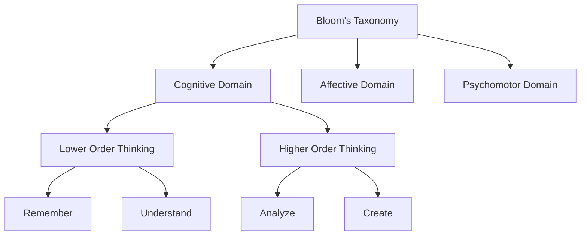

# Bloom's Taxonomy

Bloom's Taxonomy represents one of the most influential frameworks in educational theory and practice, providing a structured approach to learning objectives and assessment. Let me break this down comprehensively.

## Origins and Evolution

Benjamin Bloom and his colleagues developed the original taxonomy in 1956 to promote higher forms of thinking in education beyond simple fact recall. The framework has since evolved significantly, with a major revision in 2001 that emphasized its practical application in modern education.[^1]

Recent developments have expanded its applications beyond traditional education into various fields:
- Virtual Reality and medical training simulations[^2]
- Software development and programming education[^3]
- Business and strategic management education[^53]
- Engineering and technical education[^4]

## Applications and Outcomes

**Positive Outcomes:**
- Enhanced curriculum design and assessment strategies[^5]
- Improved student engagement and comprehension in various disciplines[^6]
- Better alignment between learning objectives and teaching methods[^7]
- Integration with modern educational technologies[^8]

**Negative Outcomes:**
- Over-emphasis on lower-order thinking skills in many educational settings[^9]
- Challenges in implementing higher-order cognitive tasks[^8]
- Potential rigidity in assessment structures[^10]
- Difficulty in measuring certain cognitive processes[^11]

## Knowledge Framework

| Bloom's Layer | Description | Examples |
|---------------|-------------|-----------|
| Factual | Basic elements students must know | Terminology, specific details, elements[^12] |
| Conceptual | Interrelationships among basics | Classifications, principles, theories[^8] |
| Procedural | How to do something | Skills, algorithms, techniques[^2] |
| Metacognitive | Knowledge of cognition | Strategic knowledge, self-knowledge[^8] |

## Integral Theory Mapping

| Quadrant            | Key Elements/Insights                                 |
| ------------------- | ----------------------------------------------------- |
| Interior-Individual | Critical thinking development, cognitive growth[^7]  |
| Interior-Collective | Shared educational values, pedagogical norms[^1]      |
| Exterior-Individual | Observable learning outcomes, skill demonstration[^12] |
| Exterior-Collective | Educational systems, institutional frameworks[^5]     |

## Knowledge Expansion

| Knowledge Item    | Description                      | Relevance                          |
| ----------------- | -------------------------------- | ---------------------------------- |
| Digital Learning  | Technology-enhanced education    | Supports modern implementation[^8] |
| Assessment Design | Evaluation methods               | Core application area[^5]          |
| Cognitive Science | Understanding learning processes | Theoretical foundation[^7]         |

## Visualization

## Resonance and Relationships

Bloom's Taxonomy has found significant resonance across multiple disciplines:
- Integration with virtual reality for medical education[^2]
- Application in engineering education methodologies[^4]
- Adaptation for business and management training[^53]
- Implementation in computer science education[^3]

## Distinction and Critiques

Several key limitations and challenges have emerged:
- The hierarchical nature may not always reflect real learning processes[^10]
- Difficulty in measuring higher-order thinking skills[^11]
- Potential oversimplification of complex learning processes[^13]
- Challenges in cross-cultural applications[^14]

The framework continues to evolve, with recent adaptations incorporating digital technologies and modern pedagogical approaches.[^8][^2] Its enduring influence on educational practice demonstrates both its fundamental value and its adaptability to changing educational needs.[^6]

Citations:

[^1]: https://www.semanticscholar.org/paper/8a1e8ebbfda3e3c1dda37dfedd7f9817f970dcab
[^2]: https://www.semanticscholar.org/paper/5f7d9493a8d52ff1d825c77da64f95abb34707b7
[^3]: https://www.semanticscholar.org/paper/7d796f6ed7a500b904811feac181a42ce71c159e
[^4]: https://www.semanticscholar.org/paper/850f784a4ea4678d58dbd1251ab03d6d24aa5245
[^5]: https://www.semanticscholar.org/paper/ac51f9de284310761c142f76b5071ba6bba776d3
[^6]: https://www.semanticscholar.org/paper/5959a597e24756257edb0c686d57fad2d2144688
[^7]: https://www.ncbi.nlm.nih.gov/pmc/articles/PMC11000043/
[^8]: https://www.semanticscholar.org/paper/35de236e07dde531ae8abf49c22e83dab1c3b8fa
[^9]: https://www.semanticscholar.org/paper/050ca7b40b219d91faeba10aeba526e104810122
[^10]: https://www.semanticscholar.org/paper/ebce5d0cfa11fe20b000adac3d2603ca88495b34
[^11]: https://www.semanticscholar.org/paper/7db6652a0fb25ebd58396988ec99fd919a30afd5
[^12]: https://www.semanticscholar.org/paper/f17d392e9f25168c3ab2d0798f09ca0e668e0f77
[^13]: https://www.semanticscholar.org/paper/49d071808226b43655902e27464f17454c8a552b
[^14]: https://www.semanticscholar.org/paper/4979ac8f82e6adc69327e7f7c5cb316a07366cb9
