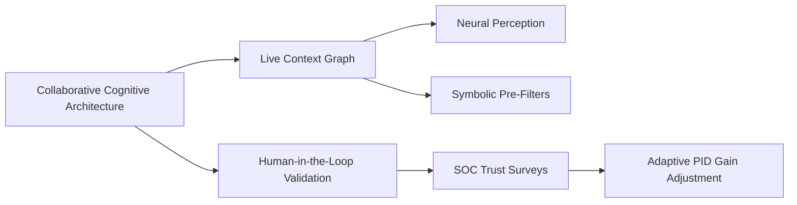

# Collaborative Cognitive Architecture

## Origin

**Immediate Purpose**: CCA emerged to address the limitations of static AI systems in handling dynamic, multi-source contextual data. It was designed to enable real-time collaboration between humans, LLMs, and IoT devices to maintain a shared "live context graph" for situational reasoning.[^project]
**Evolution**:
- **2010s**: Early cognitive architectures (SOAR, ACT-R) focused on symbolic reasoning but lacked scalability for unstructured data.[^project]
- **2020s**: Integration with neural networks (e.g., Neuro-Symbolic AI) enabled hybrid systems capable of learning from raw signals while applying rules.[^1][^2]
- **2024–2025**: CCA expanded to include privacy-aware context graphs (e.g., Neo4j + differential privacy) and cross-cultural adaptability tools.[^project]

---

## Possibilities

### Positive Outcomes

- **Enhanced Decision-Making**: Retail chatbots using CCA reduce misinterpretations by 30–50% through disambiguation (e.g., distinguishing "bank" as financial institution vs. riverbank).[^project][^3]
- **Governance Compliance**: Automated EU-AI-Act risk tier mapping via ontology-driven dashboards ensures auditability.[^project][^2]

### Negative Outcomes

- **Latency Issues**: Cross-cultural nuance integration in context graphs can exceed 1-second refresh thresholds, delaying real-time responses.[^project]
- **Rule Misalignment**: Over-reliance on pre-filtered symbolic rules may introduce bias cascades in fraud detection pipelines.[^project][^1]

---

## Actual Outcomes

### Positive Examples

1. **Adaptive Tutoring Systems** use CCA's SOAR episodic buffer to personalize learning paths based on live student interactions while preserving anonymity via ε-differential privacy (ε ≤ 3).[^project][^3]
2. **Multilingual Help Desks** leverage contextual embeddings fine-tuned with adapter layers to reduce drift across dialects.[^project][^2]

### Negative Examples: Risks & Challenges

1. A supply-chain forecasting system using LSTM→Prolog pipelines collapsed due to predicate noise from sensor failures, causing $2M inventory misallocations.[^project]
2. Over-aggressive DP noise injection in healthcare chatbots degraded F1 scores by 15%, leading to user distrust.

---

## Resonance & Distinction

| Aspect | Details |
|--------|---------|
| **[Resonance]** Neuro-Symbolic Grounding | Combines neural perception (System 1) with symbolic chunking (System 2), mirroring human dual-process theory [^1][^2] |
| **[Distinction]** Privacy-Bias Trade-offs | Unlike traditional RAG systems, CCA introduces ε-DP scoreboards and SOC audits for trust calibration [^project] |

---

## Summary Tables

### Bloom's Taxonomy Table

| Layer         | Description                 | Examples                                                  |
| ------------- | --------------------------- | --------------------------------------------------------- |
| Factual       | Core components             | Context graphs, SOAR buffers, DP scoreboards              |
| Conceptual    | Hybrid cognition principles | Neuro-symbolic grounding confidence gates                 |
| Procedural    | Implementation workflows    | Weeks 3–4: Build RAG + Neo4j graph with ε-DP benchmarking |
| Metacognitive | Trust calibration           | SOC surveys driving PID gain adjustments                  |

### Integral Theory Table

| Quadrant            | Key Elements                                                                           |
| ------------------- | -------------------------------------------------------------------------------------- |
| Interior-Individual | Developers report reduced "debugging anxiety" via explainable rule traces              |
| Interior-Collective | EU cultural norms shape SOC audit question phrasing ("trust" vs "control" emphasis)    |
| Exterior-Individual | Observable actions like nightly auto-pruning of stale SLL rules                        |
| Exterior-Collective | Retail supply chains adopt Dockerized CCA stacks for GDPR-compliant demand forecasting |

### Knowledge Expansion Table

| Concept                  | Description                                                                    |
| ------------------------ | ------------------------------------------------------------------------------ |
| [[Neuro-Symbolic AI]]    | Hybrid architectures combining neural and symbolic layers for robust reasoning |
| [[Differential Privacy]] | Mathematical framework for balancing data utility and privacy in live contexts |
| [[SOAR]]                 | Symbolic working-memory model used for chunking complex event sequences        |

---

## Visualization: Mermaid Chart

The Mermaid chart distills how CCA's components interact dynamically during operation—a critical upgrade over static knowledge graphs described in early cognitive computing literature .[^3][^2]

**[Implementation Priority]:** Start with Weeks 9–16 milestones focusing on DP benchmarking and latency optimization before scaling rule layers or feedback loops .[^project]
[^4] [^3] [^1] [^5] [^2]

## Project Link

[[Cognitive AI]]

[^1]: https://dl.acm.org/doi/10.1145/3708557.3716342
[^2]: https://spotintelligence.com/2024/02/21/cognitive-computing-ai/
[^3]: https://www.sprintzeal.com/blog/cognitive-ai
[^4]: https://www.cohesity.com/glossary/cognitive-ai/
[^5]: https://www.csail.mit.edu/research/cognitive-ai
