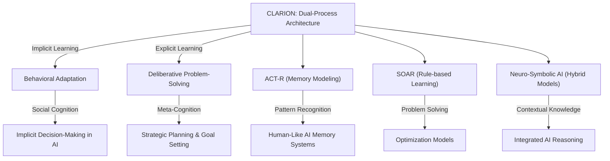

# CLARION: A Unified Cognitive Framework

## Unified Narrative

**[[CLARION]] (Connectionist Learning with Adaptive Rule Induction ON-line)** is a **cognitive architecture** designed by **Ron Sun** to model human cognition by integrating **implicit and explicit processes**. Its unique dual-process approach combines **symbolic (explicit) and sub-symbolic (implicit) representations**, distinguishing it from other cognitive architectures like **[[ACT-R]]** and **[[SOAR]]**.

### Core Structure & Subsystems

1. **Implicit-Explicit Interaction:**
	 - The **implicit layer** handles **subconscious, intuitive learning** (e.g., pattern recognition, procedural knowledge).
	 - The **explicit layer** is responsible for **deliberate reasoning, rule-based decision-making, and symbolic representation**.

2. **Key Subsystems:**
	 - **Action-Centered Subsystem (ACS):** Controls decision-making and action selection.
	 - **Non-Action-Centered Subsystem (NACS):** Stores conceptual knowledge supporting reasoning.
	 - **Motivational Subsystem (MS):** Influences decisions based on **drives, emotions, and goals**.
	 - **Meta-Cognitive Subsystem (MCS):** Adjusts system learning, decision-making, and regulation of cognition.

### Key Insights across Knowledge Items

#### 1. Dual-process Cognition is Critical for Learning and Intelligence

	 - Both **implicit (intuition, habits)** and **explicit (reasoning, structured knowledge)** are necessary for robust design in **[[AI]], psychology, and decision-making systems**.  
	 - **Interactivity** between implicit and explicit cognition leads to **adaptive intelligence**, allowing real-time **learning, reasoning, and problem-solving**.  

#### 2. Meta-Cognitive & Motivational Layers Act as Governance Mechanisms

	 - The **meta-cognitive system (MCS)** monitors, adjusts, and refines **learning strategies and cognitive functions** to improve efficiency.  
	 - The **motivational subsystem (MS)** introduces **goals, values, and adaptation mechanisms**, improving **autonomy, emotions, and self-adjustment**.  

#### 3. CLARION's Adaptability Enables Social & Environmental Awareness

	 - CLARION successfully models **social decision-making** (e.g., emotional contagion, cooperation, ethical considerations).  
	 - The implicit aspect enhances **social intuition**, enabling **human-like interaction in AI applications**.  
	 - Context-shifting mechanisms ensure agents can **adapt to new situations without explicit retraining**.  

#### 4. Realized Benefits & Limitations

	 **Benefits**  
	 - Enables **realistic simulations** of **human problem-solving and reasoning**.  
	 - Improves **decision-making** by balancing **intuitive (fast) and deliberative (slow) cognitive systems**.  
	 - Enhances **AI applications** through **human-AI collaboration and adaptive intelligence**.  

	 **Challenges**  
	 - **Computational complexity** makes real-world AI applications challenging.  
	 - **Implicit learning biases** can lead to **opaque decision-making** or ethical risks.  
	 - **Scalability issues** in large-scale AI or real-time autonomous systems.  

---

## Organized Summaries via Tables

### 1. Bloom's Taxonomy: Layers of CLARION Understanding

| **Bloom's Level**  | **Description**  | **Examples from CLARION** |
|---------------|-------------|-----------------|
| **Factual Knowledge**  | Understanding core concepts  | Dual-process cognition, subsystems (ACS, NACS, MS, MCS)  |
| **Conceptual Knowledge**  | Recognizing interrelations  | **Implicit learning guiding explicit knowledge acquisition** (e.g., adaptive decision-making)  |
| **Procedural Knowledge**  | Applying concepts to tasks  | Simulating **minefield navigation, Raven's Matrices problem-solving, serial reaction time tasks**  |
| **Metacognitive Knowledge**  | Reflecting on learning  | Evaluating the role of implicit bias in **AI decision-making and cognitive modeling**  |

---

### 2. Integral Theory: CLARION's Cognitive & Social Impact

| **Quadrant**  | **Key Insights**  |
|--------------|-------------|
| **Interior-Individual (Personal Thought & Emotion)**  | CLARION models **human intuition, emotion, and subconscious decision-making**. |
| **Interior-Collective (Societal Norms & Ethics)**  | Affects AI transparency discussions (e.g., balancing implicit automation with explicit human intervention). |
| **Exterior-Individual (Observable Behavior)**  | Enhances AI-human collaboration with **adaptive learning assistants**. |
| **Exterior-Collective (Systemic or Organizational Impact)**  | Applied in **decision-support systems, social simulation models, and AI ethics research**. |

---

### 3. Knowledge Expansion Framework: CLARION's Context Across Fields

| **Knowledge Item**  | **Description**  | **Relation to CLARION**  |
|------------------|----------------|----------------|
| **ACT-R**  | Models declarative & procedural memory  | Alternative approach to **cognitive modeling** |
| **SOAR**  | Uses symbolic production rules for problem-solving  | Lacks a strong **implicit learning** component  |
| **Neuro-Symbolic AI**  | Combines symbolic AI with deep learning   | Aligns with **CLARION's implicit-explicit hybrid approach**  |
| **Dual Process Theory**  | Psychological model of **fast (System 1) vs. slow (System 2) thinking**   | **CLARION operationalizes this model computationally**  |

---

## Emergent Relationships with Visualizations

---

## Actionable Framework/Guide for Real-World Use

### 1. Applications of CLARION's Insights in AI & Cognitive Systems

| **Practical Steps**  | **Use Cases**  |
|----------------|---------------|
| **Integrate implicit-explicit AI models**  | Adaptive learning AI, Assistive robotics  |
| **Develop AI transparency layers**  | Explainable AI (XAI) to mitigate opacity in **implicit learning models**  |
| **Leverage meta-cognitive oversight**  | AI self-regulation mechanisms that adjust learning dynamically  |

---

### 2. Research Roadmap for Extending CLARION's Functionality

| **Expansion Area**  | **Key Open Questions**  |
|----------------|----------------|
| **Implicit learning resilience**  | How do unconscious biases emerge in AI cognitive systems?  |
| **AI emotional intelligence**  | Can implicit learning improve **affective computing & empathy simulation**?  |
| **Cognitive scalability**  | How can CLARION handle real-time decision-making at scale?  |

---

### 3. Ethical & Implementation Considerations

| **Challenge**  | **Possible Solutions**  |
|---------------|----------------|
| **Ethical concerns (bias in implicit learning)**  | Introduce hybrid **meta-cognitive oversight & explainability layers**  |
| **Computational complexity**  | Develop **optimized learning algorithms for real-time efficiency**  |
| **Lack of mainstream adoption**  | Integrate CLARION's insights into **existing AI frameworks like neuro-symbolic models**  |

---

## Conclusion

CLARION represents a pioneering approach to **cognitive modeling**, contributing significantly to AI, psychology, and decision science. Its **dual-process architecture, subsystems for motivation & meta-cognition, and real-world adaptability** make it highly versatile for **artificial intelligence, cognitive assistance, and autonomous decision-making systems**. However, CLARION's complexity and computational demands present challenges for broader real-world deployment. Future work lies in **optimizing computational models, improving explainability, and expanding AI social awareness**.
[^1] [^2] [^3] [^4] [^5] [^6] [^7] [^8] [^9] [^10] [^11] [^12] [^13] [^14] [^15] [^16] [^17] [^18] [^19] [^20] [^21] [^22] [^23] [^24] [^25] [^26] [^27] [^28]

## Project Link

[[AI Cognitive Assistant]]

[^1]: https://en.wikipedia.org/wiki/Dual_process_theory
[^2]: https://www.researchgate.net/figure/The-Clarion-cognitive-architecture-The-subsystems-of-Clarion-are-shown-The-major_fig1_321354902
[^3]: https://typeset.io/pdf/the-clarion-cognitive-architecture-a-tutorial-3yvr97l4gp.pdf
[^4]: https://homepages.hass.rpi.edu/rsun/folder-files/clarion-intro-slides.pdf
[^5]: https://ccn.psych.purdue.edu/papers/ijcnn10-helie-sun.pdf
[^6]: https://en.wikipedia.org/wiki/CLARION_(cognitive_architecture)
[^7]: https://homepages.hass.rpi.edu/rsun/folder-files/clarion-intro-slides.pdf
[^8]: https://ccn.psych.purdue.edu/papers/cogArch_agent-springer.pdf
[^9]: https://bpb-us-e1.wpmucdn.com/sites.northwestern.edu/dist/8/4164/files/2012/07/Reber-Implicit-Learning-2017.pdf
[^10]: https://elifesciences.org/articles/39882
[^11]: https://snap.berkeley.edu/project/12247973
[^12]: https://arxiv.org/abs/2207.01059
[^13]: https://www.researchgate.net/publication/303802975_Implicit_Context-Specific_Learning_Leads_to_Rapid_Shifts_in_Syntactic_Expectations
[^14]: https://en.wikipedia.org/wiki/CLARION_(cognitive_architecture)
[^15]: https://sites.google.com/site/drronsun/clarion/clarion-publications
[^16]: https://ccn.psych.purdue.edu/papers/ijcnn11-clarionm.pdf
[^17]: https://acs.ist.psu.edu/misc/dirk-files/Papers/Automaticity%20of%20social%20behavior/IntuitionA%20social%20cognitive%20neuroscience%20approach.htm
[^18]: https://www.researchgate.net/figure/The-four-subsystems-of-CLARION-ACS-stands-for-the-Action-Centered-Subsystem-NACS-stands_fig1_266377339
[^19]: https://homepages.hass.rpi.edu/rsun/folder-files/clarion-intro-slides.pdf
[^20]: https://en.wikipedia.org/wiki/CLARION_(cognitive_architecture)
[^21]: https://academic.oup.com/book/37037/chapter-abstract/322690910?redirectedFrom=fulltext
[^22]: https://www.youtube.com/watch?v=HLFijuMhJWQ
[^23]: https://homepages.hass.rpi.edu/rsun/folder-files/clarion-msmcs-slides.pdf
[^24]: https://en.wikipedia.org/wiki/CLARION_(cognitive_architecture)
[^25]: https://homepages.hass.rpi.edu/rsun/folder-files/clarion-intro-slides.pdf
[^26]: https://academic.oup.com/book/37037/chapter-abstract/322690910?redirectedFrom=fulltext
[^27]: https://sites.google.com/site/drronsun/clarion/clarion-publications
[^28]: https://www.researchgate.net/publication/288687620_The_CLARION_Cognitive_Architecture_Extending_Cognitive_Modeling_to_Social_Simulation
