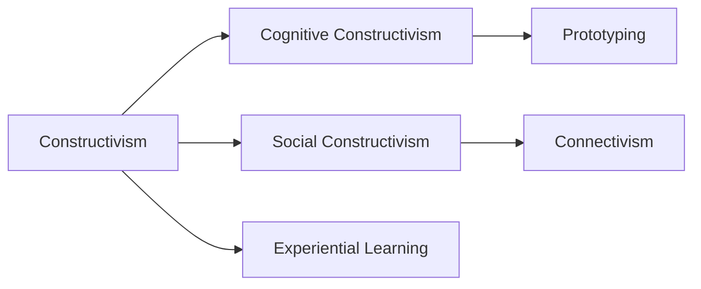

# Constructivism in Knowledge Management

## Origin

Constructivism is a learning theory that posits individuals construct their own understanding and knowledge of the world through experiencing things and reflecting on those experiences. This educational approach emerged in the 20th century as a reaction against passive, rote learning techniques. The immediate circumstances triggering its inception were marked by a need to enhance educational effectiveness and accommodate diverse learning needs.

Jean Piaget and Lev Vygotsky, pioneers of constructivism, sought to address limitations in traditional instructional methods by focusing on learners as active participants in the knowledge acquisition process. Piaget introduced the idea of cognitive development stages, emphasizing that learning is fundamentally a reconstruction. Vygotsky brought forth the social aspect of learning, indicating the vital role of language and interaction [[Social Constructivism]].

As the theory evolved, it expanded into various branches, including [[Social Constructivism]] and [[Cognitive Constructivism]]. It influenced diverse fields beyond education, such as psychology, sociology, and cognitive science, continually shaping how knowledge is perceived, communicated, and valued.

## Possibilities

### Expected Outcomes

**Positive Outcomes:**
- Encourages deeper engagement and critical thinking, leading to profound knowledge retention and application.
- Supports personalized learning journeys, accommodating individual differences and promoting inclusivity.
- Enhances collaborative learning, building essential communication skills and fostering community-building.

**Negative Outcomes:**
- Misinterpretation or misapplication can result in ambiguous knowledge constructs, leading to confusion or inaccuracies.
- Overemphasis on subjective interpretation might dilute essential factual knowledge, potentially sidelining core educational content.
- Challenges in standardization and assessment, particularly in formal educational settings, can create logistical and pedagogical complexities.

## Actual Outcomes

### Positive Outcomes

In practice, constructivism has revolutionized educational environments. For instance, Finland's education system, heralded globally for its effectiveness, heavily integrates constructivist principles, encouraging active learning and student participation. This approach has been linked to high student satisfaction and consistently outstanding PISA scores.

In the professional realm, tech companies like IDEO successfully use prototyping—an offshoot of [[Cognitive Constructivism]]—to drive innovation. By encouraging hands-on experience, reflection, and iteration, these companies foster a culture of continuous learning and adaptation, vital in fast-paced industries.

### Negative Outcomes

Conversely, challenges have arisen, as seen in some digital education platforms that rely heavily on user-generated content. Platforms can inadvertently become echo chambers, where inaccurate information propagates unchecked due to constructivism's reliance on individual contributions and interpretations, leading to the spread of misinformation.

### Resonance

Constructivism resonates with numerous fields, such as [[Experiential Learning]] and [[Social Learning Theory]], emphasizing learning through doing and observation, respectively. It complements [[Connectivism]] in digital learning contexts, reflecting the networked knowledge landscape where connections form the core of understanding.

### Distinction

Counter to constructivism are traditional instructional designs, like behaviorism, that champion structured learning through reinforcement. While constructivist methods may lack uniformity and predictability, they are critiqued for demanding high cognitive and logistical resources, making them challenging to scale in some educational systems.

# Summary

## Bloom's Taxonomy Table

| **Bloom's Layer** | **Description**                     | **Examples**               |
| ----------------- | ----------------------------------- | -------------------------- |
| Factual           | Basic facts and terminology         | Piaget's stages of development, Vygotsky's ZPD |
| Conceptual        | Relationships and overarching ideas | Interaction and social context as learning elements |
| Procedural        | Practical methods and tools         | Use of collaborative projects and peer teaching |
| Metacognitive     | Reflective insights                 | Self-assessment and self-reflection practices |

## Integral Theory Table

| **Quadrant**        | **Key Elements/Insights**  |
| ------------------- | -------------------------- |
| Interior-Individual | Self-reflection: A learner realizes their unique learning style through constructivist methods. |
| Interior-Collective | Group learning frameworks emphasize shared cultural values and enhance community engagement. |
| Exterior-Individual | Educators adapting their roles from instructors to facilitators to foster individual learning paths. |
| Exterior-Collective | Finnish education system as a network influenced by constructivist principles, emphasizing a system-wide approach to learning. |

## Knowledge Expansion Table

| **Knowledge Item**        | **Description**                    | **Relevance/Relationship**                      |
| ------------------------- | ---------------------------------- | ----------------------------------------------- |
| [[Experiential Learning]] | Learning through direct experience | Overlaps with constructivist methods emphasizing real-world problem solving |
| [[Social Constructivism]] | Focus on social interactions in learning | An extension of constructivism highlighting social dimensions |
| [[Connectivism]]          | Focuses on networks and knowledge sharing in digital age | Complements constructivism's emphasis on connectivity in knowledge building |

## Visualization

---

# Project Link

[[Create Knowledge Management System]]
