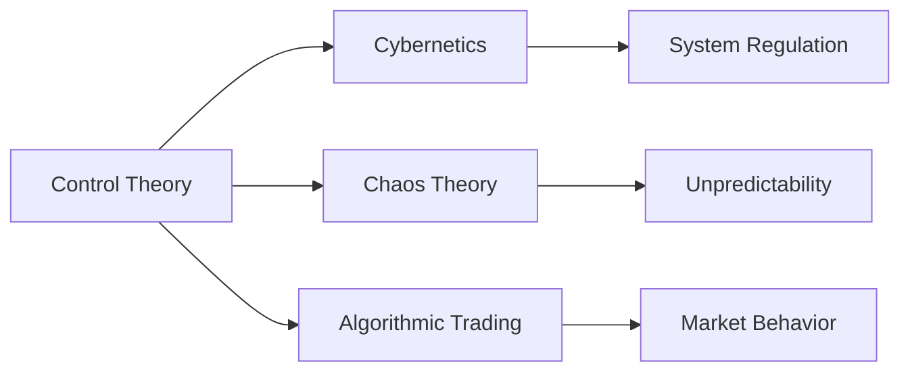

# Control Theory

## Origin

Control theory emerged from the need to systematically manage and stabilize dynamic systems. It originated alongside the Industrial Revolution when the complexity of machinery demanded more sophisticated approaches to regulation and control. James Clerk Maxwell's 1868 paper on governors is a landmark document in control theory; it addressed the complexity of maintaining consistent speed in steam engines, marking the start of analytical control system design.

Over time, control theory expanded through contributions from mathematics, physics, and engineering, becoming a foundational framework in modern systems theory. Significant milestones include the development of feedback mechanisms, the introduction of the Laplace transform for system analysis, and the advent of digital control systems with the rise of computer technology. Today's control theory applications span various industries from aerospace to finance, continuously evolving with advances in technology and computational power.

## Possibilities

**Expected Outcomes**

Control theory provides predictive and regulatory capabilities for dynamic systems. Its applications mainly revolve around:

**Positive Outcomes:**
- **Stability and Efficiency:** Enhancing system stability and operational efficiency, crucial for industries like aviation where [[autopilot systems]] rely heavily on control algorithms.
- **Automation and Productivity:** Facilitating automation, leading to increased productivity. For example, [[industrial robotics]] employ control theory to perform tasks with precision and consistency.
- **System Optimization:** Allowing for optimization in fields like [[supply chain management]], where demand and schedule variations are dynamically controlled to meet productivity objectives.

**Negative Outcomes:**
- **Over-Reliance on Models:** Dependence on mathematical models can overlook system nuances, potentially leading to inaccuracies or failures if the model assumptions are violated.
- **Complexity and Implementation Costs:** Designing and implementing control systems can be complex and costly, demanding significant expertise and resources.
- **Unintended Consequences:** Misapplication might result in [[automation bias]], where over-reliance on automated systems diminishes human oversight and judgment in critical scenarios.

## Actual Outcomes

**Positive Outcomes:**
- **Stability in Aerospace:** Control theory ensures aircraft stability and navigation accuracy, as seen in the [[fly-by-wire systems]] of modern jets.
- **Enhanced Manufacturing:** Production lines in automotive industries use control systems to maintain quality and efficiency, drastically reducing manual oversight and human error.

**Negative Outcomes:**
- **Power System Failures:** Instances like the 2003 blackout in North America show the risk of cascading failures in electrical grids, linked partly to overly complex control architectures.
- **Financial System Risks:** Control algorithms in algorithmic trading can lead to market instability if not properly regulated, shown by events like the 2010 Flash Crash.

## Resonance

Control theory's principles resonate with fields like [[Cybernetics]], where the study of regulatory systems draws on similar concepts. In neuroscience, the control theory framework aids in understanding brain function and control pathways, influencing areas like bioinformatics and [[machine learning algorithms]].

## Distinction

Alternative approaches such as [[chaos theory]] challenge control theory by emphasizing the unpredictability and complexity of dynamical systems beyond deterministic control, highlighting the need for adaptive and resilient designs.

# Summary

## Bloom's Taxonomy Table

| **Bloom's Layer** | **Description**                     | **Examples**                                           |
| ----------------- | ----------------------------------- | ------------------------------------------------------ |
| Factual           | Basic facts and terminology         | Feedback, stability, dynamic systems                    |
| Conceptual        | Relationships and overarching ideas | Feedback loops in automation systems                    |
| Procedural        | Practical methods and processes     | Designing PID controllers in engineering systems        |
| Metacognitive     | Reflective insights                 | Evaluating system robustness against model assumptions  |

## Integral Theory Table

| **Quadrant**        | **Key Elements/Insights**                                 |
| ------------------- | --------------------------------------------------------- |
| Interior-Individual | Insight into mental models and cognitive regulation       |
| Interior-Collective | Societal shift towards automation and efficiency ideals   |
| Exterior-Individual | Implementation in personal gadgets (e.g., thermostat use) |
| Exterior-Collective | Industrial adoption in complex manufacturing systems      |

## Knowledge Expansion Table

| **Knowledge Item**        | **Description**                                                                     | **Relevance/Relationship**                                                 |
| ------------------------- | ----------------------------------------------------------------------------------- | -------------------------------------------------------------------------- |
| [[Cybernetics]]           | Study of regulatory systems using control theory principles                         | Provides foundational concepts linked to control mechanisms                |
| [[Chaos Theory]]          | Focus on unpredictable behaviors in complex systems                                 | Challenges control theory with concepts of unpredictability and adaptation |
| [[Algorithmic Trading]]   | Use of control theory in financial markets to automate trading processes             | Demonstrates control theory's impact on financial system behaviors         |

## Visualization

# Project Link

[[Create Knowledge Management System]]
