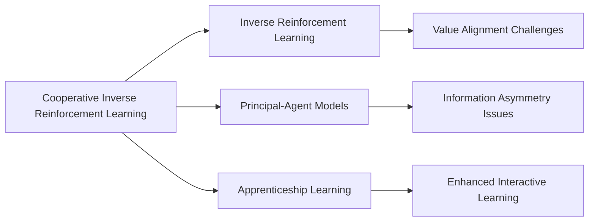

# DeepMind's Cooperative Inverse Reinforcement Learning

## Origin

**Cooperative Inverse Reinforcement Learning ([[CIRL]])** was developed to address the **value alignment problem** in artificial intelligence, ensuring that autonomous systems align their actions with human values to maximize human reward without posing unwarranted risks.[^1][^2][^3] The immediate circumstances leading to its creation involved recognizing the limitations of traditional **Inverse Reinforcement Learning (IRL)**, which assumes optimal behavior from humans. [[CIRL]], however, accounts for partial information and suboptimal human behavior, enabling more effective learning and teaching processes.[^4][^3]

[[CIRL]]'s evolution has been marked by significant milestones, including its formal definition as a cooperative, partial-information game between humans and robots, both rewarded according to the human's reward function.[^2][^3] This framework has expanded to include scenarios where humans may not behave optimally, highlighting the importance of active teaching and learning strategies.[^4]

## Possibilities

### Expected Outcomes

#### Positive Outcomes

- **Enhanced Learning and Teaching**: [[CIRL]] promotes active learning and teaching, allowing robots to learn more effectively from humans through interactive processes.[^1][^2]
- **Value Alignment**: By aligning robot actions with human values, [[CIRL]] helps ensure that [[AI]] systems contribute positively to human objectives.[^3]
- **Adaptability**: [[CIRL]] can handle suboptimal human behavior, making it more robust in real-world applications.[^4]

#### Negative Outcomes

- **Complexity**: Solving [[CIRL]] problems involves complex computations, such as reducing them to POMDPs, which can be challenging.[^1][^3]
- **Misalignment Risks**: If not implemented correctly, [[CIRL]] might still lead to value misalignment, especially if human goals are not clearly communicated.[^3]
- **Dependence on Human Behavior**: The effectiveness of [[CIRL]] heavily depends on human behavior, which can be unpredictable or suboptimal.[^4]

## Actual Outcomes

### Positive Outcomes

- **Improved Robot Learning**: CIRL has been applied in various robotics contexts, enhancing robots' ability to learn from humans through interactive demonstrations.[^1][^2]
- **Enhanced Safety**: By ensuring value alignment, CIRL contributes to safer AI systems that are less likely to pose risks to humans.[^3]

### Negative Outcomes

- **Computational Challenges**: In practice, solving CIRL problems can be computationally intensive, limiting its application in resource-constrained environments.[^1][^3]
- **Human Variability**: The effectiveness of CIRL can be hindered by variability in human behavior, which may not always align with the robot's learning objectives.[^4]

### Resonance

CIRL resonates with other disciplines through its emphasis on **value alignment** and **cooperative learning**. Similar concepts can be found in **principal-agent models** from economics, where information asymmetry between actors is a key challenge.[^3] Additionally, CIRL shares aspects with **optimal teaching** models, highlighting the importance of effective communication in learning processes.[^3]

### Distinction

CIRL distinguishes itself from traditional IRL by its focus on cooperative and interactive learning processes. However, it faces challenges such as computational complexity and dependence on human behavior, which are not as prominent in simpler IRL models.[^1][^4] Alternative approaches, like **apprenticeship learning**, also exist but may not fully capture the interactive nature of CIRL.[^3]

## Summary

### Bloom's Taxonomy Table

| **Bloom's Layer** | **Description**                     | **Examples**               |
| ----------------- | ----------------------------------- | -------------------------- |
| Factual           | Basic facts about CIRL and its purpose | CIRL is a cooperative learning framework.[^1][^2] |
| Conceptual        | Relationships between CIRL and value alignment | CIRL ensures robots align with human values.[^3] |
| Procedural        | Practical methods for implementing CIRL | Reducing CIRL to POMDPs for computation.[^1] |
| Metacognitive     | Reflective insights on CIRL's impact | Recognizing the importance of human behavior in CIRL.[^4] |

### Integral Theory Table

| **Quadrant**        | **Key Elements/Insights**  |
| ------------------- | -------------------------- |
| Interior-Individual | Personal insights into the value of interactive learning in CIRL. |
| Interior-Collective | Societal emphasis on AI safety and value alignment through CIRL. |
| Exterior-Individual | Observable behaviors of robots learning through CIRL. |
| Exterior-Collective | Organizational structures promoting CIRL for safer AI systems. |

### Knowledge Expansion Table

| **Knowledge Item**        | **Description**                    | **Relevance/Relationship**                      |
| ------------------------- | ---------------------------------- | ----------------------------------------------- |
| [[Inverse Reinforcement Learning]] | A method where AI learns from observed behavior | CIRL builds upon IRL by adding cooperative elements.[^1] |
| [[Principal-Agent Models]] | Economic models addressing information asymmetry | Similar challenges in aligning interests between human and robot.[^3] |
| [[Apprenticeship Learning]] | A paradigm for learning from human demonstrations | CIRL enhances this by incorporating interactive learning.[^3] |

### Visualization

This analysis provides a comprehensive overview of CIRL, its origins, possibilities, and actual outcomes, while also highlighting its connections to broader theoretical frameworks and related knowledge items.
[^1] [^4] [^2] [^3] [^5]

## Project Link

[[AI Cognitive Assistant]]

[^1]: https://papers.nips.cc/paper_files/paper/2016/hash/c3395dd46c34fa7fd8d729d8cf88b7a8-Abstract.html
[^2]: https://arxiv.org/abs/1606.03137
[^3]: https://people.eecs.berkeley.edu/~russell/papers/russell-nips16-cirl.pdf
[^4]: https://odr.chalmers.se/server/api/core/bitstreams/0822adb2-170e-4a27-a3fd-11af6c1d4bec/content
[^5]: https://en.wikipedia.org/wiki/Apprenticeship_learning
