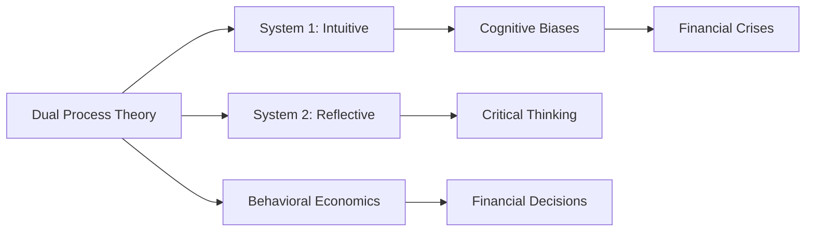

# Dual Process Theory

## Origin

**Dual Process Theory** in psychology posits that human cognition operates through two distinct systems: **System 1** (intuitive, automatic) and **System 2** (reflective, deliberate). The theory's roots trace back to William James, who distinguished between associative and true reasoning, foreshadowing the modern concepts of System 1 and System 2.[^1][^2] Over time, notable figures like Daniel Kahneman and Amos Tversky further developed this theory, emphasizing the role of heuristics and biases in decision-making.[^1]

### Evolution

- **Early Foundations**: William James laid the groundwork by differentiating between associative and true reasoning.
- **Kahneman and Tversky**: Their work on heuristics and biases significantly advanced the theory, particularly in behavioral economics.
- **Modern Applications**: Dual Process Theory is now applied across psychology, economics, and sociology, influencing fields like social psychology and behavioral economics.[^2]

## Possibilities

### Expected Outcomes

#### Positive Outcomes

- **Enhanced Decision-Making**: By understanding both intuitive and rational processes, individuals can improve decision-making by leveraging the strengths of each system.
- **Improved Cognitive Efficiency**: System 1 allows for quick, low-effort responses, while System 2 provides detailed analysis when needed.
- **Better Risk Management**: Recognizing biases in System 1 can help mitigate risks through more systematic evaluation via System 2.

#### Negative Outcomes

- **Cognitive Biases**: Overreliance on System 1 can lead to biases and errors in judgment.
- **Inefficient Use of Resources**: Overuse of System 2 can be cognitively exhausting and inefficient for routine tasks.
- **Conflict Between Systems**: Tension between intuitive and rational thinking can lead to decision paralysis.

## Actual Outcomes

### Positive Outcomes

- **Behavioral Economics**: Dual Process Theory has been instrumental in understanding consumer behavior and decision-making under uncertainty, leading to more effective economic policies.
- **Social Psychology**: It helps explain how attitudes change through both superficial and deep processing routes (e.g., Petty and Cacioppo's Elaboration Likelihood Model).[^2]

### Negative Outcomes

- **Financial Crises**: The theory explains how cognitive biases (e.g., confirmation bias) can lead to financial decisions that exacerbate crises.
- **Healthcare Decisions**: Overreliance on System 1 can result in suboptimal health choices due to biases and heuristics.

## Resonance

Dual Process Theory resonates with various cognitive architectures like **[[CLARION]]**, which also employs a dual-process model of implicit and explicit learning. It aligns with **[[MRKL]]** by highlighting the need for both intuitive and systematic processing in complex reasoning tasks.[^1][^2]

## Distinction

Competing ideas include **[[ACT-R]]**, which focuses on declarative and procedural memory, and **[[SOAR]]**, which uses production rules for problem-solving. Critiques of Dual Process Theory argue that it oversimplifies cognitive processes and doesn't fully account for the complexity of human thought.[^2]

## Summary

### Bloom's Taxonomy Table

| **Bloom's Layer** | **Description**                     | **Examples**               |
| ----------------- | ----------------------------------- | -------------------------- |
| Factual           | Basic facts and terminology         | System 1 vs. System 2      |
| Conceptual        | Relationships and overarching ideas | Heuristics and biases     |
| Procedural        | Practical methods and processes     | Using System 2 for analysis|
| Metacognitive     | Reflective insights                 | Recognizing cognitive biases|

### Integral Theory Table

| **Quadrant**        | **Key Elements/Insights**  |
| ------------------- | -------------------------- |
| Interior-Individual | Personal decision-making insights |
| Interior-Collective | Cultural norms influencing decision-making |
| Exterior-Individual | Observable behaviors like risk-taking |
| Exterior-Collective | Economic systems impacted by biases |

### Knowledge Expansion Table

| **Knowledge Item**        | **Description**                    | **Relevance/Relationship**                      |
| ------------------------- | ---------------------------------- | ----------------------------------------------- |
| [[Cognitive Biases]]     | Systematic errors in thinking      | Explains how System 1 can lead to biases         |
| [[Behavioral Economics]] | Study of psychological influences on economic decisions | Applies Dual Process Theory to understand consumer behavior |

### Visualization

This analysis provides a comprehensive understanding of Dual Process Theory, its applications, and its relevance to cognitive architectures and decision-making processes. It highlights both the benefits and pitfalls of relying on intuitive versus reflective thinking and connects these concepts to broader frameworks like Bloom's Taxonomy and Integral Theory.
[^1] [^2] [^3] [^4] [^5]

## Project Link

[[AI Cognitive Assistant]]

[^1]: https://www.structural-learning.com/post/exploring-dual-process-theory
[^2]: https://en.wikipedia.org/wiki/Dual_process_theory
[^3]: https://worldofwork.io/2019/07/dual-process-theory/
[^4]: https://scottbarrykaufman.com/wp-content/uploads/2014/04/dual-process-theory-Evans_Stanovich_PoPS13.pdf
[^5]: https://www.frontiersin.org/journals/psychology/articles/10.3389/fpsyg.2022.805386/full
