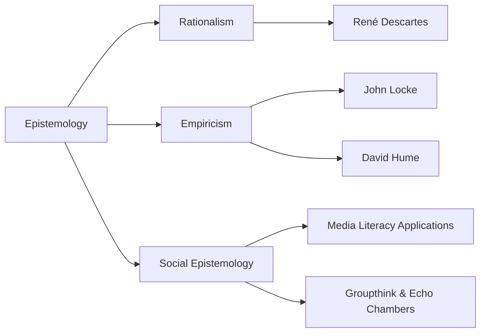
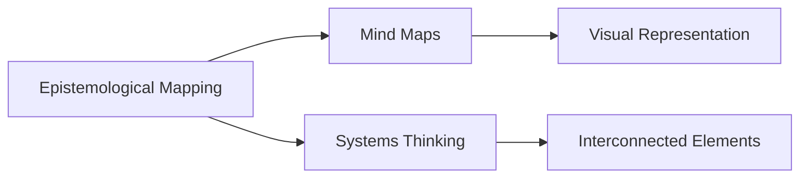

# Comprehensive Analysis of Epistemology

## Narrative

### Origin

Epistemology, the branch of philosophy concerned with the theory of knowledge, traces its origins back to Ancient Greece. The term itself derives from the Greek words "episteme" (knowledge) and "logos" (study or discourse). Epistemology emerged as an effort to address foundational questions about what we can know, how we come to know it, and what distinguishes justified belief from mere opinion.

#### Immediate Circumstances of Creation

The birth of epistemology was deeply tied to the intellectual environment of Ancient Greece, where philosophers like [[Socrates]], [[Plato]], and [[Aristotle]] sought to understand the nature of reality and truth. Socratic dialogues often revolved around questioning assumptions and probing the basis for claims—a method foundational to epistemological inquiry. [[Plato]]'s theory of forms introduced questions about whether true knowledge resides in sensory experience or in abstract reasoning. [[Aristotle]] expanded this conversation by emphasizing empirical observation as a pathway to knowledge.

#### Evolution Over Time

Epistemology evolved significantly over centuries:
- **Middle Ages:** Scholastic philosophers like Thomas Aquinas integrated epistemology with theological frameworks, focusing on reconciling faith and reason.
- **Modern Era:** Thinkers such as René Descartes ("I think, therefore I am") emphasized rationalism—the idea that reason is the primary source of knowledge—while empiricists like John Locke and David Hume argued for sensory experience as central to acquiring knowledge. This era also saw [[Immanuel Kant]]'s synthesis of rationalism and empiricism through his theory that our understanding is shaped by both innate structures in the mind and sensory input.
- **Contemporary Philosophy:** Modern epistemology has expanded into areas such as [[social epistemology]] (the study of collective knowledge), [[feminist epistemology]], which critiques traditional philosophical biases, and [[virtue epistemology]], which emphasizes intellectual virtues in acquiring justified beliefs.

---

### Possibilities

#### Expected Outcomes

##### *Positive Outcomes*

1. **Enhanced Decision-Making:** By applying epistemological principles like critical thinking and skepticism, individuals can make more informed decisions in areas like business strategy or personal finance (e.g., assessing sources before investing).
2. **Progressive Scientific Inquiry:** Epistemological frameworks underpin scientific methods—emphasizing observation, hypothesis testing, peer review—which have led to technological advancements like vaccines or space exploration.
3. **Improved Communication Across Disciplines:** Understanding how different fields validate knowledge (e.g., evidence-based medicine vs theoretical physics) fosters interdisciplinary collaboration.
4. **Empowerment via Media Literacy:** In an age rife with misinformation, knowing how to evaluate evidence promotes civic engagement and informed voting.

##### Negative Outcomes

1. **Paralysis by Analysis:** Overemphasis on skepticism can lead to indecision or distrust in established systems (e.g., vaccine hesitancy fueled by misapplied critical thinking).
2. **Relativism Risks:** Misapplication may lead individuals or societies into extreme relativism—the idea that all beliefs are equally valid—which undermines shared truths necessary for governance or justice.
3. **Cultural Conflicts:** Competing epistemologies (e.g., Western scientific paradigms vs Indigenous ways of knowing) can lead to marginalization or rejection of alternative perspectives.

---

#### Actual Outcomes

##### *Positive Examples*

1. The success of the scientific revolution relied heavily on empiricism—an outcome grounded in epistemological principles—leading directly to industrialization and modern medicine.
2. Legal systems worldwide apply concepts from justification theory (a subfield within epistemology) when determining standards for evidence admissibility during trials.

##### *Negative Examples*

1. The misuse of postmodern critiques on objectivity has been exploited in public discourse by groups pushing pseudoscience under the guise of "alternative facts." For example, climate change denialists sometimes invoke relativistic arguments against overwhelming scientific consensus.
2. During historical witch trials, flawed interpretations about "knowledge" led societies towards unjust actions based on superstition rather than rational inquiry.

---

### Resonance

Epistemological themes resonate across disciplines:
- In [[psychology]], cognitive biases highlight limitations in human reasoning processes relevant to epistemic justification.
- [[AI]] research incorporates questions about machine "knowledge," decision-making algorithms, and interpretability.
- [[Education Theory]] employs constructivist principles derived from theories about how people learn best through experiential understanding.

---

### Distinction

Competing ideas challenge traditional epistemological approaches:
1. Pragmatism (e.g., William James): Argues that truth should be evaluated based on practical outcomes rather than abstract justification theories.
2. Postmodern Critiques: Philosophers like [[Michel Foucault]] questioned whether power dynamics shape what societies accept as "truth."
3. Gaps exist regarding unifying Indigenous knowledge systems with Western paradigms without marginalizing either perspective—a growing field within [[decolonial philosophy]].

---

## Summary Section

### Bloom's Taxonomy Table

| Bloom's Layer      | Description                                      | Examples                                                                                     |
|--------------------|--------------------------------------------------|---------------------------------------------------------------------------------------------|
| Factual            | Core terminology & definitions                   | Knowledge vs Belief; Rationalism vs Empiricism                                              |
| Conceptual         | Relationships & overarching ideas                | How empirical methods grew from philosophical debates                                       |
| Procedural         | Methods/practices derived from it                | Using peer-reviewed journals; applying critical thinking frameworks                        |
| Metacognitive      | Reflective insights                              | Questioning personal biases when evaluating new information                                 |

---

### Integral Theory Table

| Quadrant                  | Key Elements/Insights                                                                                  |
|---------------------------|-------------------------------------------------------------------------------------------------------|
| Interior-Individual       | A scientist reflecting on their own cognitive biases while conducting experiments                     |
| Interior-Collective       | Cultural norms around distinguishing science-based medicine from pseudoscience                        |
| Exterior-Individual       | A journalist vetting sources during investigative reporting                                           |
| Exterior-Collective       | Development of institutions like universities dedicated specifically to advancing justified belief     |

---

### Knowledge Expansion Table

| Knowledge Item                 | Description                                      | Relevance/Relationship                                             |
|---------------------------------|--------------------------------------------------|---------------------------------------------------------------------|
| [[Social Epistemology]]         | Study of collective beliefs                     | Explores group-level implications beyond individual reasoning        |
| [[Feminist Epistemology]]       | Critique focusing on gendered assumptions        | Challenges male-dominated historical narratives within philosophy   |
| [[Scientific Method]]           | Practical application rooted in empiricism      | Operationalizes core concepts into real-world experimentation       |

---

## Visualization

### MermaidJS Relationship Chart

## Project Link

[[Create Knowledge Management System]]

---

# Epistemological Mapping

## Origin

### Immediate Circumstances

Epistemological Mapping, as a concept, emerged from the need to organize and structure knowledge in a way that facilitates understanding and application. It was developed to address the challenges posed by the vast amounts of information available, ensuring that knowledge can be effectively utilized and integrated across different fields. The initial purpose was to create a framework for categorizing knowledge based on epistemology, which examines the nature and justification of knowledge.

### Evolution

Historically, Epistemological Mapping has evolved alongside advancements in cognitive science, philosophy, and information technology. Notable milestones include its application in digital knowledge management systems and the development of visual tools for knowledge structures, such as mind maps and concept maps. Over time, its meaning has expanded to include the integration of traditional wisdom and modern insights, reflecting a holistic approach to understanding and organizing knowledge.

## Possibilities

### Expected Outcomes

#### Positive Outcomes

- **Enhanced Knowledge Integration**: Helps individuals and organizations synthesize information from disparate fields, leading to more comprehensive understanding and innovative solutions.
- **Increased Productivity**: Facilitates quicker access to relevant information, reducing time spent searching for knowledge and increasing efficiency.
- **Improved Decision-Making**: Provides a structured approach to evaluating information, supporting more informed and balanced decisions.
- **Personal Growth**: Encourages continuous learning and intellectual development by organizing knowledge in an accessible, meaningful way.

#### Negative Outcomes

- **Information Overload**: Without proper management, the system can become too complex, leading to cognitive overload.
- **Misapplication Risks**: Inappropriate mapping or categorization of knowledge can result in misunderstandings or incorrect applications.
- **Dependence on Technology**: Heavy reliance on digital tools may lead to issues if technological disruptions occur.

## Actual Outcomes

### Real Historical Events or Situations

#### Positive Outcomes

- **Wikipedia's Implementation**: The use of collaborative platforms to organize information has democratized knowledge access, enhancing learning and global communication.
- **Corporate Knowledge Bases**: Many companies have implemented digital knowledge bases to streamline processes and share expertise, resulting in higher efficiency and innovation.

#### Negative Outcomes

- **Complexity in Implementation**: Some organizations have struggled with the complexity involved in setting up and maintaining epistemological maps, leading to inefficiencies instead of improvements.
- **Data Inconsistencies**: Variabilities in how information is input and organized can lead to inconsistencies, hampering effective communication and understanding.

### Resonance

Epistemological Mapping finds parallels in areas like cognitive psychology, which examines how people organize knowledge internally, and [[Systems Thinking]], focusing on interconnectedness within knowledge systems. In education, it aligns with curriculum design, where structuring knowledge logically improves learning outcomes. These relationships complement the concept by highlighting its interdisciplinary applications and benefits.

### Distinction

Alternative approaches like traditional Linnaean classification or Big Data analytics offer different methods for organizing and interpreting knowledge. However, these may lack the focus on meaning and integration found in Epistemological Mapping. Critiques often point to its subjective nature, which can limit objectivity and accuracy if not carefully implemented.

## Summary

### Bloom's Taxonomy Table

| **Bloom's Layer** | **Description**                     | **Examples**                                             |
| ----------------- | ----------------------------------- | -------------------------------------------------------- |
| Factual           | Basic facts and terminology         | Knowledge categorization, information systems            |
| Conceptual        | Relationships and overarching ideas | Integration with cognitive science, [[Systems Thinking]]     |
| Procedural        | Practical methods and processes     | Using concept maps, digital tools for knowledge mapping  |
| Metacognitive     | Reflective insights                 | Evaluating personal understanding, adapting knowledge use|

### Integral Theory Table

| **Quadrant**        | **Key Elements/Insights**                                  |
| ------------------- | ---------------------------------------------------------- |
| Interior-Individual | Personal experiences of clarity and understanding          |
| Interior-Collective | Societal appreciation for organized knowledge systems      |
| Exterior-Individual | Use of tools like [[mind maps]] for personal productivity  |
| Exterior-Collective | Implementation in [[corporate knowledge management systems]] |

### Knowledge Expansion Table

| **Knowledge Item**               | **Description**                                  | **Relevance/Relationship**                      |
| -------------------------------- | ------------------------------------------------ | ----------------------------------------------- |
| [[Mind Maps]]                    | Visual representation of concepts and connections| Complements Epistemological Mapping             |
| [[Systems Thinking]]             | Approach to understanding interconnected elements| Enhances understanding of knowledge structures  |
| [[Cognitive Psychology]]         | Study of mental processes and knowledge organization| Provides insight into individual knowledge mapping|
| [[Linnaean Classification]]      | Traditional system of organizing biological data | Offers a contrasting approach to knowledge organization |

### Visualization

---

This structured exploration of Epistemological Mapping presents actionable insights and real-world examples of its application, supporting the development of a living knowledge management system. By focusing on organizing knowledge meaningfully, it aligns with the project goal of fostering deeper understanding and innovation.
