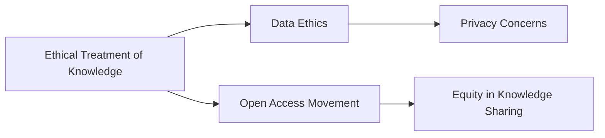

# Ethical Treatment of Knowledge

## Origin

- **Creation Circumstances and Purpose**: The concept of the [[Ethical Treatment of Knowledge]] emerged primarily as a response to ethical dilemmas arising from the misuse of knowledge across various domains—technology, medicine, and social sciences. Its initial purpose was to ensure that knowledge handling respects privacy, intellectual property, and societal welfare.
- **Evolution**: Initially centered on academic integrity and information privacy, the ethical treatment of knowledge has expanded significantly with the advent of digital age challenges, such as data mining, [[AI Ethics]] and [[Machine Learning]] ethics, and misinformation. Notable milestones include the development of ethical guidelines by institutions like UNESCO and IEEE, as well as principles established by movements like Open Access, which advocate for equitable knowledge sharing.

## Possibilities

- **Expected Outcomes**:
	- **Positive Outcomes**:
		- Enhanced trust in information through transparent practices.
		- Equitable access to knowledge resources, improving educational and professional outcomes.
		- Informed decision-making, leading to advances in technology, science, and societal structures.
	- **Negative Outcomes**:
		- Ethical constraints slowing innovation due to over-regulation.
		- Misinterpretation leading to censorship or limitations on academic freedom.
		- Potential for increased surveillance under the guise of ethical management.

## Actual Outcomes

- **Historical and Real-Life Examples**:
	- **Positive Outcomes**:
		- The implementation of open-access journals has broadened research accessibility, exemplifying the positive impact on education and innovation.
		- Google's [[AI Ethics]] board, although short-lived, sparked greater industry-wide awareness about embedding ethics into [[AI]] development.

	- **Negative Outcomes**:
		- The Cambridge Analytica scandal highlighted the misuse of personal data despite existing privacy regulations, illustrating how ethical lapses can undermine trust and societal trust.
		- Overreach in ethical policies, as seen in certain academic institutions, sometimes stifles research freedoms and can lead to a suppression of innovative ideas.

### Resonance

- **Patterns and Connections**:
	- The ethical treatment of knowledge resonates with [[data ethics]] in technology and [[bioethics]] in medicine, emphasizing similar core values of responsibility and societal impact.
	- It complements [[sustainable development goals]], particularly in promoting equitable education and reducing inequalities.

### Distinction

- **Competing Ideas and Challenges**:
	- Alternative perspectives argue for the unbounded flow of information, ala [[anarchist information theory]], suggesting that stringent ethical controls can lead to oppressive censorship.
	- [[Post-truth dynamics]] challenge the foundational ideas of ethical knowledge treatment by distorting objective facts and fostering misinformation.

## Summary

### Bloom's Taxonomy Table

| **Bloom's Layer** | **Description**                     | **Examples**                                         |
| ----------------- | ----------------------------------- | ---------------------------------------------------- |
| Factual           | Core principles of ethical knowledge | Privacy, intellectual property, transparency          |
| Conceptual        | Interdisciplinary resonance         | Connection to [[data ethics]] and [[bioethics]]       |
| Procedural        | Application through frameworks      | IEEE guidelines, UNESCO principles                   |
| Metacognitive     | Reflection on ethical application   | Awareness of consequences like the Cambridge Analytica case |

### Integral Theory Table

| **Quadrant**        | **Key Elements/Insights**                                     |
| ------------------- | ------------------------------------------------------------- |
| Interior-Individual | Personal stories of researchers advocating for open access    |
| Interior-Collective | Cultural shift toward transparency and accountability in knowledge|
| Exterior-Individual | Researcher actions in adhering to ethical publication standards|
| Exterior-Collective | Systems influenced by ethical knowledge policies, like GDPR   |

### Knowledge Expansion Table

| **Knowledge Item**        | **Description**                    | **Relevance/Relationship**                      |
| ------------------------- | ---------------------------------- | ----------------------------------------------- |
| [[Data Ethics]]           | Concerns moral issues with data    | Overlaps with privacy and responsible knowledge usage |
| [[Open Access Movement]]  | Advocates for free research access | Directly relates to equitable knowledge sharing practices |

### Visualization

---

## Project Link

[[Create Knowledge Management System]]
