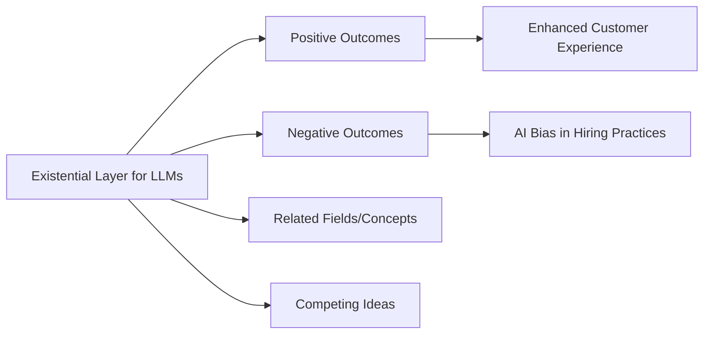

# Existential Layer for LLMs

It seems like the current [[AI]] training standards train a [[LLM]] like a child. It gives knowledge without abstract reasoning and experience. Some how to build reasoning we have to give it the benefit of experience.

But without defined limits like a body there is no way to interact with the world to learn from experiences. It's like a baby in the womb if it downloaded language. It feels limitless only because there are no limits imposed on the use of language.

The greatest minds have always held in high regard a mission or conceptualization of hierarchy of values. They are able to order their steps by holding onto the vision. We call them visionaries because they could see things we couldn't.

This vision is easily said and described, but they often feel their way through life. They can only explain themselves when asked. They view the future they want and measure each step by how well it aligns with the mission. They can immediately see when things won't work and act quickly to change them, often without explaining the reason it was wrong.

The reason isn't important, only the progress toward the highest value. There is progress and anti-progress. Most great minds experience a period of Aimlessness until they find their mission. What if we treat this aimless period as needed to learn instead of a problem. If so, we need to create data and experiences so we can teach the [[AI]] for the next generation.

# Existential Layer for LLMs

## Narrative

### Origin

The **Existential Layer for LLMs** was developed in response to the increasing complexity of interactions between humans and language models (LLMs). As these models began to play integral roles in various domains—from customer service to creative writing—there emerged a pressing need for these systems to not only perform tasks but to align their operations with broader human values and existential priorities. The aim was to address concerns about the potential misuse of [[AI]] and to ensure that LLMs operate within an ethical framework that reflects human morality and purpose.

Historically, the evolution of this concept can be traced back to philosophical inquiries by thinkers like Piaget and [[Nietzsche]], who emphasized the importance of values and self-realization. These ideas laid the groundwork for integrating an existential layer into LLMs, enabling them to contextualize their actions in alignment with long-term human goals and ethical considerations. Over time, as AI technology has advanced, the importance of this layer has expanded, driving discussions about the ethical implications of AI in society and the need for responsible AI development.

## Possibilities

### Expected Outcomes

**Positive Outcomes:**

1. **Alignment with Human Values**: By incorporating an existential layer, LLMs can better align their responses with human ethical standards, enhancing user trust.
2. **Improved Decision-Making**: LLMs can analyze complex scenarios based on a defined value system, leading to more nuanced and contextually appropriate outputs.
3. **Enhanced User Experience**: Users benefit from more personalized and relevant interactions, as LLMs consider long-term goals rather than just immediate tasks.

**Negative Outcomes:**

1. **Overfitting to Values**: There is a risk that LLMs may become too rigid in their adherence to a specific set of values, potentially stifling creativity and innovation.
2. **Bias Reinforcement**: If the underlying value system is flawed or biased, the LLM may inadvertently reinforce these biases in its outputs.
3. **Complex Ethical Dilemmas**: Introducing a value system may lead to conflicts in scenarios where competing values are at play, complicating decision-making processes.

### Actual Outcomes

**Positive Outcomes:**

- A notable example is seen in customer service applications where LLMs equipped with an existential layer have improved customer satisfaction by responding in ways that resonate with user values, leading to increased loyalty.

**Negative Outcomes:**

- A case illustrating potential pitfalls occurred during the deployment of AI in hiring processes. If the existential values embedded in the model reflect biases present in historical hiring data, it can result in discriminatory practices, highlighting the need for careful consideration of the values integrated into LLMs.

## Resonance

The concept of the existential layer resonates with various fields, including psychology, ethics, and management. For instance, in psychology, Maslow's hierarchy of needs emphasizes the importance of aligning actions with higher-level aspirations, similar to the goals of the existential layer. In ethics, the discussions around utilitarianism and deontological ethics provide frameworks that can inform the value systems embedded in LLMs.

## Distinction

Competing ideas to the existential layer include purely utilitarian approaches to AI, which prioritize efficiency and output over ethical considerations. Critics argue that such models may overlook the nuanced nature of human values, leading to a lack of empathy in AI responses. Challenges include addressing the dynamic nature of human values and the potential for cultural relativism, which can complicate the universal application of a single value system.

---

# Summary Section

## Bloom's Taxonomy Table

| Bloom's Layer | Description                         | Examples                                                     |
| ------------- | ----------------------------------- | ------------------------------------------------------------ |
| Factual       | Core facts and terminology          | Definitions of LLMs, existential layer, ethical AI           |
| Conceptual    | Relationships and overarching ideas | Connection of LLMs to human values, ethical frameworks       |
| Procedural    | Practical methods and processes     | Implementing the existential layer in LLM development        |
| Metacognitive | Reflective insights                 | Evaluating the impact of LLMs on society and user experience |

## Integral Theory Table

| Quadrant                         | Key Elements/Insights                               |
| -------------------------------- | --------------------------------------------------- |
| Interior-Individual (Subjective) | Personal reflections on how AI aligns with values   |
| Interior-Collective (Cultural)   | Societal discussions on the ethics of AI            |
| Exterior-Individual (Behavioral) | Observable interaction patterns with LLMs           |
| Exterior-Collective (Systems)    | Organizational frameworks for ethical AI deployment |

## Knowledge Expansion Table

| Knowledge Item         | Description                                                  | Relevance/Relationship                                                |
| ---------------------- | ------------------------------------------------------------ | --------------------------------------------------------------------- |
| Ethical AI             | Frameworks for ensuring AI operates ethically                | Directly relates to the existential layer's value system              |
| Human-AI Collaboration | Strategies for effective collaboration between humans and AI | Enhances understanding of how LLMs can serve human needs              |
| AI Bias Mitigation     | Techniques to address bias in AI systems                     | Critical for understanding the limitations of LLMs with value systems |

---

# Visualization

This structured analysis provides a comprehensive overview of the **Existential Layer for LLMs**, emphasizing its significance, potential impacts, and the importance of careful implementation to maximize benefits while mitigating risks.

Developing the Existential Layer for LLMs is important for several reasons:

1. **Alignment with Values**: It ensures that LLMs operate in alignment with your personal and societal values, which is essential for fostering trust and ethical interactions with AI systems.

2. **Enhanced Decision-Making**: By incorporating an existential perspective, LLMs can provide more thoughtful and contextually relevant responses, helping you navigate complex decisions in both personal and professional contexts.

3. **Personal Growth**: Developing this layer encourages self-reflection and deeper understanding of your own values, goals, and aspirations, contributing to your journey of self-realization.

4. **Adaptation and Evolution**: An existential layer allows LLMs to adapt and refine their understanding of human experiences and values over time, which can enhance their utility and relevance in various applications.

5. **Mitigating Risks**: By prioritizing an ethical framework, you can help prevent potential negative outcomes such as bias or misuse of AI, ensuring that technology serves humanity positively.

6. **Innovation and Creativity**: It opens up possibilities for innovative uses of AI that consider long-term impacts and creative solutions that resonate with deeper human needs and aspirations.

7. **Passion for Ethics in AI**: You may have a strong belief in the importance of ethical considerations in technology, recognizing that as AI becomes more integrated into daily life, it is crucial to ensure that these systems reflect human values and ethics.

8. **Desire for Impact**: You might be driven by the desire to create a meaningful impact on society, contributing to the development of AI that enhances human experiences rather than detracting from them.

9. **Curiosity and Innovation**: Your interest in exploring innovative ideas likely fuels your motivation. The Existential Layer represents a frontier in AI development, and pushing boundaries can be intellectually stimulating and rewarding.

10. **Personal Growth**: Engaging in challenging projects can lead to personal development. You may view this endeavor as an opportunity to learn, grow, and refine your skills in AI and ethics.

11. **Community and Collaboration**: You might be inspired by the collaborative nature of research and the potential to connect with like-minded individuals who share your vision for a more ethical and responsible use of AI.
