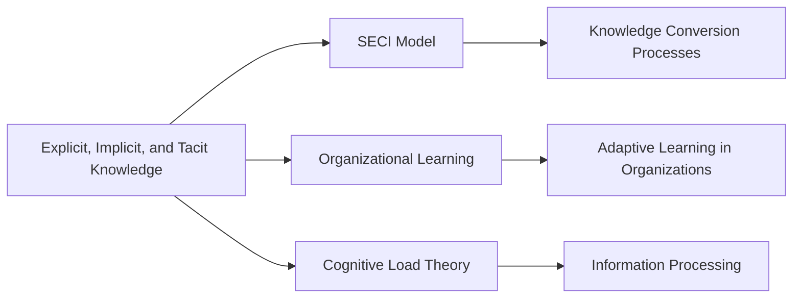

# Explicit, Implicit, and Tacit Knowledge

## Origin

The concept of Explicit, Implicit, and Tacit Knowledge has its roots in knowledge management theories developed during the mid-20th century. The differentiation of these knowledge types originated to address the inefficiencies in transferring and utilizing knowledge within organizations. [[Explicit knowledge]] is knowledge that is documented and easily communicated, such as manuals or databases. [[Implicit knowledge]] refers to information that isn't outright expressed but inferred from explicit knowledge. [[Tacit knowledge]], on the other hand, is personal, context-specific, and often unwritten, such as skills or insights gained through experience.

The evolution of these concepts accelerated during the knowledge economy era of the late 20th and early 21st centuries. With the digital revolution, the need to organize, share, and leverage diverse knowledge types became increasingly pertinent. Key milestones include the development of Nonaka's SECI model, which provides a framework for understanding knowledge conversion (Socialization, Externalization, Combination, Internalization). Over time, these concepts have expanded beyond organizational contexts, influencing fields like [[AI]], education, and healthcare.

## Possibilities

### Expected Outcomes

#### Positive Outcomes

- **Organizational Efficiency**: Using explicit knowledge for documentation and procedures enhances clarity and efficiency.
- **Innovation and Creativity**: Tacit knowledge fosters innovation by allowing leveraging of personal insights and experiences.
- **Improved Learning**: Differentiating between knowledge types facilitates targeted learning strategies.
- **Knowledge Sharing**: Enhanced collaboration through effective knowledge transfer methods.

#### Negative Outcomes

- **Dependence on Documentation**: Over-reliance on explicit knowledge can stifle innovation.
- **Knowledge Loss**: Failure to capture tacit knowledge can result in significant knowledge gaps, especially after loss of personnel.
- **Misapplication Risk**: Misunderstanding implicit knowledge leading to incorrect assumptions or flawed decisions.

## Actual Outcomes

### Positive Outcomes

- **Toyota Production System**: Effective use of explicit, implicit, and tacit knowledge in optimizing manufacturing processes.
- **Google's Innovation Labs**: Utilization of tacit knowledge in fostering an environment of continuous innovation and experimentation.

### Negative Outcomes

- **Challenger Space Shuttle Disaster**: Miscommunication and failure to interpret implicit knowledge warnings.
- **Kodak's Collapse**: Inability to capture and utilize tacit knowledge on digital transformation.

### Resonance

The concepts of Explicit, Implicit, and Tacit Knowledge resonate strongly with cognitive science, educational theory, and data science. Within these fields, understanding varies forms of knowledge assists in designing learning environments, [[AI]] algorithms, and data systems that mimic human cognitive processes.

### Distinction

Competing ideas include the Learning Pyramid for understanding how we internalize information, which challenges the importance of certain types of knowledge. Additionally, critiques of over-structuring knowledge management often point to Lost Tacit Knowledge, particularly in rapidly changing industries where informal knowledge transfer cannot keep pace with turnover.

## Summary

### Bloom's Taxonomy Table

| **Bloom's Layer** | **Description**                                  | **Examples**                                                                 |
| ----------------- | ------------------------------------------------ | --------------------------------------------------------------------------- |
| Factual           | Basic facts and terminology                      | Explicit knowledge, tacit knowledge, implicit knowledge                     |
| Conceptual        | Relationships and overarching ideas              | SECI model (Socialization, Externalization, Combination, Internalization)   |
| Procedural        | Practical methods and processes                  | Knowledge audits, tacit knowledge codification, documentation techniques    |
| Metacognitive     | Reflective insights                              | Awareness of personal learning processes; impact of diverse knowledge types |

### Integral Theory Table

| **Quadrant**        | **Key Elements/Insights**                                                                 |
| ------------------- | ----------------------------------------------------------------------------------------- |
| Interior-Individual | Individual realization of tacit knowledge in personal skill development                   |
| Interior-Collective | Cultural norms around knowledge sharing and the value of implicit understanding           |
| Exterior-Individual | Observable behaviors influenced by explicit knowledge, e.g., following documented protocols |
| Exterior-Collective | Organizational knowledge management systems that integrate various knowledge types        |

### Knowledge Expansion Table

| **Knowledge Item**                                      | **Description**                                                | **Relevance/Relationship**                                                |
| ------------------------------------------------------- | -------------------------------------------------------------- | ------------------------------------------------------------------------- |
| [[SECI Model]]                                          | Framework illustrating knowledge conversion processes          | Direct application in organizing and converting all knowledge types       |
| [[Organizational Learning]]                             | Discipline about how organizations build capability and adapt  | Central to understanding how different knowledge forms drive learning    |
| [[Cognitive Load Theory]]                               | Theory on mental effort and processing of information          | Relevant for designing systems that manage explicit and implicit knowledge |

### Visualization

---

## Project Link

[[Create Knowledge Management System]]
