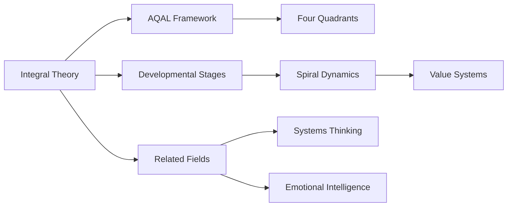

# Integral Theory

## Narrative

### Origin

[[Integral Theory]], developed by [[Ken Wilber]] in the late 20th century, emerged as an overarching framework designed to synthesize diverse fields of knowledge into a coherent system. Wilber's primary motivation was to address the fragmentation of knowledge and perspectives across disciplines—science, philosophy, spirituality, and psychology—by creating an "integral" map that could unify these domains. The theory's immediate purpose was to offer a holistic view of human development and worldviews, combining insights from different traditions without reducing them into a single perspective.

Over time, [[Integral Theory]] evolved through key milestones such as the publication of Wilber's works like *A Brief History of Everything* (1996) and *Integral Spirituality* (2006). It introduced tools like the AQAL framework ("All Quadrants, All Levels") and the concept of developmental stages (e.g., Spiral Dynamics) to systematize this synthesis. Its applications have expanded into various fields including leadership, education, psychotherapy, environmental studies, and organizational development.

### Possibilities

#### Expected Outcomes

1. **Positive Outcomes**:
	 - **Personal Growth**: When applied introspectively or therapeutically, individuals can gain greater self-awareness by exploring their interior experiences alongside external systems. For example:
		 - Leaders utilizing Integral Theory-based coaching frameworks report enhanced emotional intelligence and decision-making see also [[Emotional Intelligence]].
	 - **Interdisciplinary Collaboration**: In academia or innovation spaces, researchers adopting AQAL frameworks often bridge gaps between disciplines that traditionally operate in silos.
		 - Example: Environmental organizations applying Integral Ecology integrate cultural values with scientific models for sustainable policy-making.
	 - **Enhanced Organizational Systems**: Businesses leveraging Integral Leadership models have demonstrated improved team cohesion by addressing both individual behaviors and collective cultural dynamics.

2. **Negative Outcomes**:
	 - Risks arise when practitioners misapply or oversimplify integral concepts (e.g., focusing excessively on spirituality while ignoring practical behavioral or systemic factors).
	 - Some critics argue that its complexity can alienate newcomers or lead to intellectual elitism within academic or professional circles.
		 - For instance: Organizations attempting to implement AQAL without adequate training may face resistance due to its abstract nature.

#### Actual Outcomes

1. **Positive Real-Life Examples**:
	 - In psychotherapy practices like [[Integral Psychotherapy]], clients often experience deeper healing as therapists address not just cognitive patterns but emotional states and social contexts.
	 - Real-world application in urban planning using [[Integral Urbanism]] has led cities like Curitiba in Brazil to balance infrastructure development with cultural preservation.

2. **Negative Real-Life Examples**:
	 - Corporate misapplications include superficial adoption of "integral" language for branding purposes without actual systemic changes (e.g., misaligned leadership initiatives labeled "holistic").
	 - In educational settings, some educators overemphasize theoretical aspects of Integral Theory at the expense of actionable teaching methods.

### Resonance

Integral Theory resonates strongly with other holistic paradigms such as [[Systems Thinking]], [[Spiral Dynamics]], and transdisciplinary approaches in academia. It complements these frameworks by adding developmental depth (stages) and broader inclusivity (quadrants). For example:
- The connection between Spiral Dynamics' value systems ("orange" rational vs. "green" pluralistic) integrates seamlessly into integral stage models.
- Its emphasis on interior experiences parallels insights from mindfulness research in psychology.

### Distinction

Despite its strengths, critics highlight limitations such as:
- Over-generalization: Detractors argue that attempting to unify all knowledge may dilute specific methodologies within disciplines ([compare with critique in [[Reductionism]]]).
- Competing Frameworks: Alternatives like [[Complexity Science]] focus more intensively on emergent phenomena rather than developmental hierarchies emphasized by Integral Theory.
For example:
- Critics caution against using AQAL stages rigidly for categorizing individuals or cultures without nuance.

---

## Summary Section

### Bloom's Taxonomy Table

| **Bloom's Layer** | **Description**                                   | **Examples**                                                    |
| ----------------- | ------------------------------------------------- | --------------------------------------------------------------- |
| Factual           | Core facts about AQAL framework & key terminology | Quadrants = subjective/objective; Levels = developmental stages |
| Conceptual        | Relationships between ideas across disciplines    | How personal growth intersects with cultural evolution          |
| Procedural        | Practical applications                            | Use AQAL for designing inclusive corporate strategies           |
| Metacognitive     | Reflection on understanding impact                | Awareness of biases when interpreting developmental stages      |

---

### Integral Theory Table

| Quadrant                  | Key Elements/Insights                                                                                     |
|---------------------------|----------------------------------------------------------------------------------------------------------|
| Interior-Individual       | Personal journaling based on quadrants improves self-awareness ([see also [[Mindfulness Practices]]]).    |
| Interior-Collective       | Shared values fostered through group dialogues informed by cultural quadrant insights                     |
| Exterior-Individual       | Behavioral improvements tracked via leadership coaching progress metrics                                 |
| Exterior-Collective       | Systems analysis integrating ecological sustainability alongside economic policies                       |

---

### Knowledge Expansion Table

| Knowledge Item                      | Description                                                             | Relevance/Relationship                                                                                                                            |
| ----------------------------------- | ----------------------------------------------------------------------- | ------------------------------------------------------------------------------------------------------------------------------------------------- |
| [[Spiral Dynamics]]                 | Framework mapping value systems & societal evolution                    | Provides complementary insights into developmental stages                                                                                         |
| [[Systems Thinking]]                | Holistic approach emphasizing interconnections                          | Aligns with AQAL's exterior quadrants                                                                                                             |
| [[Emotional Intelligence]]          | Framework for understanding emotions                                    | Enhances Interior quadrant applications                                                                                                           |
| [[Wilbur's Quadrants of Knowledge]] | Ken Wilber's four quadrants model is central to his integral philosophy | It provides a framework for analyzing the various dimensions of human experience and knowledge, facilitating a holistic understanding of reality. |

---

## Visualization

---

This structured analysis showcases how Integral Theory serves as a unifying lens across domains while highlighting its nuanced possibilities and challenges through real-world examples. By mapping it against Bloom's Taxonomy layers and Integral quadrants while visualizing relationships via MermaidJS, it provides actionable insights for practical implementation or further exploration via related topics like [[Spiral Dynamics]].

## Project Link

[[Create Knowledge Management System]]
