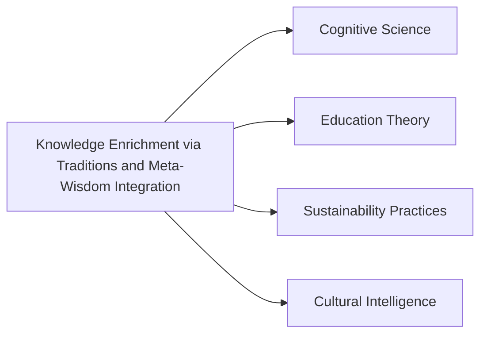

# Analyzing Knowledge Enrichment via Traditions and Meta-Wisdom Integration

## Origin

### Initial Circumstances and Purpose

The concept of **Knowledge Enrichment via Traditions and Meta-Wisdom Integration** emerged as a mechanism to counterbalance the deluge of information that contemporary society experiences. This knowledge was initially crafted to reconnect individuals with the existential meanings and wisdom embedded in traditional practices and philosophical insights. It addressed the timeless problem of making knowledge functional, meaningful, and culturally resonant in modern settings by interweaving rich traditions with modern interpretations.

### Evolution

Historically, this knowledge item evolved through various epochs where traditional wisdom underwent reinterpretation to suit contemporary needs. Notable milestones include the Age of Enlightenment, where reason began to integrate with traditional authourative wisdom, and the Digital Age, which propelled the need to reinterpret timeless wisdom through technology. As a result, this knowledge area has expanded to include an integration of digital technologies and social networks, allowing for broader dissemination and reinterpretation of established wisdom systems.

## Possibilities

### Expected Outcomes

#### Positive Outcomes

- Enhancing **personal growth** through reconnecting individuals with their cultural and spiritual roots, promoting a holistic understanding of personal and professional challenges.
- **Improved societal coherence** by fostering a shared understanding of common values and philosophical concepts, leading to more unified communities.
- **Increased innovation** by blending diverse wisdom traditions to think creatively about complex modern problems.

#### Negative Outcomes

- **Cultural stagnation** if the integration is too rigid, preventing the evolution of knowledge.
- **Misinterpretation risks**, as complex traditions and philosophical concepts may be oversimplified for modern applications, leading to superficial understanding.

## Actual Outcomes

### Real-Life Examples

#### Positive Outcomes

- The integration of indigenous knowledge systems into modern environmental management practices has notably enhanced sustainable practices and biodiversity conservation efforts in regions like [[Amazon Rainforest Management]].
- Corporate mindfulness programs, based on ancient wisdom traditions from Buddhism and Stoicism, have spurred increased productivity and employee satisfaction.

#### Negative Outcomes

- Instances where traditional knowledge has been misappropriated without proper contextual understanding, leading to cultural insensitivity and ethical issues, such as with certain [[Yoga Practices in Western Corporate Environments]].

### Resonance

The idea of integrating wisdom spans various fields such as [[Cognitive Science]], where understanding of cognitive biases can be enriched by philosophical introspection, and [[Education Theory]], where storytelling and traditional narratives are used to enhance learning experiences.

### Distinction

Competing ideas include purely technological approaches to knowledge management, such as [[AI]] and [[Machine Learning]] Systems, which may dismiss the value of traditional wisdom by focusing solely on data-driven insights.

## Summary

### Bloom's Taxonomy Table

| **Bloom's Layer** | **Description**                         | **Examples**                                                                 |
| ----------------- | --------------------------------------- | ---------------------------------------------------------------------------- |
| Factual           | Core facts and definition of traditions | E.g., Definitions and key concepts of [[Buddhism]], [[Stoicism]], etc.       |
| Conceptual        | How traditions relate to modern systems | Interconnections such as storytelling in both [[Education]] and [[Leadership]]|
| Procedural        | Applications in real scenarios          | Utilizing indigenous knowledge in [[Sustainability Practices]]               |
| Metacognitive     | Reflective insights                     | Insights from integrating mindfulness in corporate settings                  |

### Integral Theory Table

| **Quadrant**        | **Key Elements/Insights**                                                    |
| ------------------- | ---------------------------------------------------------------------------- |
| Interior-Individual | Personal narratives of transformation through traditional wisdom, like those obtained in mindfulness programs. |
| Interior-Collective | Observations of societal values shifting towards communal well-being, driven by integrated traditional values. |
| Exterior-Individual | Changes in personal behaviors, such as daily mindfulness practices adopted in tech industries. |
| Exterior-Collective | System-wide implementations like CSR models based on traditional cooperative paradigms. |

### Knowledge Expansion Table

| **Knowledge Item**              | **Description**                                            | **Relevance/Relationship**                                        |
| ------------------------------- | ---------------------------------------------------------- | ----------------------------------------------------------------- |
| [[Cultural Intelligence]]       | Understanding and adaptation across cultures               | Enhances implementation of traditional wisdom in multicultural settings |
| [[Epistemic Humility]]          | Recognizing the limits of one's knowledge                  | Essential for integrating meta-wisdom without overgeneralization  |
| [[Interdisciplinary Innovation]]| Blending knowledge from various fields to solve problems   | Similar goals of integrating diverse wisdom traditions            |

### Visualization

---

This structured exploration into **Knowledge Enrichment via Traditions and Meta-Wisdom Integration** demonstrates its role in enhancing individual and collective experiences within a "Living Knowledge Management System." By embracing and honoring the wisdom of traditions, we can develop a system that not only organizes knowledge but elevates it, enriching the human experience through meaningful integration and application.

## Project Link

[[Create Knowledge Management System]]
