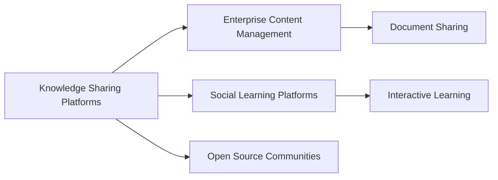

# Knowledge Sharing Platforms

## Origin

The concept of [[Knowledge Sharing Platforms]] emerged as a response to the growing need for efficient and scalable ways to manage information and facilitate communication within and across organizations. The development of these platforms was initially motivated by the simple need to capture, organize, and share explicit knowledge, that could otherwise be lost, among employees. The evolution was driven by technological advancements, the increased value placed on collaborative tools, and the recognition of knowledge as a critical asset in the information age.

Significant milestones in the evolution of [[Knowledge Sharing Platforms]] include the rise of intranet systems in the 1990s, the social media boom of the mid-2000s that highlighted the potential of user-generated content, and the subsequent development of enterprise social networks and collaborative tools like [[Microsoft SharePoint]], [[Slack]], and [[Confluence]]. These tools expanded beyond simple document sharing to include features enabling real-time communication, collaborative workflows, and integration with various enterprise applications, fundamentally changing how knowledge is shared and utilized within businesses.

## Possibilities

### Expected Outcomes

#### Positive Outcomes

- **Enhanced Collaboration**: Improved teamwork and communication within and between departments.
- **Increased Productivity**: Access to pooled knowledge accelerates problem-solving and innovation.
- **Knowledge Retention**: Captures institutional knowledge to prevent loss through employee turnover.
- **Continuous Learning**: Encourages a learning culture, enhancing skills development through shared insights.

#### Negative Outcomes

- **Information Overload**: Excessive data can overwhelm users, hindering decision-making and focus.
- **Security Risks**: Potential for data breaches or unauthorized access to sensitive information.
- **Dependence on Technology**: Over-reliance on platforms may reduce face-to-face interactions and traditional problem-solving skills.
- **Content Quality and Relevance**: Risk of shared knowledge being outdated or inaccurate without proper validation.

## Actual Outcomes

### Positive Outcomes

- **Increased Organizational Agility**: Companies like [[IBM]] have demonstrated improved agility through dynamic sharing platforms that enable rapid adaptation to market changes.
- **Enhanced Knowledge Transfer**: For example, [[Procter & Gamble]] leveraged knowledge platforms to spread best practices across global operations, significantly improving operational efficiency.

### Negative Outcomes

- **Data Breaches**: High-profile incidents, such as those faced by [[Sony]], highlight the vulnerability of shared data without robust security measures.
- **Content Sprawl**: Enterprises report difficulties managing the exponential growth of stored content, as seen in companies with unstructured platforms, leading to difficult navigation and outdated information being used.

### Resonance

[[Knowledge Sharing Platforms]] resonate across fields such as education, where e-learning and collaborative tools like [[Moodle]] transform how knowledge is disseminated. In healthcare, platforms support evidence-based practice by enabling the sharing of clinical guidelines and research. Moreover, parallels exist in crowd-sourced communities, such as [[Wikipedia]], where collective knowledge is compiled from diverse contributors.

### Distinction

Competing ideas include traditional hierarchical knowledge dissemination models that rely on top-down communication, as opposed to the decentralized approach of [[Knowledge Sharing Platforms]]. Critiques include concerns about homogenization of ideas and potential stifling of innovation due to conformity pressures within the platform's structure. Different approaches such as [[Open Source Communities]] offer alternative collaborative frameworks with their own distinct set of principles, embracing openness and flexibility.

## Summary

### Bloom's Taxonomy Table

| **Bloom's Layer** | **Description**                                | **Examples**                                   |
| ----------------- | ---------------------------------------------- | ---------------------------------------------- |
| Factual           | Basic facts and terminology                    | Intranet, document sharing, enterprise networks|
| Conceptual        | Relationships and overarching ideas            | Collaboration, communication enhancement       |
| Procedural        | Practical methods and processes                | Using [[Slack]] for team communication         |
| Metacognitive     | Reflective insights                            | Importance of managing information overload    |

### Integral Theory Table

| **Quadrant**        | **Key Elements/Insights**                              |
| ------------------- | ------------------------------------------------------ |
| Interior-Individual | Employees feeling empowered via knowledge access      |
| Interior-Collective | Cultural emphasis on continuous learning and sharing  |
| Exterior-Individual | Use of platforms like [[Confluence]] for collaboration|
| Exterior-Collective | Integration in business systems for strategic advantage|

### Knowledge Expansion Table

| **Knowledge Item**                              | **Description**                              | **Relevance/Relationship**                                  |
| ----------------------------------------------- | -------------------------------------------- | ----------------------------------------------------------- |
| [[Enterprise Knowledge Management]] | Managing digital information for enterprises | Complements knowledge sharing through organized information |
| [[Social Learning Platforms]]                   | Tools for interactive learning experiences   | Enhances learning through shared knowledge modules          |

### Visualization

---

The structured analysis provided insights into [[Knowledge Sharing Platforms]], emphasizing both the technical and human aspects of leveraging shared knowledge within and across organizations. By understanding the origins, applications, and outcomes, both intended and actual, we can draw actionable lessons for building a living knowledge management system that synthesizes diverse forms of knowledge while fostering innovation and informed decision-making. The tables and visualizations serve as digestible formats for strategy formulation and practical application, paving the way for enhanced understanding and meaningful organization of knowledge.

## Project Link

[[Create Knowledge Management System]]
