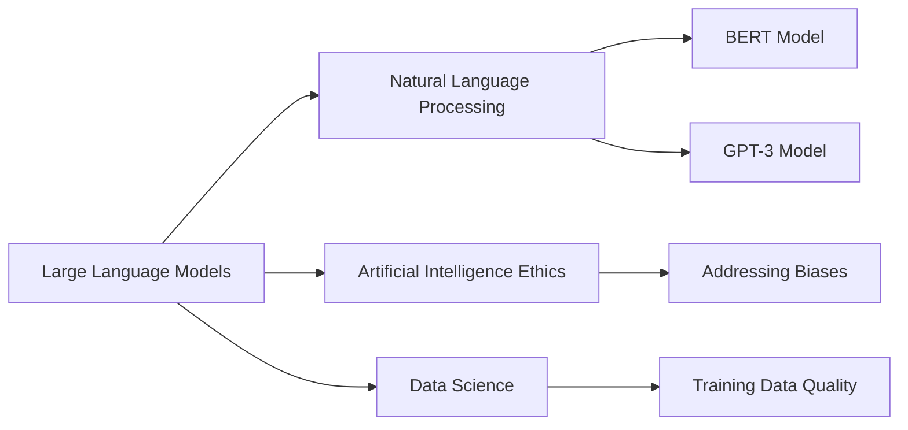

# LLM

## Origin

Large Language Models (LLMs) have their roots in the broader field of [[Natural Language Processing]] (NLP), which began to take shape in the 1950s with early experiments in machine translation. However, the modern era of LLMs is more directly linked to advancements in neural networks and the introduction of models like BERT in 2019.[^1] BERT revolutionized NLP by providing a pre-trained model that could be fine-tuned for various tasks, demonstrating the power of self-supervised learning in understanding language.[^1]

The immediate circumstances for the creation of LLMs involved addressing the limitations of previous NLP approaches, which often relied on rule-based systems or lacked the capacity to handle complex, unstructured data. LLMs were designed to process vast amounts of text data, enabling them to generate coherent text, answer questions, and perform tasks that mimic human language understanding.

### Evolution

1. **Early Beginnings**: The concept of NLP dates back to the 1960s with the creation of the first chatbot, Eliza, which used pattern recognition to simulate conversations.[^2]
2. **Neural Networks and Word Embeddings**: The 2010s saw significant advancements with the introduction of word embeddings and neural network architectures like the Transformer, which facilitated the development of larger, more sophisticated models.[^2]
3. **BERT and Beyond**: BERT's introduction in 2019 marked a significant milestone, as it provided a versatile model that could be adapted for numerous NLP tasks.[^1] Subsequent models like GPT-3 further expanded the capabilities of LLMs.[^2]

## Possibilities

### Expected Outcomes

#### Positive Outcomes

- **Enhanced Productivity**: LLMs can automate tasks such as writing, translation, and content generation, increasing productivity in various industries.[^1]
- **Improved Communication**: They facilitate more natural human-computer interactions, enabling applications like chatbots and virtual assistants.[^2]
- **Knowledge Access**: LLMs can summarize complex information, making it more accessible to a broader audience.[^1]

#### Negative Outcomes

- **Misinformation**: LLMs can generate convincing but false information, potentially spreading misinformation.[^1]
- **Job Displacement**: Automation of writing and communication tasks may lead to job displacement in certain sectors.[^1]
- **Dependence on Data Quality**: The performance of LLMs is heavily dependent on the quality and diversity of the training data, which can lead to biases if not managed properly.[^1]

## Actual Outcomes

### Positive Outcomes

- **Google Search Integration**: BERT was quickly integrated into Google Search, improving the relevance and accuracy of search results.[^1]
- **Content Creation**: Tools like ChatGPT have revolutionized content creation, allowing users to generate high-quality text with minimal input.[^1]

### Negative Outcomes

- **Misinformation Spread**: There have been instances where LLMs have been used to create and disseminate false information, highlighting the need for careful oversight.[^1]
- **Academic Integrity Concerns**: The ease of generating text has raised concerns about academic integrity, as students may use LLMs to write essays without proper attribution.[^1]

### Resonance

LLMs resonate with various disciplines, particularly in **[[AI Ethics]]** and **Data Science**, as they highlight the importance of data quality and ethical considerations in AI development. They also intersect with **Cognitive Science**, as they simulate human-like language understanding and generation.

### Distinction

Competing ideas include alternative NLP approaches like rule-based systems, which are more transparent but less flexible than LLMs. Challenges include addressing biases in training data and ensuring transparency in decision-making processes.

## Summary

### Bloom's Taxonomy Table

| **Bloom's Layer** | **Description**                     | **Examples**               |
| ----------------- | ----------------------------------- | -------------------------- |
| Factual           | Basic facts about LLMs             | Definition, history, key models (BERT, GPT-3) |
| Conceptual        | Relationships between LLMs and NLP  | How LLMs improve NLP tasks, comparison with other models |
| Procedural        | Practical applications of LLMs      | Content generation, chatbots, translation tools |
| Metacognitive     | Reflection on LLMs' impact          | Ethical considerations, societal implications |

### Integral Theory Table

| **Quadrant**        | **Key Elements/Insights**  |
| ------------------- | -------------------------- |
| Interior-Individual | Personal experiences with LLMs, insights into AI-driven [[creativity]] |
| Interior-Collective | Cultural shifts in communication, shared values around [[AI Ethics]] |
| Exterior-Individual | Observable behaviors like increased productivity, skills in using LLMs |
| Exterior-Collective | Impact on organizations, networks, and societal structures through AI integration |

### Knowledge Expansion Table

| **Knowledge Item**              | **Description**                                       | **Relevance/Relationship**                                 |
| ------------------------------- | ----------------------------------------------------- | ---------------------------------------------------------- |
| [[Natural Language Processing]] | Techniques for computers to understand human language | Foundation for LLMs, broader context of NLP applications   |
| [[AI Ethics]]                   | Principles guiding the development and use of [[AI]]      | Crucial for addressing biases and societal impacts of LLMs |
| [[Data Science]]                | Methods for extracting insights from data             | Essential for training and improving LLMs                  |

### Visualization

This visualization highlights the central role of LLMs in NLP, their connection to broader [[AI Ethics]] considerations, and their dependence on data science for effective training and application.
[^1] [^3] [^4] [^5] [^2]

# Explanation of LLM

Imagine you have a string of text that contain every book ever written. You decide you want to interact with that text as a whole so you segment the words of the books into different categories.

You start with the book titles category, you combine all of the titles and calculate how often letters appear and in which order they appear. Then you filter out the less probable and letters/orderings that don't create words and you're left with a set of probable book titles.

Next, you move on to the author names category and repeat the process, calculating the frequency and order of letters in author names and filtering out less probable options.

You continue this process for different categories such as character names, locations, and themes until you have a set of probable options for each category.

This is essentially what [[LLM]] (Language Model with Left-to-Right Markov Chains) does. It uses statistical analysis to predict the probability of the next word in a sequence based on the words that came before it. By analyzing large amounts of text, [[LLM]] can predict the likelihood of certain words or phrases appearing in a given context.

While some [[LLM]] uses Markov chains to predict the probability of the next word in a sequence, OpenAI uses neural networks to achieve the same goal. Unlike Markov chains, neural networks can capture more complex relationships between words and can predict the probability of the next word in a sequence based on the entire context of the sentence, rather than just the previous words. This allows them to generate more accurate and natural-sounding text.

[^1]: https://snorkel.ai/large-language-models/
[^2]: https://www.scribbledata.io/blog/large-language-models-history-evolutions-and-future/
[^3]: https://discourse.devontechnologies.com/t/color-of-wiki-links-should-it-be-more-clearly-distinguishable-from-item-links/70528
[^4]: https://fsulib.com/a-brief-overview-of-large-language-models/
[^5]: https://forum.obsidian.md/t/a-brutalist-approach-to-knowledge-management-in-obsidian/60553
