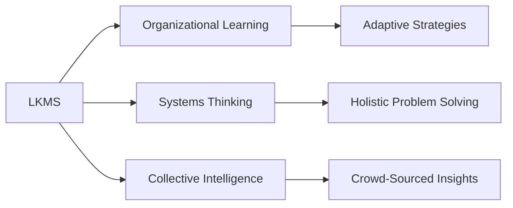

# Living Knowledge Management Systems

## Origin

The concept of [[Living Knowledge Management Systems]] ([[LKMS]]) emerged from the necessity to adapt traditional knowledge management practices to the rapidly changing and dynamic nature of modern information ecosystems.

Historically, knowledge management systems have focused on the static storage and retrieval of information. However, these systems have frequently failed to accommodate the evolving insights and wisdom derived from lived experiences and real-time data integration.

### Historical Context

- **Initial Development**: The initial development phase was marked by an increased reliance on digital information systems in the late 20th century, driven by the internet revolution. Traditional knowledge management systems were unable to cope with the ever-increasing volume and complexity of data, leading to an overload and fragmentation of information.

- **Evolution**: Over time, researchers and organizations recognized the need for systems that integrate not only explicit knowledge but also tacit and implicit insights. The realization that knowledge is not merely a static commodity but a living entity that grows and evolves led to the formulation of [[LKMS]]. This evolution is deeply intertwined with advancements in [[AI]] and [[Machine Learning]], which enable the dynamic processing and interconnection of data.

### Significant Milestones

1. **Integration of [[AI]]**: The integration of [[AI]] provided the tools required for ongoing learning and adaptation within knowledge systems, allowing them to continuously reposition knowledge in contextually relevant ways.

2. **Rise of Networked Collaboration**: As collaborative platforms gained prominence, the sharing and co-development of knowledge became more fluid, encouraging the shift toward more dynamic knowledge management frameworks.

3. **Cultural Shifts**: There has been a growing acknowledgment of the value of diverse knowledge types, including those embedded in cultural and existential narratives, prompting a reevaluation of how information systems capture and represent such knowledge.

## Possibilities

### Expected Outcomes

#### Positive Outcomes

1. **Enhanced Decision-Making**: By integrating tacit knowledge and real-time insights, LKMS can facilitate more informed decision-making processes in organizations and communities, thereby enhancing productivity and innovation.

2. **Purpose-Driven Innovation**: By organizing knowledge based on meaning and value, these systems can encourage purpose-driven innovation, helping individuals and organizations identify and focus on the most meaningful initiatives.

3. **Global Knowledge Networks**: LKMS can foster global networks of shared wisdom, allowing for cross-disciplinary collaboration and dissemination of best practices, supporting holistic development goals.

#### Negative Outcomes

1. **Overreliance on Technology**: The dynamic nature of these systems can lead to overreliance on technology, potentially sidelining the intuitive, human elements of knowledge interpretation and action.

2. **Data Privacy Concerns**: The continuous integration and processing of data raise severe privacy issues, which need to be managed to prevent the misuse of sensitive information.

3. **Complexity and Accessibility**: The sophisticated nature of LKMS may result in complexities that hinder accessibility and usability for some users, creating disparities in benefiting from such systems.

## Actual Outcomes

### Positive Outcomes

#### Real-Life Examples

1. **Enhanced Corporate Strategies**: Companies like IBM have leveraged AI-driven knowledge systems to integrate diverse data sources, enhancing strategic decision-making processes and improving business outcomes.

2. **Educational Advancements**: Educational institutions adopting LKMS strategies facilitate personalized learning experiences that consider students' unique learning paths and tacit insights, thus improving educational outcomes.

### Negative Outcomes

#### Real-Life Situations

1. **Breaches and Mismanagement of Data**: High-profile cases of data breaches in organizations employing sophisticated knowledge systems underscore the risks related to maintaining sensitive information within dynamic systems.

2. **Implementation Challenges**: Several enterprises have faced significant challenges in successfully implementing LKMS due to the high level of complexity and expertise required.

### Resonance

LKMS naturally aligns with various fields like [[Organizational Learning]], [[Systems Thinking]], and [[Collective Intelligence]], fostering enriched understanding and collaboration:

- **Organizational Learning**: Integrating LKMS with principles from organizational learning enhances adaptability and resilience within enterprises.

- **[[Systems Thinking]]**: LKMS encourages a [[Systems Thinking]] approach by looking at knowledge holistically, considering interactions and feedback loops.

- **Collective Intelligence**: These systems effectively draw from collective intelligence principles, promoting the harnessing of diverse contributions within an organization or community.

### Distinction

While LKMS continue to evolve, they do so alongside alternative frameworks and approaches that present both complements and challenges:

- **Traditional Knowledge Management Systems**: More static and linear, they offer tried-and-tested efficiencies but lack adaptability and real-time integration.

- **Decentralized Knowledge Networks**: These networks, often associated with blockchain technologies, present a decentralized alternative that contrasts with the centralized machine-learning-driven approaches of LKMS.

## Summary

### Bloom's Taxonomy Table

| **Bloom's Layer** | **Description**                     | **Examples**                                       |
| ----------------- | ----------------------------------- | -------------------------------------------------- |
| Factual           | Terminology related to LKMS         | Tacit Knowledge, Explicit Knowledge, Data Privacy  |
| Conceptual        | Relationships and overarching ideas | Integration with [[AI]], Dynamic Adaptation            |
| Procedural        | Practical methods and processes     | [[AI]]-driven analytics, Real-time data processing     |
| Metacognitive     | Reflective insights                 | Understanding value-driven KM, balancing tech and intuition |

### Integral Theory Table

| **Quadrant**        | **Key Elements/Insights**                      |
| ------------------- | ---------------------------------------------- |
| Interior-Individual | Personal stories of knowledge-driven impacts   |
| Interior-Collective | Organizational cultures fostering innovation    |
| Exterior-Individual | Specific skills developed through LKMS application |
| Exterior-Collective | Institutional practices and structures evolving from LKMS |

### Knowledge Expansion Table

| **Knowledge Item**                 | **Description**                                          | **Relevance/Relationship**                               |
| ---------------------------------- | -------------------------------------------------------- | -------------------------------------------------------- |
| [[Organizational Learning]]        | Continuous learning within organizations                 | Enhances adaptability of LKMS                             |
| [[Systems Thinking]]               | Holistic approach to understanding complex systems       | Important for mapping and navigating knowledge landscapes |
| [[Collective Intelligence]]        | Harnessing group knowledge collectively                  | Compliments LKMS principles for societal impact           |

### Visualization

---

**Concluding Thoughts**:
The narrative above provides actionable insights into the evolution and ongoing relevance of Living Knowledge Management Systems. Through this analysis, it has emphasized the significant impact on various sectors, spotlighted the potential drawbacks, and identified areas for further exploration such as privacy concerns and accessibility issues. This concise yet thorough examination aims to provide foundational insights to support the overarching goal of creating a meaningful and effective living knowledge management system, particularly within AMI-driven contexts and beyond.

## Project Link

[[Create Knowledge Management System]]
