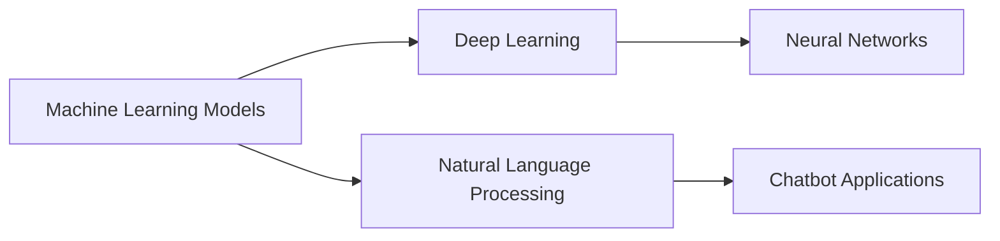

# Machine Learning Models

## Origin

The development of **Machine Learning Models** began as a response to the intricate problem of pattern recognition and data processing at scales far beyond human capacity. Initially stemming from the field of artificial intelligence, [[Machine Learning]] ([[Machine Learning]]) aimed to create systems that could learn from data and improve over time without being explicitly programmed. One of the earliest landmarks in [[Machine Learning]] was the creation of the Perceptron in the 1950s, designed as a simplistic model of a neural network tasked with fundamental pattern recognition tasks.

As technology advanced, so too did the complexity and functionality of [[Machine Learning]] models. The 1980s saw the introduction of more sophisticated architectures like multilayer perceptrons, leading to the innovation of deep learning models in the 2000s. Significantly, the advent of large datasets and enhanced computational power enabled the practical application of these models, transforming fields like image recognition, natural language processing, and more. Today, [[Machine Learning]] is integral to numerous aspects of technology, from recommender systems to autonomous vehicles.

## Possibilities

### Expected Outcomes

#### Positive Outcomes

- **Enhanced Efficiency**: When implemented correctly, [[Machine Learning]] models can automate repetitive tasks, allowing individuals and professionals to pivot their focus toward strategic initiatives. For instance, chatbots powered by natural language processing models offer improved customer service response times and resource allocation.

- **Predictive Power**: In healthcare, [[Machine Learning]] models have been applied to predict disease outbreaks, improving preventative measures and patient outcomes. Similarly, in finance, they enable more accurate risk assessments and fund management.

- **Personalization**: Algorithms behind platforms like Spotify and Netflix rely on [[Machine Learning]] models to curate user-centered experiences, tailoring recommendations to individual preferences and thus enhancing user satisfaction.

#### Negative Outcomes

- **Bias and Fairness Concerns**: Models trained on biased datasets can perpetuate and even amplify existing prejudices or inequalities. A notable example is facial recognition technology, which has struggled with accuracy across different racial and gender groups.

- **Privacy Risks**: The collection and processing of large volumes of data pose significant privacy risks. Without stringent data security measures, sensitive information could be compromised.

## Actual Outcomes

### Positive Outcomes

Real-life applications reveal the substantial benefits derived from ML models. IBM's Watson has revolutionized areas in healthcare by assisting in cancer diagnosis, leveraging its data-processing capabilities to provide evidence-based treatment options, ultimately enhancing patient management.

### Negative Outcomes

One profound instance of negative outcomes is the Cambridge Analytica scandal, which uncovered how data-driven ML strategies could be misused to manipulate political processes, raising ethical questions about privacy and the influence of technology in democratic systems.

### Resonance

[[Machine Learning]]'s principles echo across various disciplines. In [[Neuroscience]], its algorithms parallel neural processes, thus enhancing the understanding of human cognition. In [[Education]], ML models adapt learning experiences to individual needs, potentially revolutionizing personalized education models.

### Distinction

[[Statistical Models]] present an alternative approach, offering simplicity and interpretability that complex ML models may lack. While ML models excel in handling vast, intricate datasets, statistical models continue to be invaluable for their ease of use and clarity in specific contexts.

## Summary

### Bloom's Taxonomy Table

| **Bloom's Layer** | **Description**                     | **Examples**               |
| ----------------- | ----------------------------------- | -------------------------- |
| Factual           | Core facts and terminology           | Definitions of supervised and unsupervised learning |
| Conceptual        | Relationships and overarching ideas  | The connection between data availability and model performance |
| Procedural        | Practical methods and processes      | Steps in training a deep neural network |
| Metacognitive     | Reflective insights                  | Awareness of model biases and ethical implications |

### Integral Theory Table

| **Quadrant**        | **Key Elements/Insights**  |
| ------------------- | -------------------------- |
| Interior-Individual | Personal growth through understanding AI/ML technology |
| Interior-Collective | Cultural debates on privacy and ethical AI |
| Exterior-Individual | Designing ML-based software solutions |
| Exterior-Collective | Large-scale impacts on industries and economic systems |

### Knowledge Expansion Table

| **Knowledge Item**        | **Description**                                         | **Relevance/Relationship**                                 |
| ------------------------- | ------------------------------------------------------- | ---------------------------------------------------------- |
| [[Deep Learning]]         | Hierarchical models processing data in neuron-like layers| Central to evolution and current applications of ML models |
| [[Natural Language Processing]] | Applications of ML in understanding human language  | Drives real-world applications such as virtual assistants  |

### Visualization

---

## Project Link

[[Create Knowledge Management System]]
