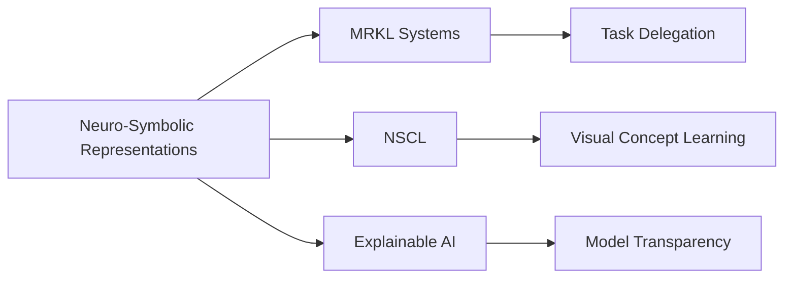

# Memory Recall by Grounding Concepts in Neuro-symbolic Representations

## Origin

**Memory recall by grounding concepts in neuro-symbolic representations** is a key aspect of the Cognitive Assistant Project, particularly in enhancing Diana's (Si) memory recall capabilities. This concept emerged from the integration of neural networks and symbolic AI, aiming to leverage the strengths of both paradigms. Neural networks excel in pattern recognition and learning, while symbolic AI provides logic and rules for complex reasoning tasks. The immediate purpose was to address the limitations of traditional [[AI]] systems in memory recall and concept grounding by combining these two approaches.

Historically, neuro-symbolic AI has evolved significantly since its inception. Initially, it focused on bridging the gap between neural networks' feature extraction and symbolic logic's reasoning capabilities. Over time, it has expanded to include applications in continuous learning, rule application, and event cognition. For instance, neuro-symbolic models have been used for relational reasoning on knowledge graphs and enhancing language models with symbolic working memory.[^1][^2]

## Possibilities

### Expected Outcomes

#### Positive Outcomes

- **Enhanced Memory Recall**: By grounding concepts in neuro-symbolic representations, cognitive assistants can improve memory recall by making concepts more interpretable and accessible.
- **Improved Reasoning**: Neuro-symbolic integration allows for more robust reasoning capabilities, combining the pattern recognition of neural networks with the logical structures of symbolic [[AI]].
- **Adaptive Learning**: These systems can adapt to new tasks and learn continuously, updating their knowledge base through neuro-symbolic representations.

#### Negative Outcomes

- **Complexity and Interpretability Challenges**: Integrating neural and symbolic components can introduce complexity, making it difficult to interpret or debug the system.
- **Representation Inconsistencies**: The gap between neural and symbolic representations can lead to inconsistencies, affecting the overall performance and reliability of the system.
- **Ethical Concerns**: Misaligned value systems in neuro-symbolic models could lead to ethical dilemmas if not properly addressed.

## Actual Outcomes

### Positive Outcomes

- **Structured Event Memory (SEM) Model**: This model demonstrates how neuro-symbolic approaches can enhance event cognition by organizing experiences into discrete events, improving memory and generalization capabilities.[^3]
- **Symbolic Working Memory in Language Models**: Enhancing language models with symbolic working memory has shown effectiveness in complex rule application, providing more precise and robust outcomes.[^2]

### Negative Outcomes

- **Catastrophic Forgetting**: Neuro-symbolic models, like those using concept-level continual learning, face challenges such as catastrophic forgetting, where new knowledge overwrites existing knowledge.[^1]
- **Interpretability Issues**: Despite advancements, the black-box nature of neural networks within neuro-symbolic systems can still hinder full interpretability and understanding of decision-making processes.[^1]

### Resonance

Neuro-symbolic representations resonate with various disciplines:
- **Cognitive Architectures**: Systems like [[SOAR]] and [[ACT-R]] utilize symbolic reasoning and can be enhanced with neuro-symbolic integration for more robust cognitive models.
- **Explainable AI (XAI)**: Techniques from XAI can help address interpretability challenges in neuro-symbolic systems by providing insights into decision-making processes.

### Distinction

Competing ideas include purely symbolic or neural approaches, each with their limitations:
- **Purely Symbolic AI**: Lacks the learning capabilities of neural networks.
- **Purely Neural Networks**: Struggles with interpretability and logical reasoning.
- **Challenges and Gaps**: Balancing the strengths of both paradigms while addressing representation inconsistencies and ethical considerations remains a significant challenge.

## Summary

### Bloom's Taxonomy Table

| **Bloom's Layer** | **Description**                     | **Examples**               |
| ----------------- | ----------------------------------- | -------------------------- |
| Factual           | Basic facts about neuro-symbolic AI | Neuro-symbolic integration, MRKL systems |
| Conceptual        | Relationships between neural and symbolic AI | Combining pattern recognition with logical reasoning |
| Procedural        | Practical methods for neuro-symbolic integration | Using symbolic working memory in language models |
| Metacognitive     | Reflective insights on system limitations | Addressing interpretability challenges, ethical considerations |

### Integral Theory Table

| **Quadrant**        | **Key Elements/Insights**  |
| ------------------- | -------------------------- |
| Interior-Individual | Personal insights into neuro-symbolic representations enhancing memory recall |
| Interior-Collective | Societal values on AI transparency and accountability |
| Exterior-Individual | Tools like MRKL systems and NSCL for practical applications |
| Exterior-Collective | Impact on organizational structures through cognitive assistants |

### Knowledge Expansion Table

| **Knowledge Item**        | **Description**                    | **Relevance/Relationship**                      |
| ------------------------- | ---------------------------------- | ----------------------------------------------- |
| [[MRKL]]         | Modular neuro-symbolic architecture | Enhances task delegation and reasoning capabilities |
| [[NSCL]]                 | Neuro-symbolic concept learner      | Improves visual concept learning and language understanding |
| [[Explainable AI]]       | Techniques for model interpretability | Addresses transparency and ethical concerns in neuro-symbolic systems |

### Visualization

This visualization highlights how neuro-symbolic representations connect to key related concepts like MRKL systems, NSCL, and Explainable AI, showcasing their roles in enhancing cognitive assistants.
[^1] [^2] [^3] [^4] [^5]

## Project Link

[[AI Cognitive Assistant]]

[^1]: https://arxiv.org/html/2411.04383v1
[^2]: https://arxiv.org/html/2408.13654v1
[^3]: https://gershmanlab.com/pubs/Franklin20.pdf
[^4]: https://www.biorxiv.org/content/10.1101/541607v1.full
[^5]: https://dl.acm.org/doi/10.1145/3539618.3594246
