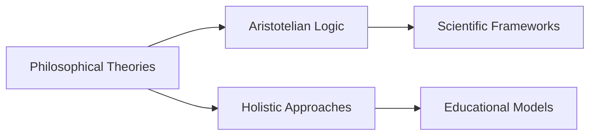

# Philosophical Theories on Meaning and Wisdom and Their Effects on Knowledge Systems

## Origin

The knowledge item **[[Philosophical Theories]] on Meaning and Wisdom and Their Effects on Knowledge Systems** emerged from the philosophical inquiry into the fundamental nature of meaning, wisdom, and their multiple dimensions in understanding and knowledge. The immediate circumstances of its creation stemmed from addressing existential questions about human experience and truth. Philosophers like Socrates, Plato, and Aristotle first explored these ideas to discern life's meaning and the virtue of wisdom, aiming to cultivate informed and ethical societies.

### Evolution

Over centuries, these philosophical inquiries intertwined with knowledge systems, evolving through significant milestones such as the Enlightenment, which emphasized rational thought, and the Information Age, where the exponential growth of information challenged the discernment of meaningful knowledge. The philosophical focus shifted toward integrating scientific methodologies and holistic understanding, as seen in the works of thinkers like [[Ludwig Wittgenstein]] and [[Michel Foucault]]. Modern perspectives often incorporate interdisciplinary approaches to unravel complex systems and phenomena.

## Possibilities

### Expected Outcomes

#### Positive Outcomes

- **Enhanced Learning and Decision-Making:** Philosophical approaches foster critical thinking, enabling individuals to dissect and interpret complex data, evidenced by improved educational methodologies and cognitive models.
- **Holistic Understanding:** The integration of meaning and wisdom promotes a balanced worldview, supporting personal growth, ethical behavior, and informed societal choices.

#### Negative Outcomes

- **Cognitive Overreach:** Overemphasis on abstract philosophy might lead to impracticality in real-world applications, overlooking the need for practical skills and hands-on approaches.
- **Philosophical Paradoxes:** Misinterpretation or overreliance on certain philosophical principles may produce conflicting perspectives, potentially stalling progress or innovation.

## Actual Outcomes

### Positive Outcomes

One illustrative historical example is the application of [[Aristotelian Logic]] in early scientific frameworks, forming a foundation for empirical research and systematic inquiry essential to advancements in fields such as medicine and technology.

### Negative Outcomes

Instances like the rigid application of [[Logical Positivism]] led to limitations in comprehending phenomena that couldn't be empirically verified, constricting philosophical discourse and scientific exploration in areas like quantum mechanics and [[Cognitive Sciences]].

### Resonance

The theories on meaning and wisdom resonate with various disciplines, notably in the realms of [[Behavioral Psychology of Learning]], where they inform understanding of human cognition and emotion, and in [[Sociology]], where they help examine cultural narratives and community evolution. The shared themes of interpretation, purpose, and understanding foster integration with ethical frameworks and decision theories, exemplifying a harmonized perspective on human excellence.

### Distinction

Different approaches, such as [[Postmodernism]], critique traditional theories, emphasizing the relative nature of knowledge and truth. Challenges arise in establishing a consensus on universal meanings or wisdom norms. The ongoing dialogue between contrasting ideologies underpins the development and complexity of contemporary knowledge systems.

## Summary

### Bloom's Taxonomy Table

| **Bloom's Layer** | **Description**                     | **Examples**                                                               |
| ----------------- | ----------------------------------- | -------------------------------------------------------------------------- |
| Factual           | Core facts and terminology          | Examples like [[Aristotelian Logic]] and basic ethical principles.         |
| Conceptual        | Relationships and overarching ideas | Connection between philosophical meaning and knowledge management systems. |
| Procedural        | Practical methods and processes     | Integrative teaching methods utilizing philosophical reasoning.            |
| Metacognitive     | Reflective insights                 | Reflections on the balance between abstract thinking and practical action. |

### Integral Theory Table

| **Quadrant**        | **Key Elements/Insights**                                                                 |
| ------------------- | ----------------------------------------------------------------------------------------- |
| Interior-Individual | Quotes from philosophical texts influencing personal beliefs and values.                  |
| Interior-Collective | Cultural significance of communal wisdom like Indigenous knowledge systems.               |
| Exterior-Individual | Behavioral applications such as ethical decision-making influenced by wisdom traditions.  |
| Exterior-Collective | Organizational strategies using philosophical frameworks to design systems and policies.  |

### Knowledge Expansion Table

| **Knowledge Item**          | **Description**                                                          | **Relevance/Relationship**                                      |
| --------------------------- | ------------------------------------------------------------------------ | ---------------------------------------------------------------- |
| [[Ethical Theories]]        | Study of morality and ethics in philosophical discourse.                 | Provides a foundation for ethical considerations in knowledge systems. |
| [[Holistic Education]]      | Educational approach integrating various learning dimensions.           | Informs instructional design and comprehensive learning systems.    |

### Visualization

## Project Link

[[Create Knowledge Management System]]
