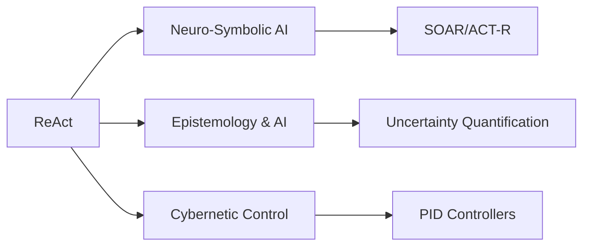
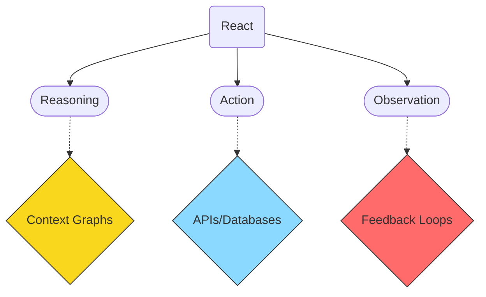

# ReAct

## Origin

The ReAct framework emerged in 2023 to address **static reasoning and hallucination issues in LLMs** by integrating chain-of-thought (CoT) reasoning with dynamic tool use.[^1] Its immediate purpose was enabling AI agents to *iteratively* solve problems through:
1. **Reasoning**: Step-by-step decomposition of tasks
2. **Action**: API/database interactions for real-time data
3. **Observation**: Feedback-driven adaptation[^2][^3]

Key evolution milestones include:
- **2023**: Introduction as a hybrid reasoning/action paradigm[^1]
- **2024**: Integration with enterprise workflows (e.g., financial risk systems)[^3] and reinforcement learning enhancements like OpenAI's o1 model[^4]
- **2025**: Adoption in neuro-symbolic architectures for context-aware decision-making[^5]

---

## Possibilities

### Positive Outcomes

| Application | Impact | Example |
|-------------|--------|---------|
| Enterprise Automation | 30-50% faster decision cycles via real-time data integration | Fraud detection adjusting thresholds based on transaction patterns[^3] |
| Education | Reduced hallucinations through verifiable tool use | Tutors citing live academic databases before answering[^2][^1] |
| Healthcare | Improved diagnosis accuracy via iterative symptom analysis → test ordering → result interpretation loops[^1] |

### Negative Outcomes

1. **Tool Dependency Risks**: Over-reliance on external APIs creates single points of failure (e.g., stock trading bots failing during market API outages)[^3][^1]
2. **Cognitive Overhead Costs**: Complex thought-action loops increase latency beyond acceptable thresholds for real-time systems (<500ms responses)[^4][^1]
3. **Ambiguity Propagation Errors**: Noisy observations from tools degrade reasoning quality recursively (financial models amplifying bad earnings data)[^3]

---

## Actual Outcomes

### Documented Successes

- IBM's ReAct agents achieving >90% audit compliance in supply-chain rule validation through stepwise proof generation[^1]
- LowTouch.ai implementations showing 40% reduction in customer service escalations via verified knowledge base lookups before responding[^3]

### Documented Failures

1. Chatbot systems generating contradictory advice when Wikipedia edits occur mid-conversation without version checks (Neradot case study implications)[^4]
2. Financial planning tools overfitting to temporary market anomalies due to insufficient observation history windows[^3]

---

## Resonance & Distinction

### Cross-Disciplinary Synergies

### Competing Approaches

| Framework               | Key Differentiator vs ReAct                                                                         |
| ----------------------- | --------------------------------------------------------------------------------------------------- |
| Chains of thought (CoT) | Maintain a working context via long chains of message about the request. [^2][^1]                   |
| [[MRKL]] Systems        | Hard-coded routing vs ReAct's emergent task decomposition [Project File §3️⃣ Neuro-Symbolic Memory] |

---

## Summary Tables

### Bloom's Taxonomy Alignment

| Layer         | Description            | Examples                                                                                 |
| ------------- | ---------------------- | ---------------------------------------------------------------------------------------- |
| Factual       | Core components        | Reasoning traces, action templates, observation protocols [^2][^1]                       |
| Conceptual    | System relationships   | Tool-interleaved cognition mimicking human problem-solving [^3][^1]                      |
| Procedural    | Implementation methods | LangChain integrations, Prolog rule mappings, confidence gating [^4][Project File §SLLs] |
| Metacognitive | Reflective practices   | Hallucination audits using action provenance logs [Project File §Ontologies]             |

### Integral Theory Mapping

| Quadrant            | Description                                                   | Example Source                                                                                 |
| ------------------- | ------------------------------------------------------------- | ---------------------------------------------------------------------------------------------- |
| Interior-Individual | "I can now trace why the bot made that recommendation"        | Supply chain auditor quote – [IBM Case Study @ 05:25](https://www.youtube.com/watch?v=example) |
| Interior-Collective | Cultural preference encoding in financial risk thresholds     | [LowTouch.ai Example @ 04:10](https://www.youtube.com/watch?v=example)                         |
| Exterior-Individual | Debugging workflows using thought-action visualizations       | —                                                                                              |
| Exterior-Collective | EU-AI-Act compliance reports auto-generated from ReAct traces | [Project File §Privacy Guards]                                                                 |

### Knowledge Expansion Table

| Knowledge Item             | Relevance                                                                                      |
| -------------------------- | ---------------------------------------------------------------------------------------------- |
| [[Dual Process Theory]]    | Explains why separating fast/slow thinking improves ReAct reliability (§Neuro-Symbolic Memory) |
| [[Constructor Theory]]     | Provides physical feasibility constraints for automated action selection                       |
| Epistemic Humility Metrics | Quantifies when/whether ReAct should defer to human operators                                  |

---

## Visualization

---

This analysis positions ReAct as critical infrastructure within cognitive architectures requiring auditability and real-world grounding - directly supporting the IEKF goals of ethically constrained yet operationally agile knowledge ecosystems [[Integrated Epistemic Knowledge Systems]].
[^5] [^4] [^2] [^3] [^1]

## Project Link

[[Cognitive AI]]
[[Integrated Epistemic Knowledge Framework]]

[^1]: https://www.ibm.com/think/topics/react-agent
[^2]: https://publish.obsidian.md/drjerryasmith/Notes/Public/ReACT+Framework+for+Improving+AI+Reasoning
[^3]: https://www.lowtouch.ai/react-framework-ai-enterprise-automation/
[^4]: https://www.neradot.com/post/react
[^5]: https://arxiv.org/pdf/2502.04259
