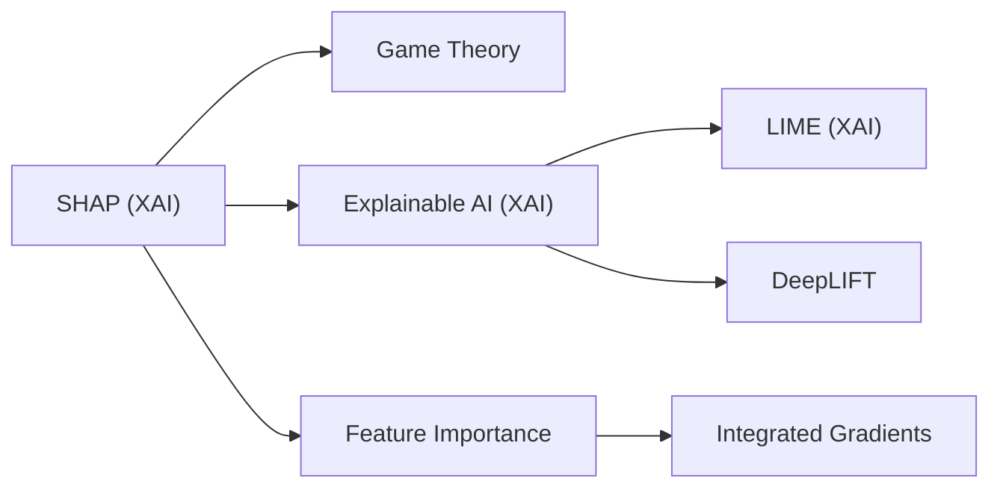
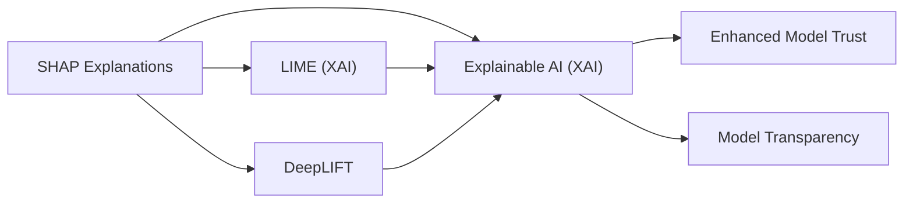

# SHAP

## Origin

[[SHAP]], or SHapley Additive exPlanations, is a method for explaining the output of machine learning models by assigning a value to each feature for a specific prediction, indicating its contribution to the outcome. This technique is based on [[SHAP|Shap]]ley values from cooperative game theory, which was introduced to address the need for interpretability in complex models. The immediate circumstances for its creation involved the increasing complexity of machine learning models and the need for transparency in their decision-making processes.

[[SHAP]]'s evolution has been significant, especially in its application across various machine learning models. Initially, it was more efficient for tree-based models like Random Forests and Gradient Boosting Machines. However, its agnostic nature allows it to be applied to any machine learning model, making it a versatile tool for model interpretability.

## Possibilities

### Expected Outcomes

#### Positive Outcomes

- **Enhanced Transparency**: [[SHAP]] provides a clear understanding of how each feature contributes to a model's prediction, which is crucial for regulatory compliance and model reliability.
- **Improved Model Development**: By identifying the most influential features, developers can refine their models, reducing overfitting and improving generalization.
- **Better Decision Making**: Stakeholders can make informed decisions by understanding the rationale behind model predictions.

#### Negative Outcomes

- **Complexity**: [[SHAP]] can be computationally intensive, especially for large datasets or complex models.
- **Misinterpretation**: Without proper understanding, [[SHAP]] values can be misinterpreted, leading to incorrect conclusions about feature importance.
- **Overreliance**: Relying solely on [[SHAP]] might overlook other important aspects of model performance.

## Actual Outcomes

### Positive Outcomes

- **Regulatory Compliance**: [[SHAP]] has been used in financial and healthcare sectors to satisfy "right to explanation" requirements, ensuring that models are transparent and fair.
- **Model Optimization**: In real-world applications, [[SHAP]] has helped developers identify and remove redundant features, improving model efficiency.

### Negative Outcomes

- **Data Leaks**: [[SHAP]] analyses have revealed data leaks where seemingly innocuous features had an unexpectedly strong influence on predictions, indicating potential issues in data preprocessing.
- **Computational Costs**: Large-scale SHAP computations can be resource-intensive, limiting its application in real-time systems.

### Resonance

SHAP connects with other explainable AI techniques like [[xAI]] and [[Feature Importance]], which also aim to provide insights into model behavior. Its principles resonate with broader concepts in [[Game Theory]] and [[Cooperative Learning]], highlighting the importance of attributing contributions in complex systems.

### Distinction

While SHAP offers detailed feature-level explanations, it faces challenges from alternative methods like [[DeepLIFT]] and [[Integrated Gradients]], which provide different perspectives on model interpretability. Critiques of SHAP include its computational complexity and the potential for misinterpretation if not used correctly.

## Summary

### Bloom's Taxonomy Table

| **Bloom's Layer** | **Description**                     | **Examples**               |
| ----------------- | ----------------------------------- | -------------------------- |
| Factual           | Basic SHAP concepts and terminology | SHAP values, base value    |
| Conceptual        | Relationships between features and predictions | Feature importance, model interpretability |
| Procedural        | Practical methods for applying SHAP | Using SHAP for model optimization |
| Metacognitive     | Reflecting on SHAP's impact on model development | Evaluating SHAP's role in improving model reliability |

### Integral Theory Table

| **Quadrant**        | **Key Elements/Insights**  |
| ------------------- | -------------------------- |
| Interior-Individual | A data scientist's personal insight into model behavior through SHAP |
| Interior-Collective | Shared values in the data science community about transparency and fairness |
| Exterior-Individual | A developer using SHAP to refine a model's features |
| Exterior-Collective | Organizations implementing SHAP for regulatory compliance and model reliability |

### Knowledge Expansion Table

| **Knowledge Item**        | **Description**                    | **Relevance/Relationship**                      |
| ------------------------- | ---------------------------------- | ----------------------------------------------- |
| [[Game Theory]]           | Principles of cooperation and contribution attribution | Underlies SHAP's method for assigning feature importance |
| [[xAI]] | Techniques for model interpretability | SHAP is a key component of XAI, enhancing model transparency |
| [[Feature Importance]]   | Methods for evaluating feature impact on models | Complementary to SHAP, offering different insights into feature contributions |

### Visualization

This visualization illustrates how SHAP connects with broader concepts in explainable AI and game theory, while also highlighting its relationship with other feature importance methods.
[^1] [^2] [^3] [^4] [^5]

# SHAP Explanations

## Origin

**SHAP (SHapley Additive exPlanations)** is a technique used in the field of explainable AI to attribute the predictions of machine learning models to their features. The concept of SHAP is rooted in Shapley values, which were introduced by Lloyd Shapley in 1953 in the context of cooperative game theory. Shapley values measure the contribution of each player in a game by averaging over all possible coalitions that could form without that player.[^1][^2]

The application of Shapley values in machine learning began in 2010 with researchers Erik Štrumbelj and Igor Kononenko proposing their use to explain individual classifications. However, it wasn't until 2017 that SHAP gained widespread recognition with the publication of a paper by Scott Lundberg and Su-In Lee, which reformulated the estimation of Shapley values as a weighted linear regression using the Kernel estimator.[^1]

## Possibilities

### Expected Outcomes

#### Positive Outcomes

- **Model Interpretability**: SHAP enhances the transparency of complex machine learning models by attributing predictions to specific features, which is crucial for debugging and trust-building.[^3][^4]
- **Fairness and Accountability**: By understanding how each feature contributes to a prediction, SHAP helps in identifying and mitigating biases in models.[^2]
- **Improved Decision-Making**: SHAP can aid in making informed decisions by providing insights into the factors influencing model outputs.[^3]

#### Negative Outcomes

- **Computational Complexity**: Calculating SHAP values can be computationally intensive, especially for large datasets or complex models, which may limit its practicality in real-time applications.[^2]
- **Overreliance on Assumptions**: SHAP assumes feature independence, which might not always hold true, potentially leading to misleading interpretations if feature interactions are significant.[^2]

## Actual Outcomes

### Positive Outcomes

- **Real-World Applications**: SHAP has been successfully applied in various domains, such as healthcare and finance, to explain model predictions and ensure accountability.[^3]
- **Enhanced Model Development**: By identifying critical features, SHAP helps in refining models, leading to better performance and reliability.[^4]

### Negative Outcomes

- **Misinterpretation of Feature Importance**: In cases where features are highly correlated, SHAP might misattribute importance, leading to incorrect conclusions about feature contributions.[^2]

### Resonance

SHAP resonates with other interpretability techniques like **LIME** and **DeepLIFT**, as it provides a unified approach to understanding model predictions. It also connects with broader themes in **Explainable AI (XAI)**, enhancing model transparency and trustworthiness.[^1][^3]

### Distinction

While SHAP offers a powerful framework for model interpretability, it faces challenges from alternative methods like **Permutation Feature Importance**, which can be simpler to compute and interpret. Additionally, SHAP's reliance on Shapley values means it shares limitations with those values, such as computational complexity and assumptions about feature independence.[^2][^3]

## Summary

### Bloom's Taxonomy Table

| **Bloom's Layer** | **Description**                     | **Examples**               |
| ----------------- | ----------------------------------- | -------------------------- |
| Factual           | Basic facts about SHAP and Shapley values | Definition of SHAP, origins in game theory[^1][^2] |
| Conceptual        | Understanding how SHAP relates to model interpretability | SHAP's role in Explainable AI, connection to LIME[^1][^3] |
| Procedural        | Practical application of SHAP in machine learning | Using SHAP to analyze feature contributions[^3][^4] |
| Metacognitive     | Reflecting on the limitations and potential biases of SHAP | Considering computational complexity and feature independence assumptions[^2] |

### Integral Theory Table

| **Quadrant**        | **Key Elements/Insights**  |
| ------------------- | -------------------------- |
| Interior-Individual | Personal insights from using SHAP for model transparency, enhancing trust in AI decisions.[^3] |
| Interior-Collective | Societal value of SHAP in promoting accountability and fairness in AI systems.[^2] |
| Exterior-Individual | Practical application of SHAP in real-world projects, such as feature selection and model optimization.[^4] |
| Exterior-Collective | Impact of SHAP on organizational structures and networks by enhancing model interpretability and trust.[^3] |

### Knowledge Expansion Table

| **Knowledge Item**        | **Description**                    | **Relevance/Relationship**                      |
| ------------------------- | ---------------------------------- | ----------------------------------------------- |
| [[xAI]]           | Local Interpretable Model-Agnostic Explanations | Alternative method for model interpretability, often compared to SHAP.[^1] |
| [[DeepLIFT]]             | Method for attributing feature importance | Another technique unified under SHAP's framework.[^1] |
| [[xAI]] | Broader field encompassing SHAP and other interpretability techniques | Contextualizes SHAP within the broader goal of enhancing AI transparency.[^3] |

### Visualization

This visualization illustrates how SHAP connects with other interpretability methods like LIME and DeepLIFT, all contributing to the broader field of Explainable AI (XAI), which aims to enhance model trust and transparency.
[^6] [^7] [^8] [^9] [^10]

## Project Link

[[AI Cognitive Assistant]]

[^1]: https://datascientest.com/en/shap-what-is-it
[^2]: https://www.aidancooper.co.uk/a-non-technical-guide-to-interpreting-shap-analyses/
[^3]: https://towardsdatascience.com/using-shap-values-to-explain-how-your-machine-learning-model-works-732b3f40e137/?gi=913a75de2b2f
[^4]: https://acerta.ai/blog/understanding-machine-learning-with-shap-analysis/
[^5]: https://shap.readthedocs.io/en/latest/
[^6]: https://mindfulmodeler.substack.com/p/a-short-history-of-shap
[^7]: https://www.pinnacleactuaries.com/article/breaking-down-concept-and-algebra-behind-shap
[^8]: https://christophmolnar.com/books/shap/
[^9]: https://mindfulmodeler.substack.com/p/interpreting-machine-learning-models
[^10]: https://shap.readthedocs.io/en/latest/
