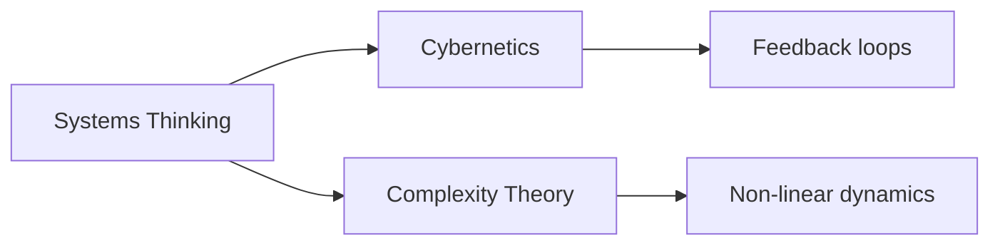

# Systems Thinking

## Narrative on Systems Thinking in Knowledge Management

### Origin

Systems Thinking emerged in the mid-20th century, primarily developed to understand complex systems in sectors such as biology, engineering, and social sciences. The concept aimed to address the compartmentalized approach of problem-solving, which failed to account for the interdependencies within systems. Originating from the work of Ludwig von Bertalanffy in general systems theory, it evolved through contributions from thinkers such as Jay Forrester and Peter Senge, who emphasized its application in organizational learning and management.

Over time, Systems Thinking has expanded beyond its initial scientific roots to include fields like ecology and social systems, addressing varied problems from business inefficiencies to environmental sustainability. It champions a holistic approach, integrating diverse components into a coherent whole, enabling stakeholders to visualize systemic relationships and feedback loops that influence system behavior.

### Possibilities

#### Expected Outcomes

- **Positive Outcomes**:
	- Enhanced decision-making and strategic planning due to a comprehensive understanding of system interactions.
	- Improved resource allocation and operational efficiency.
	- Creation of sustainable practices in environmental, organizational, and social systems.
	- Facilitation of interdisciplinary collaboration and innovation.

- **Negative Outcomes**:
	- Protracted analysis processes, leading to decision paralysis if not implemented carefully.
	- Risk of oversimplifying complex systems by neglecting qualitative nuances.
	- Potential resistance from stakeholders due to the perceived complexity of adopting systemic methods.

### Actual Outcomes

#### Positive Outcomes

- **Example**: In business, systems thinking is widely applied for organizational change in companies like Toyota, which adopted the Toyota Production System, a model improving workflow and productivity by understanding interdependencies and reducing waste.

- **Example**: In urban planning, systems thinking helped Curitiba, Brazil, develop an innovative public transport system designed to integrate with its metropolitan structure, enhancing public use and reducing vehicular congestion.

#### Negative Outcomes

- **Example**: The U.S. healthcare system has faced challenges in systems thinking due to its complexity and scale. Efforts to integrate insurance, providers, and patients have sometimes led to inefficiencies and increased costs, revealing gaps in applying systems thinking without adequate stakeholder alignment.

### Resonance

Systems Thinking correlates with [[Cybernetics]] and [[Complexity Theory]], enhancing understanding through cross-disciplinary insights. For instance, Cybernetics' focus on feedback mechanisms complements Systems Thinking's objective to visualize and predict systemic behaviors. Likewise, Complexity Theory, which analyzes unpredictable elements within systems, enriches systems thinking by addressing non-linearity and emergent phenomena.

### Distinction

Competing methodologies like linear problem-solving and reductionism challenge systems thinking. While systems thinking offers holistic perspectives, reductionist approaches claim efficacy in simplifying and addressing individual system parts. Real-world implications indicate that relying solely on linear methods may neglect larger context, risking myopic solutions to multifaceted problems.

## Summary

### Bloom's Taxonomy Table

| **Bloom's Layer** | **Description**                    | **Examples**                                             |
| ----------------- | ---------------------------------- | -------------------------------------------------------- |
| Factual           | Core facts about Systems Thinking  | Frameworks, terms like 'feedback loops', 'ecosystems'    |
| Conceptual        | Relationships between components   | Interrelations in business models, ecological networks   |
| Procedural        | Application in real-world contexts | Methodologies for project management, strategic planning |
| Metacognitive     | Reflective insights on application | Analyzing systemic failures for holistic improvements    |

### Integral Theory Table

| **Quadrant**        | **Key Elements/Insights**                                                                 |
| ------------------- | ----------------------------------------------------------------------------------------- |
| Interior-Individual | Personal understanding of systems thinking change perspectives on problem-solving         |
| Interior-Collective | Emergence of shared cultural values supporting sustainability and integrated practices    |
| Exterior-Individual | Adoption of systems thinking tools like causal-loop diagrams in personal productivity     |
| Exterior-Collective | Organizational restructuring using systems methodologies for improved workflows          |

### Knowledge Expansion Table

| **Knowledge Item**                        | **Description**                                      | **Relevance/Relationship**                      |
| ----------------------------------------- | ---------------------------------------------------- | ----------------------------------------------- |
| [[Cybernetics]]                           | Study of systems, control, and communication         | Feedback mechanisms enrich systems understanding |
| [[Complexity Theory]]                     | Analyzing unpredictable system components            | Non-linear thinking aids in addressing dynamics |
| [[Ecological Systems Theory]]             | Framework for understanding biological interactions  | Environmental perspectives on systems integration |

### Visualization

---

## Project Link

[[Create Knowledge Management System]]
