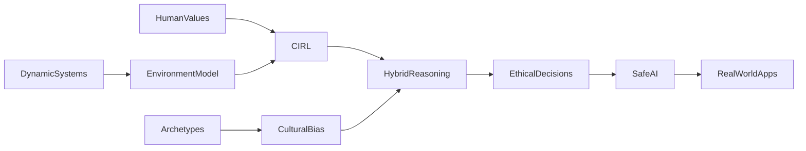

# Value-Aligned, Systemically-Aware & Culturally-Sensitive AI

## Unified Narrative

AI is moving beyond raw prediction toward systems that:
1. Learn cooperatively with people (Co-operative Inverse Reinforcement Learning, CIRL).
2. Reason over changing, inter-connected environments (Dynamic & Relational Systems thinking).
3. Fuse neural learning with symbolic rules so that new ideas are automatically checked against explicit ethical constraints (Hybrid Neuro-Symbolic Reasoning).
4. Respect the cultural power of stories by recognising, critiquing and diversifying the archetypal narratives embedded in training data (AI Archetypal Narratives).

Viewed together, these strands form a single ambition: create AI that optimises for human values, stays robust in complex real-world settings, can explain (and justify) its behaviour, and avoids cultural or ethical blind spots.
Practical implications span safe robotics, policy modelling, decision-support, creative tools, and any domain in which AI acts on—or co-creates with—human societies.

## Conceptual Overview

| Pillar | Core Idea / Definition | Key Methods & Techniques | Representative Use Cases | Open Challenges |
|--------|------------------------|--------------------------|--------------------------|-----------------|
| CIRL | AI and human jointly maximise the human's (unknown) reward function | Formalise as a partially-observable game; reduce to POMDP; active teaching/learning | Shared-control robots, assistive household agents | Computational cost; ambiguous or conflicting human goals |
| Dynamic & Relational Systems | Model entities + relations evolving through time | System dynamics, agent-based simulation, feedback-loop analysis | Urban traffic planning, ecological restoration, supply-chain resilience | Model over-complexity, brittle assumptions, data scarcity |
| Hybrid Neuro-Symbolic Value Reasoning | Combine neural pattern recognition with symbolic ethical rules | MRKL pipelines, differentiable logic layers, value-alignment constraints | Medical decision support, autonomous vehicles' "ethical governors" | Integrating conflicting moral frameworks; explainability vs. performance |
| AI Archetypal Narratives | Archetypes (Hero, Sage, etc.) surface in AI outputs, shaping culture | Narrative audits, bias detection, culturally-diverse fine-tuning | AI-assisted storytelling, chatbots, marketing content | Cultural homogenisation, bias amplification, authentic representation |

## Interconnections Across Topics

Textual Map
- CIRL supplies the value-alignment objective.
- Hybrid reasoning supplies the machinery to check alignment in real time.
- Dynamic & Relational modelling describes the multi-agent, feedback-rich environments in which CIRL agents operate.
- Archetypal-narrative analysis acts as a cultural "lens", revealing latent biases that CIRL and hybrid reasoning must address.

Visual (Mermaid)

## Actionable Framework / Guide

1. Guided Learning Path
	 Step 1 – Foundations
		 - Read Russell et al., "Co-operative Inverse Reinforcement Learning" (2016).
		 - Complete an online System Dynamics primer (e.g., MIT OpenCourseWare).
	 Step 2 – Hands-on
		 - Implement a tiny CIRL scenario in Python (human gives noisy feedback; agent uses POMDP solver).
		 - Build a simple stock-and-flow model of a familiar system (personal finances, garden ecosystem).
	 Step 3 – Hybrid Reasoning
		 - Follow IBM's Neuro-Symbolic AI tutorial; reproduce a rule-enhanced image classifier.
		 - Add an "ethical rule layer" (e.g., fairness constraint) and measure performance trade-offs.
	 Step 4 – Narrative Audit
		 - Prompt an LLM with a classic scenario (quest, mentorship, conflict). Identify archetypes and potential cultural biases.
		 - Fine-tune or post-edit to introduce under-represented archetypes; evaluate difference using crowd feedback.
	 Step 5 – Capstone Project
		 - Design an AI assistant for urban cyclists: model city traffic (Dynamic Systems), learn cyclists' preferences via CIRL, enforce safety rules via Hybrid Reasoning, and craft culturally sensitive alerts/stories.

2. Practical Experiments
	 - Run wolf-reintroduction simulation: observe unintended consequences -> discuss CIRL agent's difficulty when human reward shifts.
	 - Ethics-stress-test: feed controversial scenarios to your hybrid agent; record rule activations and outcomes.

3. Recommended Resources
	 Papers:
		 – "Cooperative Inverse Reinforcement Learning" (Russell et al., 2016)
		 – "The Logic of Ethical AI" (JAIR, 2020)
	 Courses:
		 – "AI Safety Fundamentals" (BlueDot / EA)
		 – "Systems Thinking" (Coursera, Johns Hopkins)
	 Tools & Libraries:
		 – `pomdp_py`, `PySD`, `NeSy`, `LangChain` prompt audit module

4. Continuing Exploration
	 - Join the IEEE Working Group on Ethically Aligned Design.
	 - Contribute to open-source "narrative-diversity" datasets.
	 - Track benchmarks that couple CIRL with large-scale simulators (e.g., PettingZoo multi-agent environments).

By progressing through these steps you will build an integrated skill-set: modelling complex contexts, eliciting and aligning human values, operationalising ethics, and safeguarding cultural diversity—all essential for the next generation of trustworthy AI systems.

[[Value-Aligned, Systemically-Aware & Culturally-Sensitive AI Chain]]
