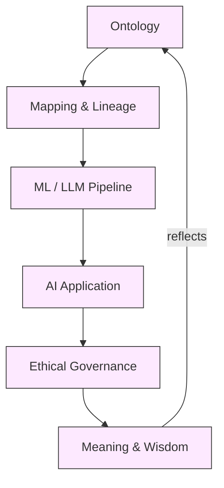

# Epistemology & Knowledge Systems in the Age of AI (2024 Integrated Guide)

> [!summary]
> How do we **define**, **justify**, **map**, **govern** and finally **make sense** of knowledge in an AI–saturated world?
> This note weaves insights from classical philosophy, modern data practice and 2024-era legal/ethical updates into one actionable loop.

---

## 1️⃣ Unified Narrative – The Five Entangled Strands

Epistemology still asks the oldest question—*How do we know?*—but Large Language Models, data trusts and global regulation give the answer five tightly-coupled dimensions:

1. **Core Epistemology**
	 - Rationalism ⇄ Empiricism now drives everything from Bayesian model selection to A/B testing culture.
	 - Social & feminist turns expose whose data, power and "ground-truth" feed an algorithm.
	 - Virtue epistemology reframes uncertainty calibration as an *intellectual virtue*.
	 - Live risk: epistemic opacity in deep nets; relativism when "all truths" look equal.

2. **Ontology**
	 - From Aristotle's categories to RDF/OWL, ontologies provide machine-processable meaning.
	 - 2024 advances: SHACL-based alignment, graph-embedding matching, real-time scene ontologies for autonomous vehicles.
	 - Persistent gap: bias baked into concept hierarchies; Indigenous and domain-local world-views that resist one-size-fits-all taxonomies.

3. **Epistemological Mapping**
	 - The cartography of knowledge—concept maps, lineage graphs, cognitive visualisations.
	 - Modern twist: graph DBs that trace evidence for explainability and audit; "knowledge gardens" blending scientific & traditional wisdom.
	 - Fail-mode: tool sprawl that re-creates the opacity it meant to cure.

4. **Ethical Treatment of Knowledge**
	 - From academic honesty to GDPR, IEEE & UNESCO standards, ethics now governs each lifecycle step.
	 - New pressure points: cross-border data-trusts, U.S. "data scraping" rulings, post-Cambridge Analytica trust deficit.
	 - Central tension: accelerate innovation vs. avoid surveillance capitalism & ethics-washing.

5. **Meaning & Wisdom**
	 - The "Why?" layer guards against building powerful yet pointless systems.
	 - Wilber's Integral Quadrants (internal/external × individual/collective) surface blind spots:
		 Q1 User experience | Q2 Behavioural metrics | Q3 Cultural legitimacy | Q4 Socio-technical infrastructure.
	 - New dialogue: reconcile post-modern power critiques with pragmatic engineering KPIs.

Together they form a continuous learning loop: **Define what exists (Ontology) → Justify it (Epistemology) → Map & operationalise (Mapping) → Govern responsibly (Ethics) → Reflect on ultimate purpose (Wisdom)** — then iterate.

---

## 2️⃣ Conceptual Overview

| Element | Core Concepts & Definitions | Methods & Techniques | 2024 AI Use Cases | Toughest Open Challenges |
|---------|----------------------------|----------------------|-------------------|--------------------------|
| **Epistemology** | Justified belief, rationalism/empiricism, social & virtue turns | Critical-thinking rubrics, Bayesian networks, uncertainty calibration | LLM "chain-of-thought" auditing; dataset provenance scoring | Epistemic opacity; deep-fake fuelled distrust |
| **Ontology** | Classes, relations, axioms; cross-ontology alignment | Protégé, SHACL, graph embeddings | Real-time scene graphs in AVs; retail mega-taxonomy mergers | Bias in global vs. local schemes; costly versioning |
| **Epistemological Mapping** | Knowledge cartography, lineage graphs | Neo4j lineage, Miro + GPT summarisation, attention heat-maps | Explainable-AI dashboards with drill-down to raw evidence | Cognitive overload; integrating tacit & Indigenous knowledge |
| **Ethical Treatment** | Privacy, transparency, consent, IP | Differential privacy, recursive data-deletion, UNESCO & IEEE checklists | Foundation-model "system cards"; cross-border data-trusts | Regulatory divergence; ethics-washing; surveillance creep |
| **Meaning & Wisdom** | Purpose, virtue ethics, Integral Quadrants | Reflective practice, value-sensitive design, scenario planning | Long-term alignment workshops; carbon-aware ML scheduling | Operationalising "wisdom" metrics; mediating multicultural values |

---

## 3️⃣ Interconnections Across Topics

- Ontology supplies the vocabulary that Mapping renders navigable.
- Mapping's lineage trails feed Ethical audits; ethics feedback spawns new ontology classes (e.g., *consent-status*).
- Meaning & Wisdom evaluate loop success, balancing individual (Q1, Q2) and collective (Q3, Q4) impacts.
- Social & feminist epistemology plug directly into Q3 by challenging whose concepts make the ontology cut.

---

## 4️⃣ Actionable Framework / Guide

### Phase 1 – Historical Foundations

1. Watch 30-min primer *Plato vs Aristotle on Knowledge*.
2. Read Descartes' *Meditations* (excerpts) and Hume's *Enquiry* §§1-2; post a 200-word Slack contrast.

### Phase 2 – Tool & Concept Mastery

1. Install **Protégé** → model a "Clinical Trial" ontology; validate with **SHACL**.
2. In **Neo4j**, ingest an open COVID trial dataset; generate a lineage graph.

### Phase 3 – Ethics in Practice

1. Analyse the Cambridge Analytica timeline; tag impacts across the four quadrants.
2. Draft a data-licence & differential-privacy plan for your ontology.

### Phase 4 – Integral Capstone

1. Build a micro-knowledge graph, fine-tune a small LLM on it.
2. Release a **System Card** covering provenance, bias, carbon, quadrant impacts.
3. Hold a multi-stakeholder review (data subjects, domain experts, ethicists) and iterate.

#### Hands-On "Pop-Up" Labs

- **Bias-Hunt Redux** ⟶ Trace bias roots through ontology classes *and* lineage graphs.
- **Relativism Stress-Test** ⟶ Two teams craft conflicting ontologies for the same domain; reconcile via virtue-epistemology dialogue.

#### Key Resources

- Books: *Epistemology: A Contemporary Introduction* (Audi); *Semantic Web for the Working Ontologist* (Allemang & Handler); *Ethics in the Age of Big Data* (Mirsch).
- Standards: UNESCO Recommendation on Ethics of AI (2023); IEEE *Ethically Aligned Design* v2.
- Communities: W3C **Responsible KB** CG; Indigenous AI Network; IEEE Global Initiative on Ethics of Autonomous & Intelligent Systems.

---

## 5️⃣ Take-Away

> [!tip] The Loop
> **Define ➜ Justify ➜ Map ➜ Govern ➜ Reflect → repeat.**
> Follow this loop to turn raw data into responsible, culturally-aware and ultimately *meaningful* intelligence—avoiding both techno-solutionism and nihilistic relativism.
