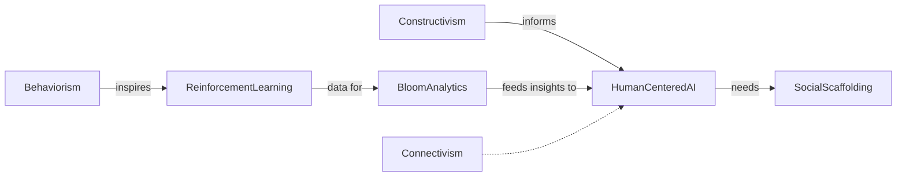

# Learning Theories & Knowledge Frameworks

*(Behavioral Psychology • Constructivism • Bloom's Taxonomy)*

> [!summary] **Why it matters**
To build human-centred, AI-enhanced learning ecosystems we must align three lenses:
*Behavioral Psychology* (how to shape action), *Constructivism* (how meaning is built), and *Bloom's Taxonomy* (how to classify cognitive depth). When woven together they create an ethical, data-rich loop from stimulus → experience → reflection → new behaviour.

---

## 1. Unified Narrative

*Epistemology asks how belief becomes knowledge; learning sciences operationalise the answer.*

1. **Behavioral Psychology (BP)**
	 - From Pavlov & Skinner to dopamine-level reward-prediction error, BP shows how external stimuli condition behaviour.
	 - Revived by reinforcement-learning (RL) algorithms, yet tempered by concerns over autonomy loss and "dark-pattern" manipulation.

2. **Constructivism (CON)**
	 - Learners actively—and socially—construct mental models (Piaget, Vygotsky).
	 - Scales today from studio-based design sprints to massive open online communities (MOOCs, GitHub Copilot pairing).
	 - Emphasises ownership, transfer, and collaborative innovation.

3. **Bloom's Taxonomy (BLM)**
	 - A classification, not a theory: *Remember → Understand → Apply → Analyse → Evaluate → Create* (2001 revision adds four knowledge types: Factual, Conceptual, Procedural, Metacognitive).
	 - Adopted in VR surgical sims, coding boot-camps, MBA strategy games—yet still critiqued for rigidity and cultural bias.

**Iterative Loop, not Linear Ladder**
Stimulus *(BP)* ↔ Experience *(CON)* ↔ Reflection/Metacognition *(BLM top tiers)* ↔ Refined Behaviour.
Modern AI platforms instantiate the full loop: RL nudges, chatbot co-construction, Bloom-tagged analytics.

---

## 2. Conceptual Overview

| Aspect | **Behavioral Psychology** | **Constructivism** | **Bloom's Taxonomy (2001+)** |
|---|---|---|---|
| Core Definition | Behaviour change via conditioning & reinforcement. | Active, often social, construction of meaning. | Classification of cognitive processes & knowledge types. |
| 2024 Focus Questions | • Can we motivate without eroding intrinsic drive? • What are ethical guard-rails for algorithmic reinforcement? | • How do we scale personalised, collaborative inquiry while preserving rigour? | • How do we validly detect *Analyse / Evaluate / Create* with AI? |
| Key Methods & Tech | Classical/operant conditioning, variable-ratio schedules, token economies, RL agents. | Scaffolding, problem-based learning (PBL), design thinking, peer review, connectivist networks. | Six cognitive verbs × four knowledge dimensions; analytic rubrics; affective & psychomotor extensions. |
| Typical Applications | Habit-forming apps, CBT, Duolingo's RL tutor. | VR critique studios, maker spaces, peer-programming as ZPD. | Curriculum mapping, adaptive quizzes, VR-checklists, AI-rubrics. |
| Strengths | Predictable, measurable, computationally tractable. | Deep transfer, creativity, learner ownership. | Shared language for curriculum, assessment & analytics. |
| Limitations | Over-justification effect; manipulation risks. | Assessment difficulty; facilitator intensive. | Hierarchy oversimplification; culture bias; weak psychomotor metrics. |
| Unsolved Challenges | Ethical RL design balancing extrinsic & intrinsic rewards. | Scalable, trustworthy assessment of open-ended learning. | Automated, valid measurement of higher-order thinking. |

---

## 3. Interconnections to AI & Beyond

### Textual Map

- **BP ↔ RL in AI** – behavioural principles encode reward structures. 
- **CON ↔ Human-AI co-creativity** – chatbots and pair-programming operate in learners' ZPD. 
- **BLM ↔ Learning Analytics** – Bloom verbs & knowledge types tag content and artefacts. 
- **Neuroscience** bridges BP and RL by modelling reward-prediction error. 
- **Connectivism** enriches CON with network-level knowledge graphs consumed by AI recommender systems.

> RL tutors predict the "next problem" (BP) but must respect autonomy and metacognitive goals (BLM) within socially scaffolded spaces (CON).

---

## 4. Actionable Framework / Guide

### A. Guided Learning Path

1. **Behavioural Foundations (≈2 h)**
	 - Read Skinner plus a modern ethical critique.
	 - Code a simple multi-armed bandit; graph reward-prediction error.
2. **Constructivist Perspective (≈4 h)**
	 - Join an online design-thinking sprint; map peers as your Zone of Proximal Development.
3. **Bloom Structuring (≈3 h)**
	 - Rewrite sprint deliverables using Bloom verbs across F/C/P/M knowledge types.
	 - Add a self-rating rubric for Metacognitive knowledge.
4. **Integration Project (1–2 weeks)**
	 - Build a micro-learning app:
		 *Behaviour layer* – RL engine with user-controlled reward intensity.
		 *Constructivist layer* – reflection journals, peer comments, versioned artefacts.
		 *Bloom layer* – auto-tag tasks; dashboard heat-map.
		 *Ethics layer* – transparency log of nudges, opt-out switch.

### B. Experiments & Practice

- A/B test RL reward schedules vs. autonomy-supportive prompts; measure intrinsic motivation.
- Use a VR CPR sim tagged at *Procedural–Analyse*; compare AI rubric with expert ratings.
- Visualise peer-review networks to study knowledge flow.

### C. Recommended Resources

- Pavlov, *Conditioned Reflexes*; Skinner, *Science and Human Behavior*.
- Piaget, *The Construction of Reality in the Child*; Vygotsky, *Mind in Society*.
- Anderson & Krathwohl, *A Taxonomy for Learning, Teaching, and Assessing*.
- Journal article: "Reward Prediction Error Signals in RL & Pedagogy" (2023).
- MOOCs: "Learning How to Learn", "Connectivism & Networked Learning".
- Toolkits: OpenAI Gym + xAPI for Bloom tagging; Mozilla Hubs for VR critique studios.

### D. Application Checklist

1. **Behaviour** – What stimulus/feedback am I providing? Is it ethical, transparent, autonomy-supportive?
2. **Construction** – How will learners generate, debate, reorganise meaning?
3. **Cognition** – Which Bloom level & knowledge type is targeted? Do analytics confirm it?
4. **Reflection** – How will learners self-monitor and avoid reward dependency?

---

> [!tip] **Design mantra**
Ask every time: *What behaviour do I want?* → *How will meaning emerge?* → *How will I recognise and measure deeper thinking?* Iterate until the system not only *teaches* but *cultivates resilient, creative, ethically grounded knowers*.
