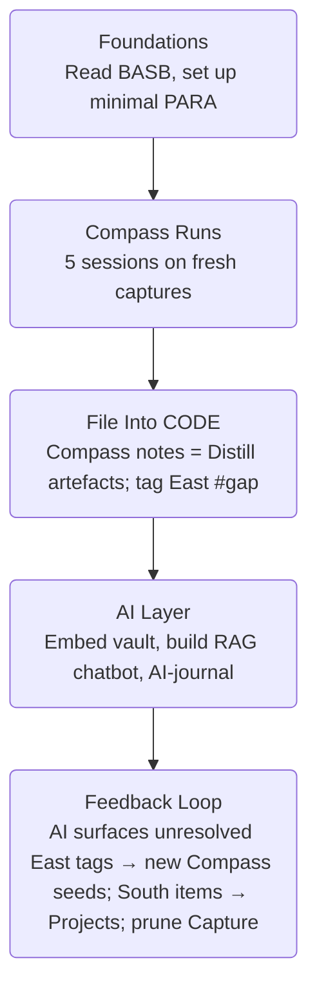

# The Compass Method for Idea Expansion

## Unified Narrative

The Compass Method—also known as **"Zettelkasten Compass," "Idea Compass," or "Fei-Ling Compass"**—is a lightweight thinking routine that transforms a single atomic note into a lattice of related insights. Borrowing Zettelkasten's principle of densely-linked notes, it overlays four repeatable prompts that keep you from staring at a blank page:

| Direction | Epistemic Lens | Guiding Question |
|-----------|----------------|------------------|
| **North** | Genealogy & context | Where does this idea come from? |
| **West**  | Family resemblance | What is similar or adjacent? |
| **East**  | Dialectic / critique | What competes, contradicts, or is missing? |
| **South** | Teleology & application | Where could this idea lead? |

"Walking the compass" lets you zoom out (North), pan sideways (West), interrogate gaps (East), and zoom in on downstream uses (South). Each bullet you write can itself become the centre of a fresh compass run, producing an ever-expanding knowledge graph that surfaces blind spots, spawns research questions, and seeds creative projects.

## Conceptual Overview

| Aspect | Details | Mini-Example (Idea = "Retrieval-Augmented Generation / RAG") |
|--------|---------|-------------------------------------------------------------|
| Core concept | 4-direction questioning of one atomic idea | Ask: *Where did RAG originate?* |
| Directional prompts | N = source/origin; W = similar/adjacent; E = opposite & missing; S = future uses | E: *What breaks if we remove external docs?* |
| Conversational features | Any bullet can spawn its own compass; items can migrate into other directions later | "Vector-DB latency" starts in East, later becomes North of a new note |
| Real-world use | Brainstorming, literature review, product road-mapping, course design | Workshop team converts South bullets into backlog items |
| Epistemic pay-off | Externalises context, analogies, disanalogies, teleology, and blind spots | Spot hallucination risks → research agenda |
| Gaps / challenges | Risk of superficial answers, need for repetition, no built-in taxonomy | Mitigate with templates, timed sprints, backlink conventions |

## Interconnections Across Topics

- Functions as a "micro-Distill" move inside the **CODE** framework—each compass table is a ready-made progressive summary.
- Produces atomic, self-contained notes ideal for **vectorisation** in AI-augmented PKM.
- South bullets map cleanly to PARA "Projects" or OKR goal notes, while East bullets feed epistemic-humility audits.

## Actionable Framework / Guide

1. **Template** Create a 2 × 2 grid labelled N-W-E-S.
2. **10-Minute Sprint** Pick a recent capture; add ≥ 2 bullets per quadrant.
3. **Link Outputs** 
	 - North → Resources folder
	 - West → relevant topic notes
	 - East → tag **#gap** + review date
	 - South → tasks / project briefs
4. **Recursion Rule** If a bullet feels "chunky," run its own compass within 48 h.
5. **Reflection Cadence** Weekly: review East-tagged gaps; Monthly: cluster South bullets into deliverables.
6. **Resources** Obsidian "Compass-Run" snippet, *How to Take Smart Notes*, Fei-Ling workshop replay.

---

# CODE Framework for Personal Knowledge Management

## Unified Narrative

Tiago Forte's **C-O-D-E (Capture → Organise → Distill → Express)** operationalises how individuals turn digital debris into finished outputs.

- **Capture** = observation
- **Organise** = categorisation (often with PARA)
- **Distill** = abstraction (progressive summarisation **or compass runs**)
- **Express** = justification / sharing

Practised well, CODE lowers cognitive load, speeds retrieval, and boosts creative synthesis. Practised poorly, it devolves into collector's fallacy, tool-fetishism, and maintenance fatigue.

## Conceptual Overview

| Aspect | Details | Example |
|--------|---------|---------|
| Core phases | Capture, Organise, Distill, Express | Screenshot → PARA/Resources → compass run → blog post |
| Origin & evolution | Grew from Forte's *Building a Second Brain* course & book | 2017 blog series → 2022 book |
| Expected positives | Fast retrieval, reduced overload, higher reuse | Find a 5-year-old idea in seconds |
| Expected negatives | Digital hoarding, overhead, platform lock-in | Hours lost re-tagging notes |
| Resonances | GTD, Zettelkasten, Agile retros, Bloom's taxonomy | Distill ≈ Analyse/Evaluate level |
| Distinctions / critiques | Implementation complexity, sustainability doubts | Many users quit after initial enthusiasm |

## Interconnections Across Topics

- Compass runs are a lightweight Distill sub-routine.
- AI-assisted search (vector & RAG) accelerates Capture ↔ Organise ↔ Distill loops **if** CODE hygiene is in place.
- South outputs from Compass naturally feed the **Express** phase.

## Actionable Framework / Guide

**6-Week Learning Path**
1. Weeks 1–2 Capture everything to one inbox—no judgement.
2. Week 3 Organise: spin up PARA; create "Projects" only for live goals.
3. Week 4 Distill: progressive summarisation **or 5 compass runs** on legacy notes.
4. Week 5 Express: ship one public artefact (tweet, memo, tutorial).
5. Week 6 Retro: score retrieval speed & note reuse; prune or refine tools.

**Experiments**
- *Compass-inside-CODE*: prefix every Distill session with a compass sprint; record idea novelty.
- *Just-in-Time Project Notebook*: create project folders only when a real deadline appears; track maintenance load.

**Key Resources** *Building a Second Brain* · BASB circle · r/PKM discussions.

---

# AI-Augmented PKM: Vectorisation, RAG, and Intelligent Journaling

## Unified Narrative

Modern LLM tooling lets us layer AI atop disciplined PKM. By chunking notes into semantically small units (a by-product of Compass & CODE), we can embed them as vectors and build **Retrieval-Augmented Generation (RAG)** assistants: *top-k retrieval → prompt concat → model answer with citations*. The same embeddings enable sentiment-aware journaling companions that surface recurring themes, flag epistemic blind spots, and propose new Compass prompts. The vision is a cybernetic knowledge garden where human curation and machine inference co-evolve.

## Conceptual Overview

| Aspect | Details | Use Case |
|--------|---------|----------|
| Core concepts | Vector store, embeddings, RAG loop, prompt engineering | "How does my last quarter of notes inform epistemic humility?" |
| Techniques | Chunk ≤ 2-3 paragraphs; YAML metadata; retrieval + synthesis; hallucination guards | Function call → 5 note IDs → LLM summary & citations |
| Real-world use | Research assistant, codebase Q&A, mood-aware journals | AI nudges weekly review when #gap notes pile up |
| Gaps / challenges | Privacy, hallucinations, embedding drift, compute cost | Local models, citation prompts, scheduled re-embedding |

## Interconnections Across Topics

- Atomic notes from Compass improve vector retrieval precision.
- PARA directory doubles as metadata schema for embeddings.
- AI-journal summaries feed back into Compass (South = new goals; East = unresolved tensions) and CODE (Capture inbox).

## Actionable Framework / Guide

1. **Data Prep** Keep notes ≤ 500 words; add YAML tags (`topic`, `status`).
2. **Toolchain** Obsidian → Markdown export → Python → OpenAI embeddings → SQLite/Weaviate.
3. **RAG Pilot** Prompt: *"Answer; cite note titles in [brackets]. If insufficient, say 'need more context'."* Evaluate 20 queries; tweak chunk & `k`.
4. **AI-Journaling Routine** Daily free-write → script scores sentiment + extracts entities → weekly compass on recurring motifs.
5. **Safety Nets** Local embeddings for sensitive notes; nightly hallucination audit comparing citations to source.
6. **Learning Resources** RAG paper, LangChain docs, "AI-Second-Brain" Discord.

---

# Putting It All Together — Integrated Learning Map

Iterating through this loop upgrades you from information consumer to **epistemic practitioner**—someone who not only stores knowledge but systematically interrogates, refines, and applies it.
