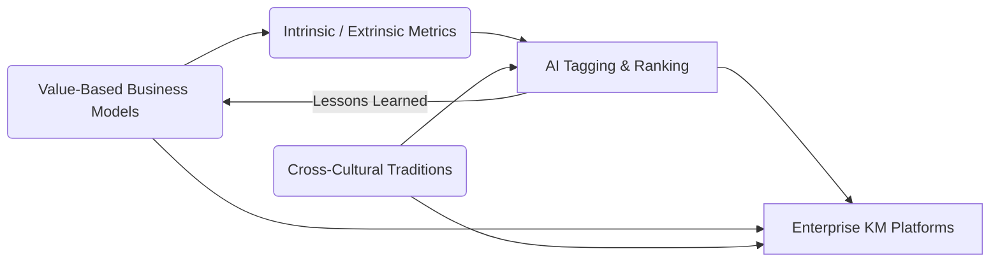

# Value-Oriented Knowledge Management

*(Integrating Value-Based Business Models, Cross-Cultural Traditions, Intrinsic / Extrinsic Value Metrics, and Enterprise KM)*

---

## 1. Unified Narrative

Classic KM imagined "knowledge" as a neutral commodity to be stored and mined. Evidence now shows that neutrality is a myth: every fact is saturated with values, context, and power. A modern, living KM system must keep four lenses in constant dialogue:

1. **Value-Based Business Models (VBBM)**
	 - Born from CSR and Triple-Bottom-Line debates—profit, people, planet.
	 - Knowledge selection is a moral act that shapes stakeholder realities; mis-aligned "Pepsi-Refresh"-style campaigns prove the cost of ignoring this.

2. **Cross-Cultural Traditions**
	 - From early anthropological relativism to today's cultural-agility playbooks.
	 - "Valuable" knowledge is **negotiated**, not discovered; bias, stereotyping, or cultural erasure can derail even the best KM platform.

3. **Intrinsic / Extrinsic Value Metrics**
	 - Inherent vs. situational worth, now coded into AI ranking engines.
	 - Google PageRank and IBM portals show upside; Cambridge Analytica abuse exposes ethical cliffs—metrics are aids, not oracles.

4. **Enterprise Knowledge Management (EKM)**
	 - 1990s capture-and-share matured into today's sense-and-respond ecosystems.
	 - IBM's portal boosts efficiency; Boeing 787 and Challenger disasters show that ignored tacit knowledge kills. Technology must surface minority voices, not just archive files.

**Synthesis Thesis**

> "To manage knowledge responsibly in a 21st-century enterprise, treat it as a dynamic, value-laden flow—evaluated for intrinsic worth, culturally co-validated, and aligned with business models that seek social, environmental, and economic benefit. AI accelerates mechanics, but humans govern value trade-offs, cultural fit, and ethical guardrails."

**Practical AI implications**
- Dual-score ranking: intrinsic priority + context-sensitive extrinsic weight.
- Cultural-variance modules flag potential misinterpretations before cross-border rollout.
- Explainable-AI panels reveal metric logic *and* stakeholder impact.
- Red-team simulations test for failure modes (Pepsi, Cambridge Analytica, Boeing).

---

## 2. Conceptual Overview

| Theme | Core Concept & Evolution | Representative Methods | Positive / Negative Cases | Open Challenges |
|-------|-------------------------|------------------------|---------------------------|-----------------|
| Value-Based Business Models | CSR ➜ Triple Bottom Line ➜ Living Stakeholder Value | ESG dashboards, value-prop design, behavioral-econ nudges | (+) Unilever Sustainable Living Plan  (–) Pepsi Refresh misalignment | Balancing short-term profit shocks; measuring non-financial ROI |
| Cross-Cultural Knowledge | Cultural relativism, CQ, power-aware ethnography | CQ training, intercultural design sprints, bias audits | (+) Silk Road diffusion, ERASMUS exchange  (–) Colonial suppression, globalization homogenization | Avoiding tokenism; surfacing marginalized tacit knowledge |
| Intrinsic / Extrinsic Metrics | Inherent vs. situational value; algorithmic codification | Hybrid scoring (human + ML), provenance graphs, ethical checklists | (+) Google PageRank, IBM KM  (–) Cambridge Analytica misuse, data-driven tunnel vision | Metric gaming; context drift; explainability requirements |
| Enterprise KM | Capture ➜ Share ➜ Co-create ➜ Sense-and-respond | KMS, ERP, communities of practice, social annotation | (+) IBM Global Services, P&G innovation hubs  (–) Boeing 787 delays, NASA Challenger | Tacit capture at scale; security vs. openness; tech over-reliance |

---

## 3. Interconnections Across Topics

- **VBBM defines *why* we curate knowledge; metrics define *what* we surface; cross-cultural lenses define *for whom*; EKM + AI define *how fast & how safely*.**
- Failure case studies feed new guardrails into metrics and cultural validation layers.
- Integral View: leaders' internal values (Interior-Individual) drive VBBM; enterprise systems (Exterior-Collective) operationalize them; cross-quadrant tensions reveal where silos or biases hide.

---

## 4. Actionable Framework / Guide

### A. Guided Learning Path

1. **Foundations (Weeks 1-2)**
	 - Read Elkington, *Cannibals with Forks*; contrast Unilever vs. Pepsi Refresh.
	 - Hands-on: explore an ESG / Triple-Bottom-Line dashboard.
2. **Cross-Cultural Layer (Weeks 3-4)**
	 - Book: Erin Meyer, *The Culture Map*; article: Boas on cultural relativism.
	 - Exercise: map a recent project's decision flow, highlight culture-based misreads.
3. **Value Metrics & Ethical AI (Weeks 5-6)**
	 - Paper: "Intrinsic vs. Extrinsic Information Value in AI Systems."
	 - Lab: build a doc-ranking prototype with an "ethical alert" module flagging Cambridge-Analytica-style misuse.
4. **Enterprise Practice & Risk Scenarios (Weeks 7-8)**
	 - Cases: IBM portal (success), Boeing 787 & Challenger (failure).
	 - Capstone: design a *Living KM* playbook; include recovery protocol for value-metric misfires.

### B. Practical Experiments

- Deploy a Slack/Teams bot that flags high-intrinsic lessons *and* highlights cultural nuance tags.
- Red-team/blue-team simulation: attempt to game the value metric; iteratively refine safeguards.

### C. Key Resources

- Tech: open-source KMS (H2KNOW), Hofstede & CQ APIs, Explainable-AI panels (e.g., Lucidate).
- Communities: KMWorld, Cross-Cultural Management Society, B-Corp network, Responsible AI Institute.

### D. Ongoing Practice

- Quarterly **Value & Culture Alignment Audit**: review metric outputs, stakeholder impact, and lessons from recent failures.
- Continuous crowdsourcing loop where employees re-score knowledge items and flag cultural or ethical concerns.

---

> [!tldr]
A 21st-century KM system must:
> 1. Align with value-based business models (profit + people + planet).
> 2. Co-validate knowledge through cross-cultural lenses.
> 3. Distinguish intrinsic from extrinsic value via hybrid human-AI metrics.
> 4. Operationalize the above in enterprise platforms that surface tacit voices, remain explainable, and adapt through continuous audit and feedback.
