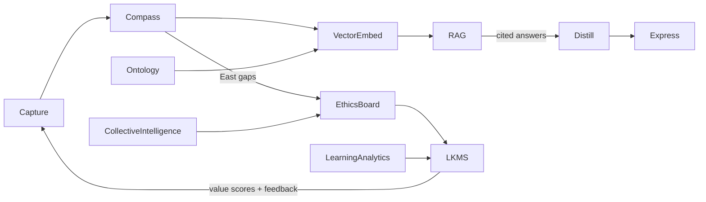

# Integrated Epistemic Knowledge Framework (IEKF)

*A living blueprint for building AI-accelerated, ethically grounded, continuously learning knowledge ecosystems.*

## Sub Lessons

- [[Epistemology and AI]]
- [[Integral and Constructor Theories]]
- [[Integrated Epistemic Knowledge Systems]]
- [[Learning Theories & Knowledge Frameworks]]
- [[Personal Knowledge Management Systems]]
- [[Value-Oriented Knowledge Management]]

---

## Unified Narrative

*"What counts as knowledge today?"*

Humanity's oldest question—**How do we know what is true and worthwhile?**—now plays out amid cloud GPUs, algorithmic opacity and cultural cross-currents. Nine strands once treated separately have fused into a single epistemic stack:

1. **Ethical Bedrock & Meta-Wisdom** – cross-cultural guard-rails and centuries of cognitive compression.
2. **Reflexive Epistemology & Meta-Knowledge** – dashboards that audit *how* we know, exposing bias, uncertainty and provenance gaps.
3. **Value-Aware Filtering** – hybrid (human + ML) scoring of intrinsic and context-sensitive worth.
4. **Semantic Structure** – ontologies and knowledge graphs give machine-readable meaning.
5. **AI Augmentation** – LLMs/embeddings/RAG for sense-making, with hallucination and over-reliance counter-measures.
6. **Living Knowledge-Management Systems (LKMS)** – real-time capture, versioning, privacy-by-design and feedback loops.
7. **Personal Knowledge Workflows** – the Compass routine plus C-O-D-E (Capture-Organise-Distil-Express) turn raw inputs into shareable insight.
8. **Collective Intelligence & Open Innovation** – crowds and cross-cultural panels diversify both data *and* critique.
9. **Learning Sciences & Developmental Lenses** – Behaviourism→Constructivism, Bloom, Integral Theory and Constructor Theory ensure systems are pedagogically sound *and* physically possible.

When braided into one loop, the Integrated Epistemic Knowledge Framework (IEKF) delivers **faster, safer decisions and a workforce that gets smarter rather than overwhelmed**.

---

## Conceptual Overview

| Layer | Core Concepts & 2024 Nuance | Common Methods | Illustrative Uses | Open Challenges |
|------|-----------------------------|----------------|------------------|-----------------|
| Ethical Bedrock | Tradition, meta-wisdom, cultural intelligence | Value-sensitive design, cross-cultural review boards | Unilever Sustainable Living, GDPR-compliant LKMS | Tokenism, ethics-washing |
| Reflexive Epistemology | Epistemic humility, bias & uncertainty dashboards | Fairlearn, WhyLabs, red-teaming | IBM system cards, algorithmic audits | Analysis paralysis, unclear ownership |
| Value-Aware Filtering | Intrinsic vs extrinsic worth, dual-score ranking | Human-in-the-loop scoring, qualitative overlays | ESG dashboards, Coursera adaptivity | Metric gaming, feedback bias loops |
| Semantic Structure | Ontologies, KG, SHACL alignment | RDF/OWL, graph embeddings | Siemens industrial KG, drug discovery | Ontology drift, maintenance cost |
| AI Augmentation | LLM co-pilots, embeddings, RAG | Prompt engineering, hallucination guards | GPT Q&A bots, sentiment-aware journals | Hallucination, over-reliance |
| LKMS (Dynamic Flow) | Stream capture, versioning, privacy-by-design | Event sourcing, differential privacy | Adaptive intranets, data trusts | Complexity, data breaches |
| Personal KM | Compass + C-O-D-E | Progressive summarisation, timed sprints | BASB cohorts, project notebooks | Digital hoarding, tool churn |
| Collective Intelligence | Crowdsourcing, open innovation, CQ facilitation | Swarm workshops, wiki governance | Wikipedia, crisis-mapping | Echo chambers, coordination overhead |
| Learning & Development | Behaviourism↔Constructivism↔Bloom + AQAL + CT | RL tutors, scaffolded peer review | Duolingo RL, VR sims, integral design sprints | Measuring higher-order thinking, autonomy erosion |

---

## Interconnections Across Topics

*"Everything Talks to everything"*

- **Compass notes → vector store → RAG** → accelerates *Distil* & *Express* in C-O-D-E.
- Ontology terms **auto-populate metadata**, boosting retrieval precision *and* explainability.
- Dual value scores write back into LKMS; low-trust items trigger *East-quadrant* Compass prompts ("What contradicts or is missing?").
- **Integral Theory** vets *significance* across quadrants; **Constructor Theory** gates *feasibility* before any feature ships.
- Learning analytics tag content with Bloom levels so AI tutors recommend tasks within each user's ZPD.
- Collective-intelligence panels stress-test both metrics and ontologies, closing the reflexive loop.

---

## Actionable Framework

### Guided 12-Week Learning Sprint

| Weeks | Focus & Milestones |
|------|-------------------|
| 1 – 2 | Foundations → read *BASB* + *Epistemic-Humility* primer; set up PARA folders. |
| 3 – 4 | **Compass Mastery** → run 10 Compass sprints; link East-gaps to #bias dashboard. |
| 5 – 6 | **Semantic Layer** → build mini-ontology in Protégé; validate via SHACL; ingest into Neo4j. |
| 7 – 8 | **AI Augmentation** → embed vault; deploy RAG chatbot with citation checks. |
| 9 – 10 | **Valuation & Governance** → add dual-score ranking; run Fairlearn + OpenDP audits; convene cross-cultural panel. |
| 11 | **Integral-Constructor Gate** → quadrant review + CT feasibility screen of your system. |
| 12 | **Capstone Share-out** → publish System Card & blog post; gather peer/stakeholder feedback. |

### Hands-On Experiments

1. **Mini-LKMS 2.0 build** – real-time versioning, privacy flags, live value scores.
2. **Metric-gaming red-team** – attempt to push low-value notes into top search slots; refine safeguards.
3. **RL vs Autonomy test** – compare variable-ratio rewards to autonomy-supportive prompts; measure intrinsic motivation.

### Continual-Improvement Cadence

| Cadence | Key Activity |
|---------|--------------|
| Monthly | Bias, privacy & East-tag scan; refresh meta-knowledge dashboard. |
| Quarterly | Ontology-drift check; recalibrate scoring weights with human feedback. |
| Yearly | Cultural-wisdom & carbon-footprint audit; ethics charter update. |

### Key Resources

Books • *Atlas of AI* (Crawford) • *Knowledge Graphs for Explainable AI* (Hitzler) • *Integral Spirituality* (Wilber)
Courses • MIT AI Ethics & Governance • Stanford CS520 (KG + RAG demos) • BASB Cohort
Tools • Obsidian + Compass snippet • Protégé/Neo4j • LangChain • Truera/WhyLabs • Fairlearn • OpenDP

---

> [!summary] **Take-Away Mantra**
> **DEFINE → JUSTIFY → MAP → GOVERN → REFLECT → repeat.**
> By braiding ancient wisdom, reflexive governance, semantic structure and AI acceleration into one living loop, organisations build knowledge systems that are **fast, trustworthy and future-proof**—helping humans *and* machines learn what truly matters.
