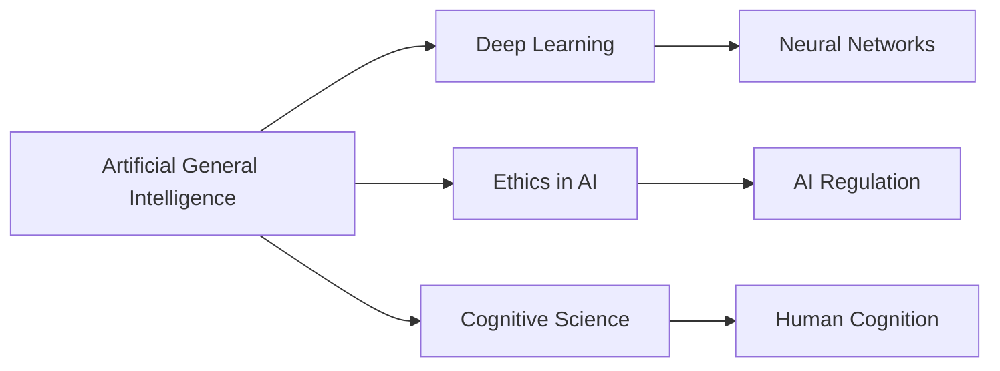

# AGI

## Unified Narrative

AGI aspires to perform any intellectual task a human can. Unlike today's "narrow" systems (one model per task), AGI would integrate perception, reasoning, memory, planning, and self-improvement under one roof. Historians cite the 1956 Dartmouth workshop, but the explicit term AGI surfaced in the early 2000s. Still, no working AGI exists; progress is measured by milestones such as curriculum-learning agents (DeepMind's Gato) or large language models (GPT-4) that show multi-domain competence yet remain brittle.

Practical stakes:
- Enormous upside—accelerated discovery in science, climate solutions, personalised education.
- Non-trivial risk—economic disruption and mis-aligned objectives could harm society.

### Conceptual Overview

| Aspect | Key Points | Techniques in Play | Present Demonstrations | Key Unknowns |
|--------|-----------|-------------------|------------------------|-------------|
| General learning | Transfer & continual learning | Foundation models, world models | GPT-4 tool-use plug-ins | Robustness to domain shift |
| Unified memory & reasoning | Combine symbolic, neural, and episodic memory | Differentiable memories, neuro-symbolic stacks | AlphaCode, Toolformer | Long-term consistency |
| Self-reflection & alignment | Meta-cognition, constitutional AI | RLHF, red-teaming | Claude, Gemini Safety layers | Formal alignment proofs |
| Embodied agency | Sense–plan–act loops | Sim2Real robotics, cognitive architectures | Gato+robotic arm demos | Safe exploration in open world |

### Interconnections Across Topics

- AGI is likely to weave together Neuro-Symbolic reasoning for logic, Meta-Cognition for self-monitoring, and large-scale foundational models for perception/language.
- Success hinges on AI ethics, governance, and human-AI collaboration techniques forged in today's narrow AI deployments.

(Text map)
Narrow AI → Hybrid (Neuro-Symbolic + Meta) → Broad foundation models → AGI

### Actionable Framework / Guide

1. Build breadth: follow the "AGI portfolio" – implement small projects in vision, language, control.
2. Integrate: create a personal assistant that uses LLM (language), symbolic planner (calendar rules), and meta layer (confidence gating).
3. Study alignment: enroll in "CS-294: AI Safety" (Berkeley) + read "Superintelligence" (Bostrom).
4. Contribute: open-source a benchmark or join an AGI safety reading group.
5. Continual update: track research via Alignment Forum, DeepMind publications, Anthropic's safety blogs.

## Origin

The concept of **Artificial General Intelligence (AGI)** has its roots in the early days of artificial intelligence research, particularly in the 1950s with pioneers like Alan Turing and the 1956 Dartmouth Conference, which marked the official birth of [[AI]] as a field.[^1][^2] The term "AGI" itself was popularized around 2002 by Shane Legg and Ben Goertzel.[^3] The immediate purpose of AGI research was to create machines that could simulate human intelligence across a wide range of cognitive tasks, addressing the problem of replicating human-like intelligence in machines.[^1][^3]

Over time, AGI has evolved through various approaches, including symbolic [[AI]], connectionism, and deep learning. Despite significant advancements, AGI remains elusive, with ongoing debates about its feasibility and timeline.[^3][^2]

## Possibilities

### Expected Outcomes

#### Positive Outcomes

- **Enhanced Productivity**: AGI could automate complex tasks, freeing humans for more creative and strategic work.
- **Improved Decision-Making**: AGI systems could analyze vast amounts of data, providing insights that enhance decision-making in various sectors.
- **Societal Benefits**: AGI could solve complex problems in healthcare, education, and environmental sustainability.

#### Negative Outcomes

- **Job Displacement**: AGI could lead to significant job displacement if not managed carefully.
- **Existential Risks**: Some experts warn that AGI could pose existential risks if not properly controlled or aligned with human values.
- **Dependence on Technology**: Over-reliance on AGI could lead to diminished human skills and critical thinking abilities.

## Actual Outcomes

### Positive Outcomes

- **Deep Learning Advances**: While not AGI, deep learning systems have achieved remarkable success in specific tasks like image recognition and natural language processing, benefiting industries such as healthcare and finance.[^1][^3]
- **Innovation**: The pursuit of AGI has driven innovation in [[AI]], leading to advancements in machine learning and related technologies.

### Negative Outcomes

- **[[AI]] Winters**: The field has experienced periods of reduced funding and interest, known as "AI winters," due to overpromising and underdelivering on AGI.[^1][^3]
- **Ethical Concerns**: The development of AGI raises ethical concerns regarding control, accountability, and potential misuse.

### Resonance

AGI resonates with concepts in cognitive science, neuroscience, and philosophy, as it seeks to replicate human cognition. It also connects with broader societal discussions on technology ethics and the future of work.

### Distinction

Competing ideas include **Narrow AI**, which focuses on specific tasks, and **Artificial Superintelligence (ASI)**, which exceeds human capabilities. Challenges include the difficulty of replicating human intelligence and the ethical implications of creating autonomous intelligent beings.[^3][^4]

## Summary

### Bloom's Taxonomy Table

| **Bloom's Layer** | **Description**                     | **Examples**               |
| ----------------- | ----------------------------------- | -------------------------- |
| Factual           | Basic facts and terminology         | Definition of AGI, Turing Test |
| Conceptual        | Relationships and overarching ideas | Connection between AGI and AI evolution |
| Procedural        | Practical methods and processes     | Deep learning algorithms for AGI development |
| Metacognitive     | Reflective insights                 | Ethical considerations in AGI development |

### Integral Theory Table

| **Quadrant**        | **Key Elements/Insights**  |
| ------------------- | -------------------------- |
| Interior-Individual | Personal fascination with AI's potential |
| Interior-Collective | Societal debates on AI ethics and impact |
| Exterior-Individual | Development of AI tools and algorithms |
| Exterior-Collective | Organizational and governmental AI policies |

### Knowledge Expansion Table

| **Knowledge Item**    | **Description**                                  | **Relevance/Relationship**                     |
| --------------------- | ------------------------------------------------ | ---------------------------------------------- |
| [[Deep Learning]]     | Subset of machine learning using neural networks | Key technology in AGI development              |
| [[AI Ethics]]         | Principles guiding AI development to avoid harm  | Essential for responsible AGI creation         |
| [[Cognitive Science]] | Study of mental processes and intelligence       | Provides insights into human cognition for AGI |

### Visualization

This analysis provides a comprehensive overview of AGI, highlighting its origins, possibilities, and challenges, while connecting it to broader themes in technology and society.
[^1] [^3] [^2] [^5] [^4]

## Project Link

[[Create Knowledge Management System]]

[^1]: https://artificialgeneralsintelligence.com/history-of-artificial-general-intelligence/
[^2]: https://ignitetech.ai/about/blogs/path-artificial-general-intelligence
[^3]: https://en.wikipedia.org/wiki/Artificial_general_intelligence
[^4]: http://www.scholarpedia.org/article/Artificial_General_Intelligence
[^5]: https://www.simovate.com/en/blog/what-is-artificial-general-intelligence-agi
