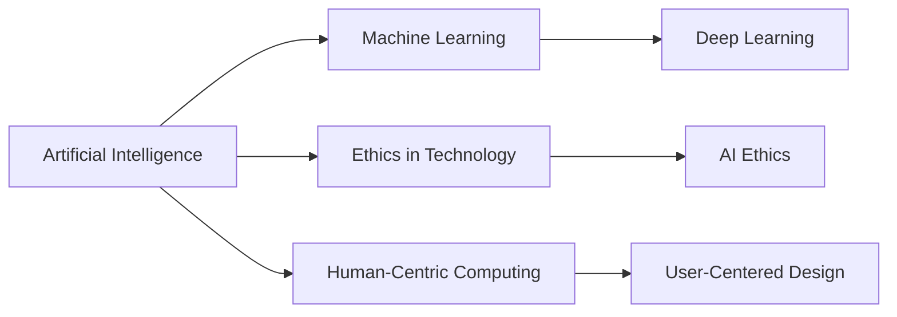

# Artificial Intelligence

## Origin

The origins of Artificial Intelligence ([[AI]]) can be traced back to the mid-20th century when scientists and researchers began conceptualizing machines that could mimic human thought processes. It emerged primarily out of the need to solve complex problems more efficiently than human capabilities alone could achieve. Initial [[AI]] frameworks were developed to address specific problems such as performing calculations more quickly and automating repetitive tasks in computing. The famous Dartmouth Conference in 1956, often considered the founding moment of [[AI]], was organized to explore the feasibility of constructing a machine that could simulate every aspect of human intelligence.

**Evolution:**
Since its inception, [[AI]] has evolved dynamically through various paradigms like symbolic [[AI]], [[Machine Learning]], and deep learning. Key milestones include the creation of [[AI]] languages like LISP in the 1960s, the advent of expert systems in the 1970s and 80s, and the rapid expansion of [[AI]] capabilities post-2000 with advancements in data processing and algorithmic performance. In recent years, [[AI]] has expanded beyond simple problem-solving to include applications like natural language processing, image recognition, and autonomous systems.

## Possibilities

**Expected Outcomes:**

**Positive Outcomes:**
1. **Enhanced Productivity:** AI can automate mundane tasks, freeing up human resources for higher-order thinking and creativity.
2. **Improved Decision-Making:** AI systems can process vast amounts of data to provide insights, aiding better decision-making in industries like healthcare, finance, and logistics.
3. **Personalization:** [[AI]] can tailor content and services to individual preferences, enhancing user experiences in areas such as e-commerce and digital marketing.

**Negative Outcomes:**
1. **Job Displacement:** Automation through [[AI]] may lead to job displacement in various sectors, particularly affecting roles that involve repetitive tasks.
2. **Ethical Concerns:** Issues such as bias in [[AI]] algorithms and privacy concerns arise because [[AI]] systems can perpetuate existing biases or misuse sensitive data.
3. **Over-Reliance on Technology:** Dependency on [[AI]] systems may lead to a reduction in critical thinking and decision autonomy.

## Actual Outcomes

**Real Historical Events and Real-Life Situations:**

**Positive Outcomes:**
- **Healthcare Diagnostics:** AI's integration into medical imaging has led to significant improvements in diagnostic accuracy; an example being AI models that can detect abnormalities in X-rays with precision comparable to medical experts.
- **Financial Services:** AI is used in fraud detection and automated trading, helping banks minimize risks and optimize investment strategies.

**Negative Outcomes:**
- **Bias and Fairness:** AI systems like facial recognition software have been criticized for bias against certain demographic groups, leading to calls for stricter regulation.
- **Data Privacy Breaches:** The use of AI in consumer data analysis has resulted in privacy concerns, illustrated by incidents like the Cambridge Analytica scandal.

### Resonance

AI exhibits remarkable synergy with multiple fields such as [[Neuroscience]], which informs AI about human cognition, and the [[Ethical Treatment of Knowledge]], which provides guidelines on responsible AI implementation. This interconnection enhances our understanding of both AI and these related disciplines.

### Distinction

While AI offers transformative potential, alternative frameworks like [[Human-Centric Computing]] emphasize prioritizing human values over technology-driven objectives. Challenges such as policy development for AI governance and addressing transparency and accountability issues remain central to its evolution.

## Summary

### Bloom's Taxonomy Table

| **Bloom's Layer** | **Description**                           | **Examples**                                                                                                                                       |
| ----------------- | ----------------------------------------- | -------------------------------------------------------------------------------------------------------------------------------------------------- |
| Factual           | Basic facts and terminology               | AI, [[Machine Learning]], neural networks                                                                                                          |
| Conceptual        | Relationships and overarching ideas       | Connections between AI and various domains (e.g., AI and healthcare), ethical considerations, and technological frameworks                         |
| Procedural        | Practical methods, tools, or applications | Implementing AI in workflow automation, designing algorithms for specific tasks such as NLP or image recognition                                   |
| Metacognitive     | Reflection on understanding and impact    | Evaluating the implications of AI across societal segments, understanding vulnerabilities like biases, reflecting on personal and professional use |

### Integral Theory Table

| **Quadrant**        | **Key Elements/Insights**                                                   |
| ------------------- | --------------------------------------------------------------------------- |
| Interior-Individual | Personal impact of AI on professional life, such as using AI tools for creativity enhancement |
| Interior-Collective | Societal shifts owing to AI, exemplified by changes in work culture and socio-economic models |
| Exterior-Individual | Observable behaviors, such as increased productivity through AI-powered apps                      |
| Exterior-Collective | Influence of AI on organizations, such as the adoption of AI in global corporate strategies      |

### Knowledge Expansion Table

| **Knowledge Item**          | **Description**                                                             | **Relevance/Relationship**                                  |
| --------------------------- | --------------------------------------------------------------------------- | ----------------------------------------------------------- |
| [[Machine Learning]]        | A subfield of AI focusing on systems that learn from data                   | Integral to AI's current capabilities and development       |
| [[Ethics in Technology]]    | Frameworks ensuring the ethical implementation of technological systems     | Essential for addressing [[AI Ethics]] and privacy concerns |
| [[Human-Centric Computing]] | An approach placing human values at the forefront of technology development | Provides a contrast to AI-driven growth priorities          |

### Visualization

---

This analysis presents a structured and detailed narrative of the AI knowledge item, linking historical origins with tangible real-world applications and enabling a holistic understanding through the lenses of Bloom's Taxonomy and Integral Theory. By identifying resonances, distinctions, and related knowledge items, the narrative prepares you to integrate AI into a broader context of innovative knowledge management systems.

## Project Link

[[Create Knowledge Management System]]

[[LLM]]

[[Text Splitting or Chunking for Embedding]]

[[Vector Embedding]]

# Artificial Intelligence Reading List

<https://nlp.seas.harvard.edu/annotated-transformer/>
<https://scottaaronson.blog/?p=762>
<https://karpathy.github.io/2015/05/21/rnn-effectiveness/>
<https://colah.github.io/posts/2015-08-Understanding-LSTMs/>
<https://arxiv.org/pdf/1409.2329>
<https://www.cs.toronto.edu/~hinton/absps/colt93.pdf>
<https://arxiv.org/pdf/1506.03134>
<https://proceedings.neurips.cc/paper_files/paper/2012/file/c399862d3b9d6b76c8436e924a68c45b-Paper.pdf>
<https://arxiv.org/pdf/1511.06391>
<https://arxiv.org/pdf/1811.06965>
<https://arxiv.org/pdf/1512.03385>
<https://arxiv.org/pdf/1511.07122>
<https://arxiv.org/pdf/1704.01212>
<https://arxiv.org/pdf/1706.03762>
<https://arxiv.org/pdf/1409.0473>
<https://arxiv.org/pdf/1603.05027>
<https://arxiv.org/pdf/1706.01427>
<https://arxiv.org/pdf/1611.02731>
<https://arxiv.org/pdf/1806.01822>
<https://arxiv.org/pdf/1405.6903>
<https://arxiv.org/pdf/1410.5401>
<https://arxiv.org/abs/1512.02595>
<https://arxiv.org/pdf/2001.08361>
<https://arxiv.org/abs/math/0406077>
<http://www.vetta.org/documents/Machine_Super_Intelligence.pdf>
<https://www.lirmm.fr/~ashen/kolmbook-eng-scan.pdf>
<https://cs231n.github.io/>
