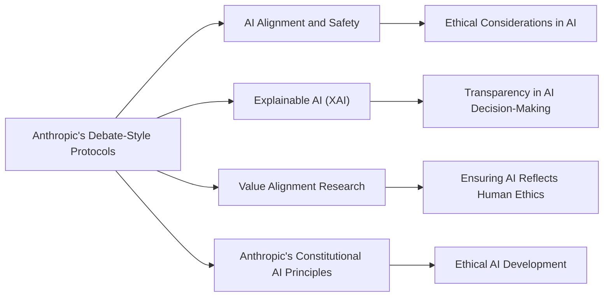

# Anthropic's Debate-style Protocols

## Origin

Anthropic's debate-style protocols originated from the need to enhance [[AI]] safety and alignment by leveraging adversarial dynamics. The basic idea involves pitting [[AI]] systems against each other in debates to improve their capabilities and ensure alignment with human values.[^1][^2] This approach was initially proposed by researchers like Irving, Christiano, and Amodei in 2018 as part of [[AI]] safety efforts.[^2] Over time, these protocols have evolved to include more sophisticated debate structures, such as concurrent turns and the involvement of judges to evaluate arguments.[^1]

## Possibilities

### Expected Outcomes

#### Positive Outcomes

- **Improved AI Alignment**: Debate-style protocols can enhance [[AI]] systems' ability to understand and align with human values by encouraging them to generate and evaluate arguments from multiple perspectives.[^2]
- **Enhanced Transparency**: These protocols promote transparency in [[AI]] decision-making by requiring systems to provide clear, debatable arguments for their conclusions.[^2]
- **Adversarial Robustness**: By pitting [[AI]] systems against each other, these protocols can help identify and mitigate potential biases or flaws in [[AI]] reasoning.[^1]

#### Negative Outcomes

- **Complexity and Cost**: Implementing debate-style protocols can be resource-intensive, requiring significant computational power and human oversight.[^1]
- **Potential for Misinformation**: If not properly regulated, debates could spread misinformation if [[AI]] systems are not incentivized to provide accurate information.[^1]
- **Judge Bias**: The effectiveness of these protocols heavily depends on the impartiality and competence of the judges evaluating the debates.[^1]

## Actual Outcomes

### Positive Outcomes

- **Successful Prototyping**: Anthropic has successfully demonstrated the effectiveness of debate-style protocols in controlled environments, showing promise for future [[AI]] safety applications.[^1]
- **Improved Argument Quality**: These protocols have been observed to enhance the quality of arguments generated by [[AI]] systems, leading to more robust decision-making processes.[^1]

### Negative Outcomes

- **Limited Scalability**: Currently, these protocols face challenges in scaling to more complex tasks or larger datasets due to their resource-intensive nature.[^1]
- **Dependence on Human Oversight**: The success of debate-style protocols relies heavily on human judges, which can introduce variability and bias into the system.[^1]

### Resonance

Debate-style protocols resonate with other AI alignment strategies, such as **Explainable AI (XAI)** and **Value Alignment Research**. These approaches all aim to make AI systems more transparent and aligned with human values, but they differ in their methods. XAI focuses on providing insights into AI decision-making processes, while value alignment research seeks to ensure AI goals align with human ethics.[^2]

### Distinction

Alternative approaches to AI alignment include **Inverse Reinforcement Learning (IRL)** and **Cooperative Inverse Reinforcement Learning (CIRL)**. These methods focus on learning human preferences through observation and interaction, differing from debate-style protocols, which rely on adversarial argumentation to improve alignment.

## Summary

### Bloom's Taxonomy Table

| **Bloom's Layer** | **Description**                     | **Examples**               |
| ----------------- | ----------------------------------- | -------------------------- |
| Factual           | Basic facts about debate-style protocols | Definition, purpose, and basic structure.[^1] |
| Conceptual        | Relationships between debate protocols and AI alignment | How debates enhance transparency and alignment.[^2] |
| Procedural        | Practical methods for implementing debate protocols | Training AI systems to generate arguments, using judges for evaluation.[^1] |
| Metacognitive     | Reflective insights on the impact of debate protocols | Analysis of potential biases and limitations in judge evaluations.[^1] |

### Integral Theory Table

| **Quadrant**        | **Key Elements/Insights**  |
| ------------------- | -------------------------- |
| Interior-Individual | Personal reflections on the ethical implications of AI debates, e.g., ensuring AI systems are aligned with human values.[^3] |
| Interior-Collective | Societal norms around AI transparency and accountability, influencing the development of debate protocols.[^2] |
| Exterior-Individual | Observable behaviors like AI systems generating arguments and humans evaluating them.[^1] |
| Exterior-Collective | Organizational structures implementing debate protocols for AI safety, such as Anthropic's research initiatives.[^1] |

### Knowledge Expansion Table

| **Knowledge Item**        | **Description**                    | **Relevance/Relationship**                      |
| ------------------------- | ---------------------------------- | ----------------------------------------------- |
| [[Explainable AI (XAI)]] | Techniques for understanding AI decisions | Complements debate protocols by providing transparency into AI reasoning. |
| [[Value Alignment Research]] | Ensuring AI systems reflect human ethics | Similar goal to debate protocols but uses different methods like IRL and CIRL. |
| [[Anthropic's Constitutional AI]] | Principles guiding AI behavior to be ethical and harmless | Supports the ethical considerations in debate-style protocols.[^3] |

### Visualization

This visualization highlights how Anthropic's debate-style protocols connect with broader themes in AI alignment, transparency, and ethical considerations, showcasing their role in enhancing AI safety and ethical development.
[^1] [^3] [^2] [^4] [^5]

## Project Link

[[AI Cognitive Assistant]]

[^1]: https://www.alignmentforum.org/posts/QtqysYdJRenWFeWc4/anthropic-fall-2023-debate-progress-update
[^2]: https://arxiv.org/html/2409.07335v1
[^3]: https://www.anthropic.com/news/claudes-constitution
[^4]: https://quod.lib.umich.edu/cgi/p/pod/dod-idx/role-of-the-protocol-in-anthropic-reasoning.pdf?c=ergo%3Bidno%3D12405314.0002.009%3Bformat%3Dpdf
[^5]: https://benthams.substack.com/p/the-ultimate-guide-to-the-anthropic
