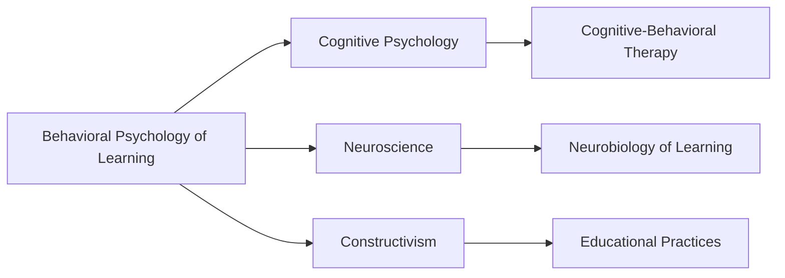

# Behavioral Psychology of Learning

## Narrative Analysis

### Origin

The knowledge item [[Behavioral Psychology of Learning]] originated from the foundational need to understand how humans and animals learn behaviors. Its creation aimed to address questions about the processes involved in acquiring new skills, habits, and conditioned responses. Anaesthetic roots trace back to the late 19th and early 20th centuries with pioneers like [[Ivan Pavlov]], who introduced classical conditioning, and [[B.F. Skinner]], known for his work on operant conditioning. This knowledge responded to the need for finding systematic ways to predict and influence behavior, especially in educational, organizational, and therapeutic settings.

Historically, the evolution of Behavioral Psychology witnessed important milestones, including the shift from classical to operant conditioning, the emergence of cognitive-behavioral approaches, and later integrating the field with neuroscience. Over time, it expanded from just understanding behavior patterns to applying these insights for behavioral modification in diverse fields such as [[Psychotherapy]], [[Education]], and [[Organizational Development]].

### Possibilities

**Expected Outcomes**

- **Positive Outcomes**:
	- Enhanced learning environments utilizing reinforcement strategies to improve student engagement and retention.
	- Application in therapy for altering maladaptive behavior and promoting mental health through cognitive-behavioral interventions.
	- Improved organizational performance by designing motivational systems that increase employee productivity and satisfaction.

- **Negative Outcomes**:
	- Risk of over-reliance on external rewards, leading to diminished intrinsic motivation (overjustification effect).
	- Potential misuse in manipulative contexts, such as consumer marketing exploiting compulsive behaviors.
	- Ethical concerns surrounding behavior modification, particularly regarding the manipulation of vulnerable populations.

### Actual Outcomes

- **Positive Outcomes**:
	- Schools have successfully employed token economies to boost student engagement and performance.
	- Cognitive-behavioral therapy (CBT) is globally recognized for its efficacy in treating anxiety and depression.
	- Companies using incentive-based systems have seen improved performance and morale among their workforce.

- **Negative Outcomes**:
	- Some marketing campaigns have been criticized for using psychological triggers irresponsibly to drive sales, leading to impulsive buying.
	- Certain organizational reward systems have led to unethical behavior, such as cutting corners to meet sales targets.

### Resonance

[[Behavioral Psychology of Learning]] resonates with fields such as [[Neuroscience]], which examines the neurological bases of behavior and learning. It complements cognitive psychology by integrating behavioral insights with cognitive processes to form the cognitive-behavioral framework. This interdisciplinary approach enhances the understanding of learning mechanisms by linking observable behavior with underlying mental functions.

### Distinction

Competing ideas include [[Constructivism]], which argues that learning is an active, contextualized process of constructing knowledge rather than acquiring it passively. Critiques of Behavioral Psychology arise from its sometimes narrow focus on observable behavior, ignoring the complex, internal mental processes emphasized by cognitive theories. Real-world implications of these gaps highlight the need for a more holistic approach to understanding learning, considering both environmental stimuli and internal cognitive processes.

## Summary Tables

### Bloom's Taxonomy Table

| **Bloom's Layer** | **Description**                     | **Examples**                                       |
| ----------------- | ----------------------------------- | -------------------------------------------------- |
| Factual           | Basic facts and terminology         | Classical conditioning, operant conditioning       |
| Conceptual        | Relationships and overarching ideas | Integration of behaviorism with cognitive theories |
| Procedural        | Practical methods and processes     | Use of token economies, reinforcement schedules    |
| Metacognitive     | Reflective insights                 | Ethical considerations of behavior modification    |

### Integral Theory Table

| **Quadrant**        | **Key Elements/Insights**                                          |
| ------------------- | ------------------------------------------------------------------- |
| Interior-Individual | Personal changes through behavior therapy (CBT impact on anxiety) |
| Interior-Collective | Societal shift in education through behaviorist approaches        |
| Exterior-Individual | Application of skills and habits through reinforcement            |
| Exterior-Collective | Organizational systems redesigned for positive reinforcement      |

### Knowledge Expansion Table

| **Knowledge Item**         | **Description**                            | **Relevance/Relationship**                                          |
| -------------------------- | ------------------------------------------ | ------------------------------------------------------------------- |
| [[Cognitive Psychology]]   | Study of mental processes                  | Complements behaviorism by incorporating understanding of cognition |
| [[Neuroscience]]           | Study of the nervous system                | Provides biological basis for behavioral learning phenomena         |
| [[Constructivism]]         | Learning theory involving active creation  | Alternative approach challenging behaviorist views                   |

### Visualization

---

**Key Actionable Insights**:
- Incorporate [[Behavioral Psychology of Learning]] principles in living knowledge management systems to personalize reinforcement mechanisms, fostering intrinsic motivation for more effective learning pathways.
- Apply insights from cognitive-behavioral techniques to enhance the system's capability in adapting to user behavioral patterns, thus creating a dynamic and responsive knowledge environment.
- Address ethical implications by constructing systems that promote autonomy and encourage intrinsic motivation rather than relying solely on external reinforcement.

## Project Link

[[Create Knowledge Management System]]
