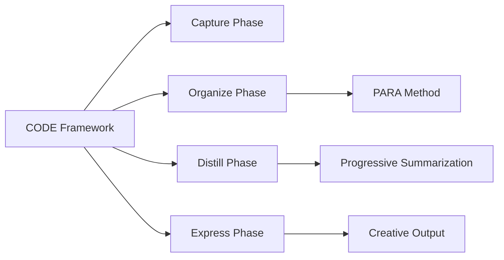

# CODE Framework

The [[CODE Framework]], developed by Tiago Forte, represents a systematic approach to personal knowledge management. Let me break down this comprehensive analysis:

## Origin & Evolution

The [[CODE]] framework emerged from Tiago Forte's decade-long experience in teaching knowledge management and productivity.[^1] It was developed as a response to the growing challenge of information overload in the digital age, providing a structured approach to managing the overwhelming amount of information we encounter daily.[^1]

Initially conceived as part of Forte's "Building a Second Brain" methodology, [[CODE]] has evolved from a simple note-taking system into a comprehensive framework for knowledge management. The framework took Forte approximately ten years to distill and refine into its current form.[^2]

## Possibilities

**Expected Outcomes**

*Positive:*
- Improved information retention and retrieval
- Enhanced creative output through systematic knowledge processing
- Reduced cognitive load through external storage systems
- Better organization of digital content across platforms[^1]

*Negative:*
- Risk of over-capturing information without proper processing
- Potential for creating digital hoarding behaviors
- Time investment needed for system maintenance
- Possible over-reliance on tools rather than actual knowledge synthesis[^3]

**Actual Outcomes**

*Positive Examples:*
- Users report successfully converting scattered notes into concrete projects
- Improved ability to find and utilize previously captured information
- Enhanced collaboration through better knowledge sharing[^4]

*Negative Examples:*
- Some users report feeling overwhelmed by the system's requirements
- Cases of excessive focus on capturing without meaningful processing
- Instances of tool obsession rather than actual productivity gains[^5]

## Resonance

The [[CODE]] framework shows strong connections to:
- David Allen's Getting Things Done (GTD) methodology
- The Zettelkasten method of note-taking
- Knowledge management frameworks in enterprise settings
- Agile project management principles[^6]

## Distinction

The framework faces several critiques:
- Complexity in implementation despite claims of simplicity
- Potential overemphasis on digital tools
- Questions about long-term sustainability
- Challenge of maintaining consistency across different platforms[^3]

## Summary Tables

### Bloom's Taxonomy Analysis

| Layer | Description | Examples |
|-------|-------------|-----------|
| Factual | Core components of CODE | Capture, Organize, Distill, Express[^1] |
| Conceptual | Framework principles | Knowledge as actionable resources, Progressive summarization[^1] |
| Procedural | Implementation methods | Note-taking workflows, Information processing techniques[^7] |
| Metacognitive | System adaptation | Personal workflow optimization, Tool selection strategies[^8] |

### Integral Theory Analysis

| Quadrant | Key Elements/Insights |
|----------|---------------------|
| Interior-Individual | Personal knowledge processing, Individual learning styles |
| Interior-Collective | Knowledge sharing culture, Collaborative learning |
| Exterior-Individual | Note-taking behaviors, Information capture habits |
| Exterior-Collective | Digital tool ecosystems, Organizational knowledge systems |

### Knowledge Expansion

| Knowledge Item | Description | Relevance |
|---------------|-------------|------------|
| PARA Method | Organizational system | Complementary framework for structure[^9] |
| Progressive Summarization | Note refinement technique | Core component of Distill phase[^1] |
| Digital Gardens | Personal knowledge bases | Alternative implementation approach[^10] |

## Visualization

[^1]: https://web-highlights.com/blog/master-your-second-brain-how-to-use-the-code-technique/
[^2]: https://www.storyrules.com/creating-the-software-stack-for-the-knowledge-era-part-2/
[^3]: https://www.reddit.com/r/productivity/comments/15ozlkl/building_a_second_brain_i_cant_believe_tiago/
[^4]: https://joellindstrom.com/2023/07/31/book-review-building-a-second-brain-by-tiago-forte/
[^5]: https://thewallflowerdigest.co.uk/life/thoughts-on-building-a-second-brain-by-tiago-forte/
[^6]: https://publiclibrariesonline.org/2023/07/building-a-second-brain-a-conversation-with-tiago-forte/
[^7]: https://www.socialmediaexaminer.com/managing-ideas-a-framework-for-unlocking-creativity/
[^8]: https://www.felixliao.com/blog/fostering-mindfulness-and-boosting-productivity-the-second-brain-methodology-by-tiago-forte/
[^9]: https://growthocracy.com/how-to-build-a-second-brain-using-tiago-fortes-code-method/
[^10]: https://github.com/brettkromkamp/awesome-knowledge-management
