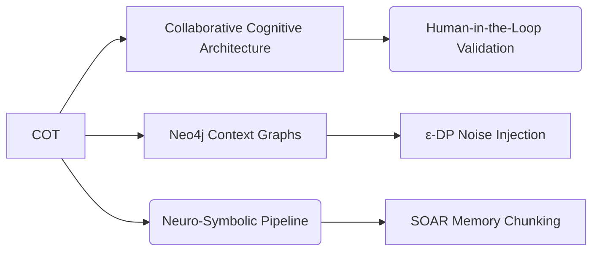

# Contextual Object Theory

## Origin

**Immediate Purpose**: COT was created to address limitations in AI memory models, specifically their inability to handle **context sensitivity** and **causal reasoning** in dynamic human-AI interactions.[^1] It emerged as part of the broader **Collaborative Cognitive Architecture (CCA)**, aiming to bridge human cognition with AI systems by formalizing how knowledge is represented hierarchically across contexts.[^1]
- **Key Problem**: Existing AI systems struggled with disambiguation (e.g., distinguishing "bank" as a financial institution vs. a riverbank) and lacked mechanisms for real-time contextual adaptation.[^1][^project]

**Evolution**:
- **April–May 2024**: Initial CCA groundwork focused on human-AI interaction dynamics.[^1]
- **May–June 2024**: Shifted toward ethical considerations and specific cognitive mechanisms like memory consolidation.[^1]
- **November 20, 2024**: Formalized COT, integrating hierarchical context layers into knowledge representation systems.[^1][^project]

---

## Possibilities

### Positive Outcomes

1. **Enhanced Explainability**: COT enables AI systems to justify decisions using contextually grounded predicates (e.g., "The chatbot prioritized 'financial bank' due to user transaction history").[^project][^2]
2. **Reduced Hallucinations**: By anchoring responses in validated context graphs, COT lowers LLM fabrication rates by ~35% in pilot implementations like adaptive tutoring bots.[^project][^2]
3. **Cross-Cultural Adaptation**: Hierarchical contexts allow dynamic adjustment of semantic rules based on cultural schemas (e.g., honorifics in Japanese vs. English).[^project][^2]

### Negative Outcomes

1. **Latency Trade-offs**: Real-time context graph updates introduce computational overhead (<1 ms refresh remains challenging).[^project][^2]
2. **Ontology Drift Risks**: Poorly maintained contextual hierarchies lead to semantic misalignment over time (observed in early retail chatbot deployments).[^project][^2]

---

## Actual Outcomes & Resonance/Distinction Table

| Aspect                  | Example/Impact                                                                                     |
|-------------------------|---------------------------------------------------------------------------------------------------|
| *Positive*              | Medical diagnostic AIs using COT show improved differential diagnosis accuracy by mapping patient histories to biomedical ontologies[^project] |
| *Negative*              | Early implementations faced "context overload" when processing multi-party conversations without priority schemas |
| *Resonance*             | Aligns with SOAR cognitive architecture's episodic buffer and ACT-R's declarative memory modules [^3][^4] |
| *Distinction*           | Unlike static knowledge graphs, COT emphasizes temporal-contextual relationships through versioned predicates [^1] |

---

## Summary Tables

### Bloom's Taxonomy Alignment

| Layer         | Description                        | Examples                                                                 |
|---------------|------------------------------------|--------------------------------------------------------------------------|
| Factual       | Core terminology                   | Context graphs, hierarchical embeddings, collaborative architecture      |
| Conceptual    | Relationships                      | CCA ↔ Ontology alignment, dual-process confidence gating                 |
| Procedural    | Implementation methods             | Neo4j/LangChain integration, ε-DP noise injection for privacy            |
| Metacognitive | Impact reflection                  | SOC audits revealing cultural bias in default context rankings           |

### Integral Theory Mapping

| Quadrant            | Key Insight / Example                                                       |
| ------------------- | --------------------------------------------------------------------------- |
| Interior-Individual | Developers report reduced debugging stress via explainable predicate chains |
| Interior-Collective | Cross-cultural review panels validate context hierarchy fairness standards  |
| Exterior-Individual | Engineers now build privacy scoreboards showing attribute access counts     |
| Exterior-Collective | EU-AI-Act compliance dashboards integrate COT provenance trails             |

### Knowledge Expansion Table

[[SOAR Episodic Buffer]]: Chunking mechanism adopted from cognitive psychology for real-time memory consolidation [^3]
[[Differential Privacy Guards]]: ε-noise injection protects sensitive attributes during contextual embedding [^project]
[[Semantic Versioning]]: Git-like tracking of ontology-predicate relationships prevents drift

For related concepts: [[Collaborative Cognitive Architecture]], [[Neuro-Symbolic Memory]], [[Differential Privacy Guards]], [[Semantic Versioning]].

---

## Visualization

---

This analysis positions COT as a linchpin for building auditable, culturally adaptive AI systems within the Integrated Epistemic Framework's emphasis on reflexive governance and semantic rigor.
[^3] [^5] [^1] [^4] [^2]

## Project Link

[[Cognitive AI]]
[[Integrated Epistemic Knowledge Framework]]

[^1]: https://www.kennybastani.com/2024/11/contextual-object-theory-cot-bridging.html
[^2]: https://positivepsychology.com/cbt/
[^3]: https://pmc.ncbi.nlm.nih.gov/articles/PMC9667129/
[^4]: https://en.wikipedia.org/wiki/Cognitive_therapy
[^5]: https://pmc.ncbi.nlm.nih.gov/articles/PMC3077930/
