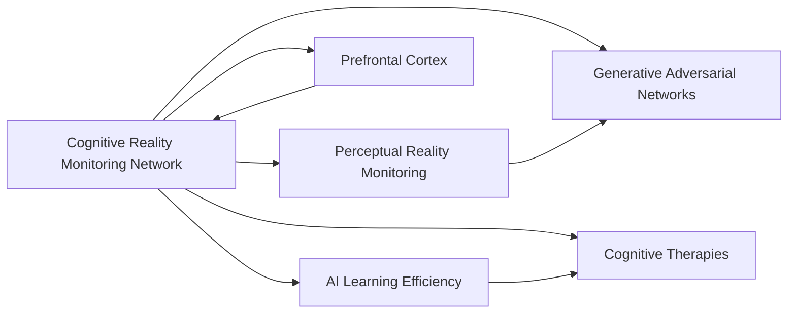

# CRMN

## Origin

The **Cognitive Reality Monitoring Network (CRMN)** is a computational model derived from theories of mixture-of-experts architecture, hierarchical reinforcement learning, and generative/inference computing modules. It maps a gating network onto the prefrontal cortex, focusing on monitoring the accuracy of mental states and distinguishing them from external reality.[^1][^2] This model addresses all three levels of understanding proposed by David Marr: computational theory, algorithms, and hardware, making it a comprehensive framework for understanding consciousness.

The CRMN evolved from earlier models like "perceptual reality monitoring" by Hakwan Lau and its extension by Samuel Gershman using Generative Adversarial Networks (GANs).[^2] The CRMN's development aimed to explain how the brain efficiently learns new behaviors with limited trials, despite its vast neural complexity.

## Possibilities

### Expected Outcomes

#### Positive Outcomes

- **Enhanced Cognitive Abilities**: CRMN can improve cognitive functions by enhancing metacognition, allowing individuals to better distinguish between internal mental states and external reality.
- **Efficient Learning**: By understanding how the brain reduces dimensionality in learning, CRMN can inform more efficient [[machine learning]] algorithms that require fewer training samples.
- **Neurological Insights**: Provides insights into neural mechanisms, potentially aiding in the diagnosis and treatment of cognitive disorders.

#### Negative Outcomes

- **Overreliance on Computational Models**: Relying too heavily on CRMN might overlook other cognitive processes not captured by its computational framework.
- **Misinterpretation of Reality**: If not properly calibrated, CRMN could lead to incorrect assessments of reality, affecting decision-making and behavior.

## Actual Outcomes

### Positive Outcomes

- **Improved AI Learning**: By mimicking the brain's learning efficiency, [[AI]] systems can be designed to learn from fewer examples, enhancing their adaptability.
- **Cognitive Therapies**: Understanding how CRMN operates can help develop therapies that improve metacognitive skills in individuals with cognitive impairments.

### Negative Outcomes

- **Complexity in Implementation**: The CRMN's complexity might make it challenging to implement in real-world [[AI]] systems without significant computational resources.
- **Ethical Concerns**: Misuse of CRMN could lead to AI systems that manipulate perceptions of reality, raising ethical concerns.

## Resonance

CRMN resonates with concepts in **[[personal knowledge management systems]]** like Obsidian, where networks of interconnected knowledge can enhance understanding and distinction between internal thoughts and external information.[^3] It also relates to **reality monitoring in media and society**, where distinguishing between true and false information is crucial.[^4]

## Distinction

Competing ideas include other cognitive architectures like **[[SOAR]]** and **[[ACT-R]]**, which focus on different aspects of cognition but do not specifically address reality monitoring in the same way as CRMN. Limitations of CRMN include its reliance on computational models, which might not fully capture human cognitive processes.

## Summary

### Bloom's Taxonomy Table

| **Bloom's Layer** | **Description**                     | **Examples**               |
| ----------------- | ----------------------------------- | -------------------------- |
| **Factual**      | Basic concepts of CRMN, Marr's levels | CRMN's computational framework, prefrontal cortex involvement.[^1] |
| **Conceptual**   | Relationships between CRMN and cognitive processes | CRMN's role in metacognition, hierarchical reinforcement learning.[^2] |
| **Procedural**   | Methods for applying CRMN in AI systems | Using CRMN to enhance AI learning efficiency.[^2] |
| **Metacognitive**| Reflective insights on CRMN's impact | Evaluating CRMN's potential to improve cognitive therapies.[^1] |

### Integral Theory Table

| **Quadrant**            | **Key Elements/Insights**                                                             |
| ----------------------- | ------------------------------------------------------------------------------------- |
| **Interior-Individual** | Personal insights from using CRMN-inspired cognitive tools, enhancing self-awareness. |
| **Interior-Collective** | Societal implications of CRMN in shaping shared understanding of reality.             |
| **Exterior-Individual** | Observable behaviors influenced by CRMN, such as improved decision-making.            |
| **Exterior-Collective** | Impact of CRMN on collective systems, like AI governance and media monitoring.        |

### Knowledge Expansion Table

| **Knowledge Item**        | **Description**                    | **Relevance/Relationship**                      |
| ------------------------- | ---------------------------------- | ----------------------------------------------- |
| [[Perceptual Reality Monitoring]] | Early model influencing CRMN's development | Direct precursor to CRMN, focusing on perceptual processes.[^2] |
| [[Generative Adversarial Networks (GANs)]] | Computational framework used in CRMN extensions | Enhances CRMN's generative capabilities for modeling reality.[^2] |
| [[Prefrontal Cortex]]     | Key brain region involved in CRMN | Central to CRMN's cognitive monitoring functions.[^1] |

### Visualization

This analysis provides a comprehensive overview of CRMN, its origins, applications, and relationships with other cognitive and AI frameworks. It highlights both the potential benefits and challenges of implementing CRMN in real-world contexts.
[^1] [^3] [^2] [^5] [^4]

## Project Link

[[AI Cognitive Assistant]]

[^1]: https://pubmed.ncbi.nlm.nih.gov/38316366/
[^2]: https://cbs.riken.jp/en/events/ccic/abstract/mitsuo.kawato.html
[^3]: https://discourse.samgqroberts.com/t/the-atoms-of-obsidian-md/22
[^4]: https://memlab.yale.edu/sites/default/files/files/2007_Johnson_ACP.pdf
[^5]: https://forum.obsidian.md/t/building-up-knowledge-on-a-topic-through-linking-notes-from-different-sources/39279
