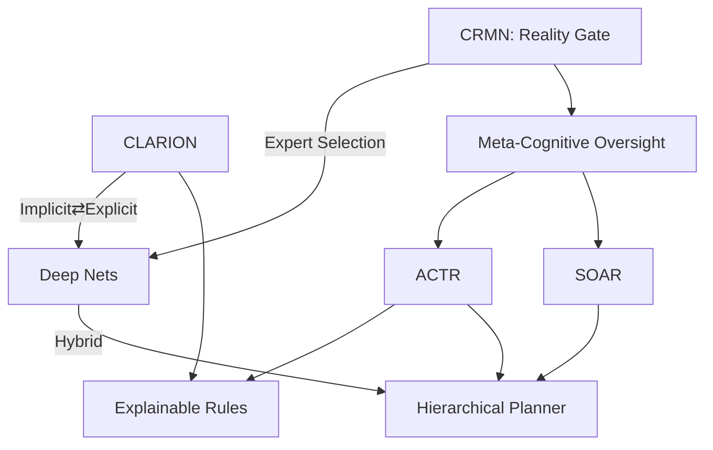

# Cognitive Architectures & Reality-Monitoring in AI

(A practical learning map covering CRMN, CLARION, ACT-R, and SOAR)

---

## Unified Narrative

Modern AI is rediscovering lessons from cognitive science: intelligent agents learn faster, generalize better, and behave more safely when their design mirrors the layered, mixed-mode nature of the human mind. Four flagship architectures illustrate this trajectory:

- CRMN (Cognitive Reality Monitoring Network) treats the brain as a Mixture-of-Experts system with a "gating" network in prefrontal cortex. Its core job is reality-monitoring—checking whether a mental representation reflects the outside world or an internally generated thought. This "metacognitive watchdog" explains how humans avoid hallucination, and it inspires AI models that learn efficiently from few examples by routing tasks to the right expert module.

- CLARION (Connectionist Learning with Adaptive Rule Induction ON-line) operationalizes dual-process theory: fast, implicit pattern learning co-exists and exchanges information with slow, explicit rule reasoning. A motivational layer supplies drives and values, while a meta-cognitive layer tunes learning parameters on the fly.

- ACT-R (Adaptive Control of Thought—Rational) focuses on symbolic production rules tied to neurally inspired subsymbolic parameters. It excels at modeling human task performance and has powered intelligent tutoring systems, user-interface analyses, and cognitive simulations.

- SOAR emphasises goal-driven problem solving. Productions, reinforcement learning, and "chunking" convert deliberation into compiled skills. Its hierarchical task decomposition enables large, multi-step plans—for instance, full mission control simulations at NASA.

Together, these frameworks show a recurring pattern:

1. Hybrid representation (symbolic + sub-symbolic) avoids the brittleness of purely rule-based or purely neural systems.
2. Meta-cognition (monitoring, gating, conflict resolution) is essential for rapid error detection, safe autonomy, and sample-efficient learning.
3. Motivational or reward layers align behaviour with goals and ethics.
4. Scaling issues (computational load, knowledge engineering) remain the main roadblock to real-world deployment; current research blends these architectures with deep learning and large language models (LLMs) to overcome it.

---

## Conceptual Overview

| Architecture | Core Idea & Definitions | Methods & Techniques | Representative Use Cases | Open Challenges |
|--------------|------------------------|----------------------|--------------------------|-----------------|
| CRMN | Mixture-of-Experts network for reality monitoring; maps to prefrontal cortex | Gating nets, hierarchical RL, GAN-based generative + inference modules | Few-shot learning, hallucination detection, metacognitive therapy tools | High compute cost; calibrating "what is real" in dynamic environments; ethical misuse |
| CLARION | Dual-process (implicit vs. explicit) cognition with motivational & meta-cognitive subsystems | Back-prop for implicit nets, rule induction for explicit layer, meta-level parameter tuning | Social-robot intuition, adaptive game agents, decision aids requiring transparency | Opacity of implicit layer, scalability, bias control |
| ACT-R | Production-rule system coupled with subsymbolic utility values; single goal stack | Conflict-resolution heuristics, declarative/procedural memory modules, latency modelling | Intelligent tutoring systems, cockpit/ATC simulations, cognitive workload analysis | Parallel goal handling, emotion integration, neural-network synergy |
| SOAR | Universal problem-solver using states, operators, and chunking; hierarchical decomposition | Reinforcement learning, semantic & episodic memory, impasse-driven subgoal creation | Virtual humans, StarCraft bots, NASA Test Director, large planning tasks | Heavy knowledge-engineering, runtime resource demands, generalization to novel domains |

---

## Interconnections Across Topics

Text view
- CRMN's gating resembles SOAR/ACT-R conflict resolution but is neurally grounded; it could serve as a meta-controller for CLARION's implicit/explicit modules.
- Dual-process thinking (CLARION) supplies the psychological backbone that CRMN formalises at the neural level; ACT-R and SOAR implement adjoining symbolic layers that plug into CLARION's explicit system.
- All four gain sample-efficiency by re-using subtask solutions (chunking in SOAR, production compilation in ACT-R, meta-learning in CRMN, implicit → explicit transfer in CLARION).
- Hybrid Neuro-Symbolic AI and Explainable AI (XAI) research borrow components from each: e.g., LLMs + symbolic planners (SOAR), deep nets + rule extractors (CLARION), latent-space reality tests (CRMN).

Visual (concept map)

---

## Actionable Framework / Guide

1. Guided Learning Path
	 a. Foundations (2–3 weeks)
			– Read "Thinking, Fast and Slow" (dual-process intro).
			– Watch MIT's "Digital Brains" lecture on Marr's levels for grounding CRMN.
	 b. Architecture Deep-Dive (6–8 weeks)
			– CRMN: Kawato & Lau papers → implement a toy gating-network that separates real images from GAN-generated ones.
			– CLARION: Sun's tutorial + run the Java demo modelling Iowa Gambling Task.
			– ACT-R: Install ACT-R 7, replicate the classic Stroop model.
			– SOAR: Follow "Gentle Introduction to SOAR"; build a simple Blocks-World planner.
	 c. Integration & Hybrid Experiments (4 weeks)
			– Use an LLM (e.g., GPT-4) as the language module, route tasks to a SOAR planner, and add a lightweight CRMN-style reality check on outputs.
			– Log and analyse implicit–explicit transitions (à la CLARION) for transparency.

2. Hands-On Projects
	 - Few-Shot Tutor: Combine ACT-R's tutoring scripts with CRMN gating to decide when to give hints vs. let the student practice.
	 - Safety Filter: Wrap any generative AI with a CRMN "is this hallucination?" verifier plus CLARION-like explicit rule overrides.
	 - Game AI: Implement a SOAR agent for Minecraft, then augment with CLARION's implicit layer for rapid reflexes.

3. Recommended Resources
	 – Books:
		 - Sun, "Anatomy of the Mind" (CLARION)
		 - Anderson, "How Can the Human Mind Occur in the Physical Universe?" (ACT-R)
		 - Laird, "The Soar Cognitive Architecture"
	 – Courses / Toolkits:
		 - ACT-R Summer School (free materials)
		 - SOAR Tutorial & Python bindings
		 - CLARION C++ Toolkit
	 – Papers to Watch:
		 - Lau & Rosenthal on Perceptual Reality Monitoring
		 - "Mixture-of-Experts for Few-Shot RL" (CRMN-inspired)
		 - "Neuro-Symbolic Concept Learner" (ties architectures to modern DL)

4. Practical Tips
	 - Start with small domains; each architecture's learning curve rises sharply with task size.
	 - Log intermediate representations—use them for XAI and for debugging reality-monitoring failures.
	 - When combining systems, define clear hand-off protocols (e.g., CRMN decides; SOAR plans; CLARION refines implicit heuristics).

---

By following this roadmap, you build from cognitive theory to hands-on AI systems, learning how CRMN safeguards reality, how CLARION balances intuition and reasoning, how ACT-R models human tasks, and how SOAR scales goal-driven planning—knowledge that can be mixed and matched for safer, more capable AI.
