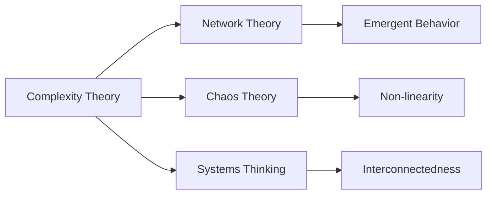

# Complexity Theory

## Origin

### Immediate Circumstances and Creation

Complexity Theory emerged from the need to understand complex systems in various fields such as biology, ecology, economics, and computer science. Originally, it was developed to address the challenges of analyzing systems composed of numerous interacting components, which could not be explained by traditional linear models. The purpose was to provide a framework for studying how individual parts of a system give rise to collective behavior and how the system interacts with its environment.

### Evolution and Historical Milestones

Complexity Theory has evolved significantly since its inception. Key milestones include:

1. **1950s-1960s**: Emergence in [[Cybernetics]] and early computational models.
2. **1970s-1980s**: Widespread recognition through the work of theorists like [[Ilya Prigogine]] and the establishment of the [[Santa Fe Institute]], which focused on interdisciplinary research into complex systems.
3. **1990s-Present**: Integration into fields such as weather forecasting, financial markets, and social sciences, alongside advancements in computational power allowing for more sophisticated models and simulations.

## Possibilities

### Expected Outcomes

#### Positive Outcomes

- **System Stability and Predictive Insights**: Complexity Theory helps in improving the stability and predictability of complex systems, allowing organizations to forecast trends and prepare for future challenges. For example, in finance, it aids in recognizing patterns that might signal economic shifts.
- **Innovation and Problem Solving**: By analyzing the emergent behavior of systems, Complexity Theory encourages innovative problem-solving approaches, facilitating breakthroughs across disciplines.
- **Sustainability Practices**: It provides tools for developing sustainable practices by understanding ecological systems' dynamics, leading to better resource management.

#### Negative Outcomes

- **Analysis Paralysis**: The complexity of systems may lead to indecisiveness, as the overwhelming data requires specialized knowledge to interpret effectively.
- **Over-reliance on Models**: There is a risk of over-dependence on models that may fail to predict unprecedented events or black swan incidents accurately.
- **Misapplication Risks**: Without proper understanding, applying these models can lead to faulty assumptions, as seen in certain financial markets crashes.

## Actual Outcomes

### Positive Outcomes

1. **Ecosystem Management**: The application of Complexity Theory has enhanced the management of natural resources, such as in the [[Everglades Restoration Project]], where understanding complex water flow systems helped restore ecosystems.

2. **Health Systems**: Complexity Theory has been used to improve patient care through understanding intricate networks of health behaviors and social determinants as exemplified by the use of complexity frameworks in public health during the COVID-19 pandemic.

### Negative Outcomes

1. **2008 Financial Crisis**: The inappropriate application of complex system models in financial markets contributed to catastrophic failure. The overconfidence in models led to significant financial losses and global economic downturn.

2. **Technological Over-reliance**: In some cases, a heavy focus on algorithmic trading, driven by complexity models, has resulted in market manipulation and volatility, highlighting the need for prudent regulation.

### Resonance

Complexity Theory resonates with various disciplines, including:

- **Network Theory**: Understanding the interconnectedness of components.
- **Chaos Theory**: Studying dynamic systems and unpredictability.
- **Big Data Analytics**: The integration of large datasets for complex decision-making.

These connections enable a holistic view of systems, promoting comprehensive strategies in both academia and industries.

### Distinction

Complexity Theory faces competition and critique from:

- **Reductionism**: The simplistic approach of breaking down systems into individual parts, criticized for not capturing emergent phenomena.
- **Linear Models**: Still favored in certain contexts due to simplicity and ease of predictability.
- **Algorithm Critiques**: Concern from ethical standpoints over how complexity models drive decisions without transparency.

## Summary

### Bloom's Taxonomy Table

| **Bloom's Layer** | **Description**                     | **Examples**                         |
| ----------------- | ----------------------------------- | ------------------------------------ |
| Factual           | Basic facts and terminology         | Complex systems, emergent behavior   |
| Conceptual        | Relationships and overarching ideas | Interconnectedness, non-linearity    |
| Procedural        | Practical methods and processes     | Modeling and simulation tools        |
| Metacognitive     | Reflective insights                 | Understanding model limitations      |

### Integral Theory Table

| **Quadrant**        | **Key Elements/Insights**                               |
| ------------------- | ------------------------------------------------------- |
| Interior-Individual | Understanding of complex systems empowers individuals to anticipate outcomes |
| Interior-Collective | Societal value in sustainable resource management       |
| Exterior-Individual | Actions shaped by insights from complexity, e.g., a financial analyst |
| Exterior-Collective | Institutional adoption of complexity models, e.g., in economics |

### Knowledge Expansion Table

| **Knowledge Item**                  | **Description**                               | **Relevance/Relationship**                     |
| ----------------------------------- | --------------------------------------------- | ---------------------------------------------- |
| [[Network Theory]]                  | Study of how network structure affects behavior | Complements insights on interconnectedness     |
| [[Chaos Theory]]                    | Dynamic systems behavior and unpredictability | Offers insights on stability within complexity |
| [[Systems Thinking]]                | Understanding system interrelationships       | Shares holistic perspective on system dynamics |

### Visualization

---

This structured analysis and visualization provides an insightful look into the origins, applications, and impacts of Complexity Theory within the context of Knowledge Management. By leveraging frameworks like Bloom's Taxonomy and Integral Theory, the analysis extends into actionable insights that cater to both academic and practical domains.

## Project Link

[[Create Knowledge Management System]]
