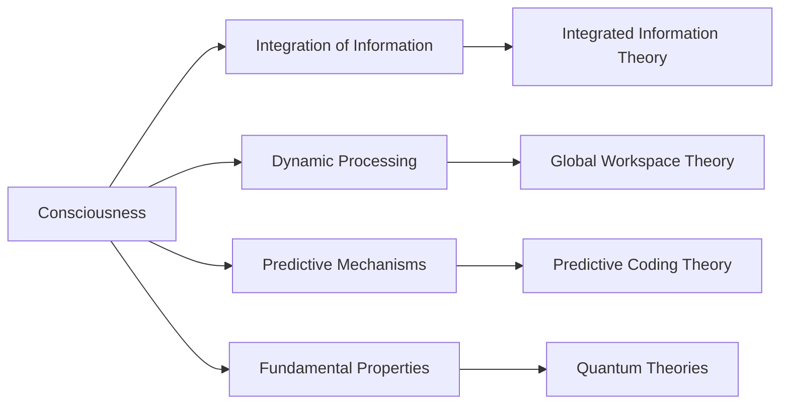

# Consciousness and Thought Generation: A Unified Understanding Framework

## Unified Narrative

The exploration of consciousness and thought generation delves into the intricate interplay between neural activity and information processing, emphasizing consciousness as an emergent property of the brain's complex systems. This understanding is rooted in several key theories:

1. **Integration of Information**: The Neural Correlates of Consciousness and Integrated Information Theory (IIT) propose that consciousness arises from the integration of diverse neural signals, allowing for coherent experiences. This underscores the brain's ability to unify information across multiple regions.

2. **Dynamic Processing**: The Global Workspace Theory highlights that conscious thoughts result from continuous interactions among specialized brain regions, enabling dynamic processing and availability of information for higher cognitive functions.

3. **Predictive Mechanisms**: [[Predictive Coding Theory]] posits that the brain constructs and updates internal models to predict and reconcile sensory inputs, thus generating conscious experiences.

4. **Fundamental Properties**: [[Quantum Theories of Consciousness]] suggest that consciousness may be linked to fundamental properties of nature, offering a non-materialist perspective on its origins.

These theories collectively suggest that consciousness is not a mere byproduct of neural activity but a complex, emergent phenomenon resulting from the brain's intricate information processing capabilities. This synthesis reflects an evolution from reductionist views to a more integrated perspective that emphasizes the brain's holistic functioning.

## Organized Summaries via Tables

### Bloom's Taxonomy Table

| **Bloom's Layer**    | **Description**                           | **Examples**                            |
|----------------------|-------------------------------------------|-----------------------------------------|
| Factual              | Core facts, terminology, and basic elements | Neural correlates, holistic processing. |
| Conceptual           | Relationships between consciousness and thought generation. | Emergence of consciousness from integrated brain activity. |
| Procedural           | Methods for studying consciousness.      | Neuroimaging techniques, cognitive therapies. |
| Metacognitive        | Reflection on implications for neuroscience and ethics. | Debates on free will, ethical concerns in neurotechnology. |

### Integral Theory Table

| **Quadrant**        | **Key Elements/Insights**                              | **Expanded**                                                   |
| ------------------- | ------------------------------------------------------ | -------------------------------------------------------------- |
| Interior-Individual | Personal experiences of consciousness and cognition.   | Subjective awareness and self-reflection.                      |
| Interior-Collective | Cultural views on consciousness and mind.              | Philosophical debates, societal norms regarding mental health. |
| Exterior-Individual | Observable behaviors linked to thought processes.      | Cognitive performance, responses to therapies.                 |
| Exterior-Collective | Systems and structures influencing thought generation. | Research institutions, ethical frameworks in neurotechnology.  |

### Knowledge Expansion Table

| **Knowledge Item**                 | **Description**                                                                     | **Relevance/Relationship**                                      |
| ---------------------------------- | ----------------------------------------------------------------------------------- | --------------------------------------------------------------- |
| Neural Correlates of Consciousness | Investigates specific brain regions involved in conscious thought.                  | Underpins the understanding of the brain's architecture.        |
| Predictive Coding Theory           | A framework suggesting that the brain predicts sensory inputs to minimize surprise. | Relates to the integrative processing of information.           |
| Quantum Consciousness              | A speculative theory suggesting quantum processes underlie consciousness.           | Presents alternative views on the nature of thought generation. |

## Emergent Relationships with Visualizations

## Actionable Framework/Guide

### Steps for Applying Key Findings

1. **Mental Health Interventions**: Leverage the understanding of thought generation as an integrated process to develop therapies that address underlying neural dynamics, enhancing treatment outcomes for disorders like depression and anxiety.

2. **Cognitive Enhancement Technologies**: Utilize insights into holistic processing to inform the design of brain-computer interfaces and neurofeedback systems aimed at optimizing cognitive function.

3. **Artificial Intelligence**: Model thought generation as a complex, adaptive system to create AI algorithms that mimic human-like thought processes, improving AI capabilities.

4. **Ethical Considerations**: Address potential ethical concerns related to neurotechnology by establishing frameworks that prioritize privacy, consent, and ethical use of brain manipulation technologies.

### Framework for Navigating Future Research

- **Interdisciplinary Collaboration**: Foster collaboration between neuroscience, psychology, philosophy, and technology to deepen understanding and address complex questions surrounding consciousness.
- **Advanced Neuroimaging Techniques**: Continue to develop and refine neuroimaging methods to map brain activity and understand neural correlates of consciousness more precisely.
- **Ethical Discussions**: Engage in ongoing ethical discussions to guide the responsible development and application of technologies related to consciousness and cognition.

### Real-World Relevance or Utility of Synthesized Knowledge

- **Healthcare**: Improve mental health treatments by applying a holistic understanding of consciousness and cognition.
- **Education**: Enhance educational methods by incorporating insights into brain function and cognitive processes.
- **Policy**: Inform policy-making on neurotechnology and AI, ensuring ethical considerations are prioritized in development and application.

This framework balances practicality and abstract exploration, providing a guide for implementing insights into real-world applications while acknowledging the complexities of consciousness research.

## Sources

- [[Consensus of Thoughts]]
- [[Existential Layer for LLMs]]
- [[IHAMS]]
- [[Living Document]]
- [[Living Knowledge Framework]]
